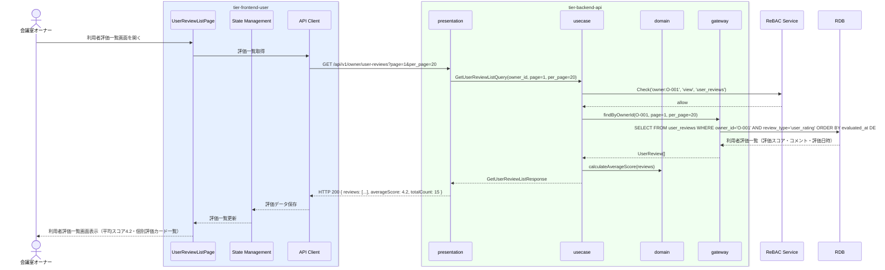

# 利用者評価一覧を確認する

## 概要

会議室オーナーが利用者から付けられた評価を一覧で確認する。評価スコア・コメントを把握し、会議室の運営改善や使用許諾判断の参考情報として活用する。

## データフロー

```mermaid
graph LR
  subgraph FE["tier-frontend-user"]
    subgraph FE_V["view"]
      UserReviewListPage
    end
    subgraph FE_S["state"]
      UserReviewListState
    end
    subgraph FE_A["api-client"]
      GetUserReviewListRequest
    end
  end
  subgraph BE["tier-backend-api"]
    subgraph BE_P["presentation"]
      GetUserReviewListRequestDTO
    end
    subgraph BE_U["usecase"]
      GetUserReviewListQuery
    end
    subgraph BE_D["domain"]
      UserReview
    end
    subgraph BE_G["gateway"]
      UserReviewRecord
    end
  end
  subgraph DB["tier-datastore-rdb"]
    user_reviews[("user_reviews")]
  end

  UserReviewListPage --> UserReviewListState --> GetUserReviewListRequest
  GetUserReviewListRequest -->|"GET /api/v1/owner/user-reviews?page=1&per_page=20"| GetUserReviewListRequestDTO
  GetUserReviewListRequestDTO --> GetUserReviewListQuery
  GetUserReviewListQuery --> UserReview
  UserReview --> UserReviewRecord
  UserReviewRecord -->|"SELECT WHERE owner_id=? AND review_type=user_rating ORDER BY evaluated_at DESC LIMIT 20"| user_reviews
  user_reviews --> UserReviewRecord
  UserReviewRecord --> UserReview
  UserReview --> GetUserReviewListQuery --> GetUserReviewListRequestDTO
  GetUserReviewListRequestDTO -->|"HTTP 200"| GetUserReviewListRequest
  GetUserReviewListRequest --> UserReviewListState --> UserReviewListPage
```



| レイヤー | データモデル | 変換内容 |
|---------|------------|---------|
| FE view | UserReviewListPage | 平均スコア・評価カード一覧・ページネーション表示 |
| FE state | UserReviewListState | 評価一覧・平均スコア状態管理 |
| FE api-client | GetUserReviewListRequest | クエリパラメータ組み立て → GET リクエスト |
| BE presentation | GetUserReviewListRequestDTO | バリデーション + Query 変換 |
| BE usecase | GetUserReviewListQuery | 認可チェック → 利用者評価取得 → 平均スコア計算 |
| BE domain | UserReview | 利用者評価値オブジェクト |
| BE gateway | UserReviewRecord | Entity → DB カラム形式の DTO |
| DB | user_reviews | SELECT WHERE owner_id=? AND review_type=user_rating ORDER BY evaluated_at DESC LIMIT ? OFFSET ? |

## 処理フロー



## バリエーション一覧

| バリエーション名 | 値 | 処理内容 | 適用 tier | 適用箇所 |
|----------------|---|---------|----------|---------|
| 評価種別 | 利用者評価 | オーナーが登録した利用者評価のみ取得（会議室評価・オーナー評価は除外） | tier-backend-api | GET /api/v1/owner/user-reviews |

## 分岐条件一覧

| 条件名 | 判定ルール | 適用 tier | 適用箇所 | BDD Scenario |
|--------|----------|----------|---------|-------------|
| 所有権チェック | 認証中のオーナーIDに紐づく利用者評価のみ参照可能 | tier-backend-api | GET /api/v1/owner/user-reviews | 正常系: 自身の利用者評価一覧を確認する |

## 計算ルール一覧

| 計算名 | 入力情報 | 計算式/ロジック | 出力情報 | 適用 tier |
|--------|---------|---------------|---------|----------|
| 平均スコア計算 | user_reviews.score | AVG(score) WHERE owner_id=? AND review_type='user_rating' | 平均評価スコア | tier-backend-api |

## 状態遷移一覧

| 状態モデル | 遷移元 | 遷移先 | トリガー | 事前条件 | 事後処理 | 適用 tier |
|-----------|--------|--------|---------|---------|---------|----------|
| - | - | - | - | - | 参照系UCのため状態遷移なし | - |

## 関連 RDRA モデル

| モデル種別 | 要素名 | 関連 |
|-----------|--------|------|
| 業務 | 精算業務 | このUCが属する業務 |
| BUC | 利用実績管理フロー | このUCを含むBUC |
| アクター | 会議室オーナー | 操作するアクター（社外） |
| 情報 | 利用者評価 | 参照する情報（評価ID、オーナーID、利用者ID、評価スコア、コメント、評価日時） |
| 状態 | - | 状態遷移なし（参照系UC） |
| 条件 | - | 直接適用される条件なし |
| 外部システム | - | 連携なし |

## E2E 完了条件（BDD）

### 正常系

```gherkin
Feature: 利用者評価一覧を確認する

  Scenario: 自身の利用者評価一覧を確認する
    Given 会議室オーナー「田中太郎」がオーナーポータルにログイン済みである
    When 利用者評価一覧画面を開く
    Then 平均スコア「4.2（評価件数: 15件）」と個別評価「利用者ID:U-101・評価スコア:5・コメント:「とても丁寧な対応でした」・2026年3月15日」が一覧で表示される

  Scenario: 評価件数が多い場合はページネーションで表示される
    Given 会議室オーナー「田中太郎」に対して利用者評価が25件存在する
    When 利用者評価一覧画面を開く
    Then 1ページ目に20件の評価が表示され、「次へ」ボタンが表示される
```

### 異常系

```gherkin
  Scenario: 他のオーナーの利用者評価にアクセスしても自身のデータのみ返される
    Given 会議室オーナー「田中太郎」（owner_id: O-001）がログイン済みである
    When 利用者評価一覧APIに対してリクエストする
    Then owner_id=O-001に紐づく利用者評価のみが返され、他のオーナーのデータは含まれない

  Scenario: 評価が0件の場合は空状態を表示する
    Given 会議室オーナー「田中太郎」に対して利用者評価が0件である
    When 利用者評価一覧画面を開く
    Then 「まだ評価がありません」という空状態のメッセージが表示される
```

## ティア別仕様

- [利用者・オーナー向けフロントエンド仕様](tier-frontend-user.md)
- [バックエンドAPI仕様](tier-backend-api.md)

### 統合 API Spec

- [OpenAPI Spec](../../_cross-cutting/api/openapi.yaml)（全 UC 統合、Contract First 開発用）
