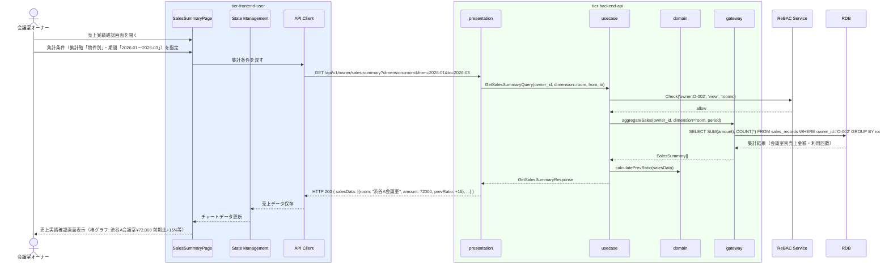

# 売上実績を確認する

## 概要

会議室オーナーが自身の会議室の売上実績（売上金額・利用回数）を確認する。会議室別・期間別に集計した売上データを把握し、運営改善や収益計画に活用する。

## データフロー

```mermaid
graph LR
  subgraph FE["tier-frontend-user"]
    subgraph FE_V["view"]
      SalesSummaryPage
    end
    subgraph FE_S["state"]
      SalesSummaryState
    end
    subgraph FE_A["api-client"]
      GetSalesSummaryRequest
    end
  end
  subgraph BE["tier-backend-api"]
    subgraph BE_P["presentation"]
      GetSalesSummaryRequestDTO
    end
    subgraph BE_U["usecase"]
      GetSalesSummaryQuery
    end
    subgraph BE_D["domain"]
      SalesSummary
    end
    subgraph BE_G["gateway"]
      SalesRecord
    end
  end
  subgraph DB["tier-datastore-rdb"]
    sales_records[("sales_records")]
  end

  SalesSummaryPage --> SalesSummaryState --> GetSalesSummaryRequest
  GetSalesSummaryRequest -->|"GET /api/v1/owner/sales-summary?dimension=room&from=2026-01&to=2026-03"| GetSalesSummaryRequestDTO
  GetSalesSummaryRequestDTO --> GetSalesSummaryQuery
  GetSalesSummaryQuery --> SalesSummary
  SalesSummary --> SalesRecord
  SalesRecord -->|"SELECT SUM(amount), COUNT(*) WHERE owner_id=? GROUP BY room_id"| sales_records
  sales_records --> SalesRecord
  SalesRecord --> SalesSummary
  SalesSummary --> GetSalesSummaryQuery --> GetSalesSummaryRequestDTO
  GetSalesSummaryRequestDTO -->|"HTTP 200"| GetSalesSummaryRequest
  GetSalesSummaryRequest --> SalesSummaryState --> SalesSummaryPage
```



| レイヤー | データモデル | 変換内容 |
|---------|------------|---------|
| FE view | SalesSummaryPage | 集計軸セレクター・期間ピッカー・チャート表示 |
| FE state | SalesSummaryState | 集計条件・売上データ状態管理 |
| FE api-client | GetSalesSummaryRequest | クエリパラメータ組み立て → GET リクエスト |
| BE presentation | GetSalesSummaryRequestDTO | バリデーション + Query 変換 |
| BE usecase | GetSalesSummaryQuery | 認可チェック → 売上集計 → 前期比計算 |
| BE domain | SalesSummary | 売上集計値オブジェクト |
| BE gateway | SalesRecord | Entity → DB カラム形式の DTO |
| DB | sales_records | SELECT SUM(amount), COUNT(*) WHERE owner_id=? GROUP BY 集計軸 |

## 処理フロー



## バリエーション一覧

| バリエーション名 | 値 | 処理内容 | 適用 tier | 適用箇所 |
|----------------|---|---------|----------|---------|
| 利用履歴集計区分 | 物件別 | 会議室IDでGROUP BY して売上金額を集計 | tier-backend-api | GET /api/v1/owner/sales-summary?dimension=room |
| 利用履歴集計区分 | 期間別 | 利用日の年月でGROUP BY して月別売上推移を集計 | tier-backend-api | GET /api/v1/owner/sales-summary?dimension=period |

## 分岐条件一覧

| 条件名 | 判定ルール | 適用 tier | 適用箇所 | BDD Scenario |
|--------|----------|----------|---------|-------------|
| 所有権チェック | 認証中のオーナーIDに紐づく売上実績のみ参照可能 | tier-backend-api | GET /api/v1/owner/sales-summary | 正常系: 自身の会議室の売上実績を確認する |

## 計算ルール一覧

| 計算名 | 入力情報 | 計算式/ロジック | 出力情報 | 適用 tier |
|--------|---------|---------------|---------|----------|
| 売上金額集計 | sales_records.amount | SUM(amount) GROUP BY 集計軸 | 集計期間の総売上金額 | tier-backend-api |
| 前期比計算 | 当期・前期の売上金額 | (当期金額 - 前期金額) / 前期金額 × 100 | 前期比(%) | tier-backend-api |

## 状態遷移一覧

| 状態モデル | 遷移元 | 遷移先 | トリガー | 事前条件 | 事後処理 | 適用 tier |
|-----------|--------|--------|---------|---------|---------|----------|
| - | - | - | - | - | 参照系UCのため状態遷移なし | - |

## 関連 RDRA モデル

| モデル種別 | 要素名 | 関連 |
|-----------|--------|------|
| 業務 | 精算業務 | このUCが属する業務 |
| BUC | 利用実績管理フロー | このUCを含むBUC |
| アクター | 会議室オーナー | 操作するアクター（社外） |
| 情報 | 売上実績 | 参照する情報（実績ID、会議室ID、オーナーID、集計期間、利用回数、売上金額） |
| 状態 | - | 状態遷移なし（参照系UC） |
| 条件 | - | 直接適用される条件なし |
| 外部システム | - | 連携なし |

## E2E 完了条件（BDD）

### 正常系

```gherkin
Feature: 売上実績を確認する

  Scenario: 物件別の2026年第1四半期の売上実績を確認する
    Given 会議室オーナー「山田花子」がオーナーポータルにログイン済みである
    When 売上実績確認画面で集計軸「物件別」・期間「2026-01〜2026-03」を指定する
    Then 会議室「渋谷A会議室：¥72,000（前期比: +15%）」と「新宿B会議室：¥54,000（前期比: -3%）」が棒グラフで表示される

  Scenario: 月別の売上推移を確認する
    Given 会議室オーナー「山田花子」がオーナーポータルにログイン済みである
    When 売上実績確認画面で集計軸「期間別」・期間「2026-01〜2026-03」を指定する
    Then 月別売上金額「1月: ¥42,000、2月: ¥48,000、3月: ¥36,000」が折れ線グラフで表示される
```

### 異常系

```gherkin
  Scenario: 他のオーナーの売上実績データにアクセスしても自身のデータのみ返される
    Given 会議室オーナー「山田花子」（owner_id: O-002）がログイン済みである
    When 売上実績確認APIに対してリクエストする
    Then owner_id=O-002の会議室の売上実績のみが返され、他のオーナーのデータは含まれない
```

## ティア別仕様

- [利用者・オーナー向けフロントエンド仕様](tier-frontend-user.md)
- [バックエンドAPI仕様](tier-backend-api.md)

### 統合 API Spec

- [OpenAPI Spec](../../_cross-cutting/api/openapi.yaml)（全 UC 統合、Contract First 開発用）
