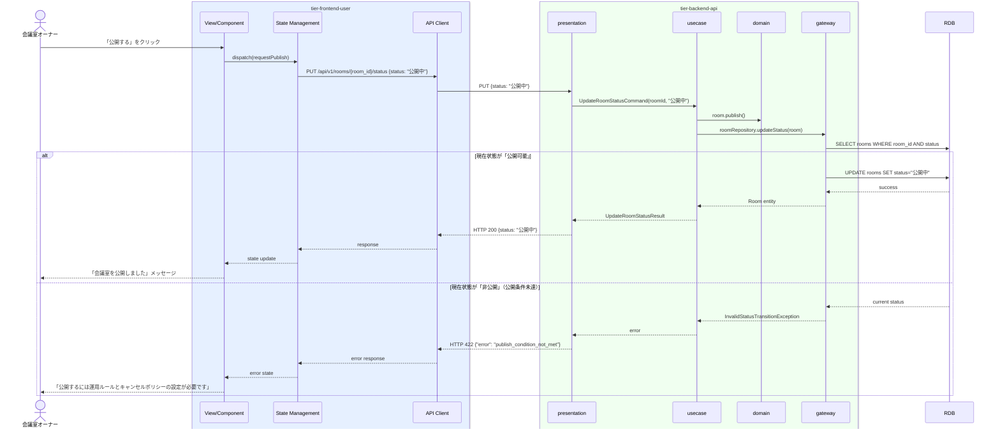

# 会議室の公開状態を変更する

## 概要

会議室オーナーが会議室の公開状態（公開中・非公開・公開可能）を切り替える。公開可能状態から「公開中」にすると利用者から会議室が検索・予約できるようになる。公開条件を満たさない場合は公開中への遷移が拒否される。

## データフロー

```mermaid
graph LR
  subgraph FE["tier-frontend-user"]
    subgraph FE_V["view"]
      RoomPublishControl
    end
    subgraph FE_S["state"]
      RoomStatusState
    end
    subgraph FE_A["api-client"]
      UpdateRoomStatusRequest
    end
  end
  subgraph BE["tier-backend-api"]
    subgraph BE_P["presentation"]
      UpdateRoomStatusRequestDTO
    end
    subgraph BE_U["usecase"]
      UpdateRoomStatusCommand
    end
    subgraph BE_D["domain"]
      Room
    end
    subgraph BE_G["gateway"]
      RoomRecord
    end
  end
  subgraph DB["tier-datastore-rdb"]
    rooms[("rooms")]
  end
  RoomPublishControl --> RoomStatusState --> UpdateRoomStatusRequest
  UpdateRoomStatusRequest -->|"PUT /api/v1/rooms/{room_id}/status"| UpdateRoomStatusRequestDTO
  UpdateRoomStatusRequestDTO --> UpdateRoomStatusCommand
  UpdateRoomStatusCommand --> Room
  Room --> RoomRecord
  RoomRecord -->|"UPDATE"| rooms
  rooms --> RoomRecord
  RoomRecord --> Room
  Room --> UpdateRoomStatusCommand --> UpdateRoomStatusRequestDTO
  UpdateRoomStatusRequestDTO -->|"HTTP 200"| UpdateRoomStatusRequest
  UpdateRoomStatusRequest --> RoomStatusState --> RoomPublishControl
```



| レイヤー | データモデル | 変換内容 |
|---------|------------|---------|
| FE view | RoomPublishControl | 公開/非公開ボタン UI |
| FE state | RoomStatusState | 会議室公開状態・処理中フラグを管理 |
| FE api-client | UpdateRoomStatusRequest | roomId をパスに付与 |
| BE presentation | UpdateRoomStatusRequestDTO | roomId + status バリデーション（enum チェック） |
| BE usecase | UpdateRoomStatusCommand | 公開条件充足確認・遷移可否チェック |
| BE domain | Room | 状態機械による遷移制御（公開条件未充足は拒否） |
| BE gateway | RoomRecord | Entity → DB カラム形式 DTO。UPDATE rooms |
| DB | rooms | UPDATE (status=公開中/非公開) |

## 処理フロー



## バリエーション一覧

| バリエーション名 | 値 | 処理内容 | 適用 tier | 適用箇所 |
|----------------|---|---------|----------|---------|
| - | - | 本UCにはバリエーションなし | - | - |

## 分岐条件一覧

| 条件名 | 判定ルール | 適用 tier | 適用箇所 | BDD Scenario |
|--------|----------|----------|---------|-------------|
| 会議室公開条件（公開中への遷移） | 「公開可能」状態からのみ「公開中」に遷移可能（運用ルール・キャンセルポリシー設定済みが前提） | tier-backend-api | PUT /api/v1/rooms/{room_id}/status | 公開可能状態から公開中への変更が成功する |
| 会議室公開条件（非公開への遷移） | 「公開中」または「公開可能」から「非公開」への変更は常に可能 | tier-backend-api | PUT /api/v1/rooms/{room_id}/status | 公開中から非公開への変更が成功する |
| 公開状態遷移ガード | 「非公開」から直接「公開中」への遷移は不可 | tier-backend-api | PUT /api/v1/rooms/{room_id}/status | 非公開から公開中への直接変更でエラーが返る |

## 計算ルール一覧

| 計算名 | 入力情報 | 計算式/ロジック | 出力情報 | 適用 tier |
|--------|---------|---------------|---------|----------|
| - | - | 本UCには計算ルールなし | - | - |

## 状態遷移一覧

| 状態モデル | 遷移元 | 遷移先 | トリガー | 事前条件 | 事後処理 | 適用 tier |
|-----------|--------|--------|---------|---------|---------|----------|
| 会議室 | 非公開 | 公開可能 | 運用ルール&キャンセルポリシー設定完了 | 会議室公開条件充足 | なし | tier-backend-api |
| 会議室 | 公開可能 | 公開中 | オーナーが「公開する」を操作 | 会議室が「公開可能」状態 | 検索インデックスへの反映 | tier-backend-api |
| 会議室 | 公開中 | 非公開 | オーナーが「非公開にする」を操作 | 会議室が「公開中」状態 | 検索インデックスから削除 | tier-backend-api |
| 会議室 | 公開可能 | 非公開 | オーナーが「非公開にする」を操作 | 会議室が「公開可能」状態 | なし | tier-backend-api |

## 関連 RDRA モデル

| モデル種別 | 要素名 | 関連 |
|-----------|--------|------|
| 業務 | 会議室管理業務 | このUCが属する業務 |
| BUC | 会議室管理フロー | このUCを含むBUC |
| アクター | 会議室オーナー | 操作するアクター（社外） |
| 情報 | 会議室情報 | 変更対象（公開状態） |
| 状態 | 会議室 | 遷移: 非公開⇔公開可能⇔公開中 |
| 条件 | 会議室公開条件 | 公開中への遷移条件（運用ルール・キャンセルポリシー設定済み） |

## E2E 完了条件（BDD）

### 正常系

```gherkin
Feature: 会議室の公開状態を変更する

  Scenario: 公開可能状態の会議室を公開中に変更できる
    Given 会議室オーナー「田中一郎」がログイン済みで、会議室「渋谷会議室A」が「公開可能」状態である
    When 会議室公開管理画面で「公開する」ボタンをクリックする
    Then 「会議室を公開しました」のメッセージが表示され、会議室の状態が「公開中」になる

  Scenario: 公開中の会議室を非公開に変更できる
    Given 会議室オーナー「田中一郎」がログイン済みで、会議室「渋谷会議室A」が「公開中」状態である
    When 会議室公開管理画面で「非公開にする」ボタンをクリックする
    Then 「会議室を非公開にしました」のメッセージが表示され、会議室の状態が「非公開」になる
```

### 異常系

```gherkin
  Scenario: 非公開から公開中への直接変更でエラーが返る
    Given 会議室「渋谷会議室B」が「非公開」状態（運用ルール未設定）である
    When オーナー「田中一郎」が PUT /api/v1/rooms/room-002/status に {"status": "公開中"} を送信する
    Then HTTP 422 が返り、「公開するには運用ルールとキャンセルポリシーの設定が必要です」のエラーが表示される
```

## ティア別仕様

- [利用者・オーナー向けフロントエンド](tier-frontend-user.md)
- [バックエンドAPI](tier-backend-api.md)

### 統合 API Spec

- [OpenAPI Spec](../../../_cross-cutting/api/openapi.yaml)（全 UC 統合、Contract First 開発用）
