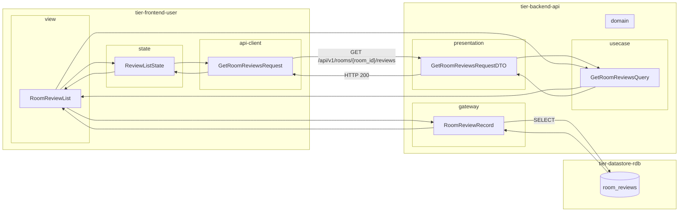
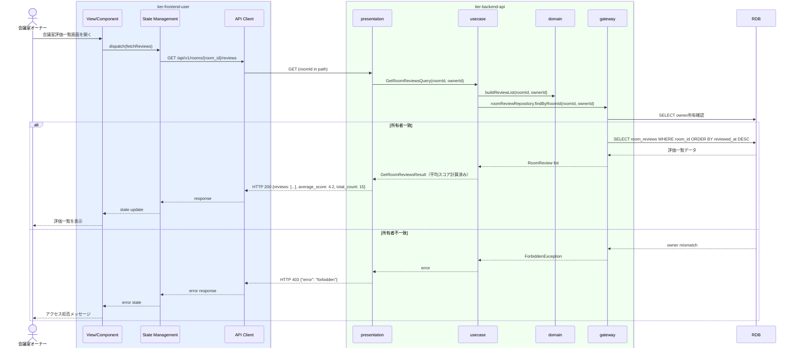

# 会議室の評価を確認する

## 概要

会議室オーナーが利用者から付けられた自身の会議室の評価（評価スコア・コメント・評価日時）を一覧で確認する。評価内容をもとに会議室の改善活動に活用する参照系のUC。

## データフロー



| レイヤー | データモデル | 変換内容 |
|---------|------------|---------|
| FE view | RoomReviewList | 評価一覧表示・平均スコア表示 UI |
| FE state | ReviewListState | 評価一覧・平均スコア・ローディング状態を管理 |
| FE api-client | GetRoomReviewsRequest | roomId をパスに付与、page クエリ |
| BE presentation | GetRoomReviewsRequestDTO | roomId + ページネーションパラメータ取り出し |
| BE usecase | GetRoomReviewsQuery | 所有者チェック・ページネーション適用 |
| BE domain | RoomReviewList | 平均スコア計算付き評価一覧 |
| BE gateway | RoomReviewRecord | SELECT room_reviews WHERE room_id ORDER BY reviewed_at DESC |
| DB | room_reviews | SELECT (room_id フィルタ、ページネーション) |

## 処理フロー



## バリエーション一覧

| バリエーション名 | 値 | 処理内容 | 適用 tier | 適用箇所 |
|----------------|---|---------|----------|---------|
| 評価種別 | 会議室評価 | 会議室への評価（設備・清潔さ等）を一覧表示 | tier-backend-api | GET /api/v1/rooms/{room_id}/reviews |

## 分岐条件一覧

| 条件名 | 判定ルール | 適用 tier | 適用箇所 | BDD Scenario |
|--------|----------|----------|---------|-------------|
| 所有者チェック | 対象会議室の所有者のみが評価一覧を閲覧可能 | tier-backend-api | GET /api/v1/rooms/{room_id}/reviews | 他人の会議室評価閲覧でエラーが返る |

## 計算ルール一覧

| 計算名 | 入力情報 | 計算式/ロジック | 出力情報 | 適用 tier |
|--------|---------|---------------|---------|----------|
| 平均評価スコア | 会議室評価.評価スコア（全件） | Σ(評価スコア) / 件数 | 平均スコア（小数第1位） | tier-backend-api |

## 状態遷移一覧

| 状態モデル | 遷移元 | 遷移先 | トリガー | 事前条件 | 事後処理 | 適用 tier |
|-----------|--------|--------|---------|---------|---------|----------|
| - | - | - | 状態変化なし（参照のみ） | - | - | - |

## 関連 RDRA モデル

| モデル種別 | 要素名 | 関連 |
|-----------|--------|------|
| 業務 | 会議室管理業務 | このUCが属する業務 |
| BUC | 会議室管理フロー | このUCを含むBUC |
| アクター | 会議室オーナー | 操作するアクター（社外） |
| 情報 | 会議室評価 | 参照する情報（評価ID、利用者ID、会議室ID、評価スコア、コメント、評価日時） |
| 状態 | - | 状態変化なし（参照のみ） |
| バリエーション | 評価種別 | 会議室評価 / オーナー評価 / 利用者評価（本UCは会議室評価を対象） |

## E2E 完了条件（BDD）

### 正常系

```gherkin
Feature: 会議室の評価を確認する

  Scenario: オーナーが自身の会議室の評価一覧を閲覧できる
    Given 会議室オーナー「田中一郎」がログイン済みで、会議室「渋谷会議室A」に評価が5件登録されている
    When 会議室評価一覧画面（/owner/rooms/room-001/reviews）を開く
    Then 評価一覧が評価日時降順で表示され、平均スコアと総件数も表示される

  Scenario: 評価が0件の場合に空状態メッセージが表示される
    Given 会議室オーナー「田中一郎」がログイン済みで、新規登録した会議室「渋谷会議室B」に評価が0件である
    When 会議室評価一覧画面を開く
    Then 「まだ評価がありません」のメッセージが表示される
```

### 異常系

```gherkin
  Scenario: 他のオーナーの会議室評価閲覧でエラーが返る
    Given オーナー「田中一郎」が room_id="room-999"（別オーナー所有）の評価一覧を参照しようとする
    When GET /api/v1/rooms/room-999/reviews を送信する
    Then HTTP 403 が返り、「この操作を行う権限がありません」のエラーが表示される
```

## ティア別仕様

- [利用者・オーナー向けフロントエンド](tier-frontend-user.md)
- [バックエンドAPI](tier-backend-api.md)

### 統合 API Spec

- [OpenAPI Spec](../../../_cross-cutting/api/openapi.yaml)（全 UC 統合、Contract First 開発用）
