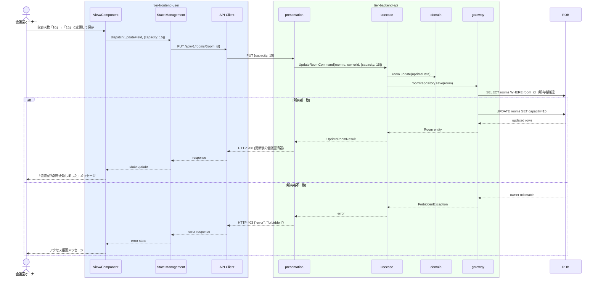

# 会議室情報を変更する

## 概要

会議室オーナーが登録済みの会議室情報（会議室名・所在地・収容人数・価格・設備等）を修正・更新する。公開中の会議室も情報変更可能だが、変更は即時反映される。

## データフロー

```mermaid
graph LR
  subgraph FE["tier-frontend-user"]
    subgraph FE_V["view"]
      RoomEditForm
    end
    subgraph FE_S["state"]
      RoomEditState
    end
    subgraph FE_A["api-client"]
      UpdateRoomRequest
    end
  end
  subgraph BE["tier-backend-api"]
    subgraph BE_P["presentation"]
      UpdateRoomRequestDTO
    end
    subgraph BE_U["usecase"]
      UpdateRoomCommand
    end
    subgraph BE_D["domain"]
      Room
    end
    subgraph BE_G["gateway"]
      RoomRecord
    end
  end
  subgraph DB["tier-datastore-rdb"]
    rooms[("rooms")]
  end
  RoomEditForm --> RoomEditState --> UpdateRoomRequest
  UpdateRoomRequest -->|"PUT /api/v1/rooms/{room_id}"| UpdateRoomRequestDTO
  UpdateRoomRequestDTO --> UpdateRoomCommand
  UpdateRoomCommand --> Room
  Room --> RoomRecord
  RoomRecord -->|"UPDATE"| rooms
  rooms --> RoomRecord
  RoomRecord --> Room
  Room --> UpdateRoomCommand --> UpdateRoomRequestDTO
  UpdateRoomRequestDTO -->|"HTTP 200"| UpdateRoomRequest
  UpdateRoomRequest --> RoomEditState --> RoomEditForm
```



| レイヤー | データモデル | 変換内容 |
|---------|------------|---------|
| FE view | RoomEditForm | 種別別フォーム UI（物理/バーチャル） |
| FE state | RoomEditState | 編集中会議室情報・isDirty フラグを管理 |
| FE api-client | UpdateRoomRequest | roomId をパスに付与 |
| BE presentation | UpdateRoomRequestDTO | roomId + 更新フィールドバリデーション |
| BE usecase | UpdateRoomCommand | 所有者チェック。公開中の場合は検索インデックス更新指示 |
| BE domain | Room | 所有者チェック付きエンティティ |
| BE gateway | RoomRecord | Entity → DB カラム形式 DTO |
| DB | rooms | UPDATE (変更フィールドのみ部分更新) |

## 処理フロー



## バリエーション一覧

| バリエーション名 | 値 | 処理内容 | 適用 tier | 適用箇所 |
|----------------|---|---------|----------|---------|
| 会議室種別 | 物理 | 所在地・広さ・収容人数フォームを表示 | tier-frontend-user | 会議室情報編集画面 |
| 会議室種別 | バーチャル | 会議ツール種別・同時接続数・録画可否フォームを表示 | tier-frontend-user | 会議室情報編集画面 |

## 分岐条件一覧

| 条件名 | 判定ルール | 適用 tier | 適用箇所 | BDD Scenario |
|--------|----------|----------|---------|-------------|
| 会議室種別別登録条件（情報変更） | 会議室種別に応じて変更可能な項目が異なる（物理：所在地等、バーチャル：会議ツール種別等） | tier-frontend-user | 会議室情報編集画面 | 物理会議室の場合は所在地が変更可能 |
| 所有者チェック | 対象会議室の所有者のみが情報変更可能 | tier-backend-api | PUT /api/v1/rooms/{room_id} | 他人の会議室変更でエラーが返る |

## 計算ルール一覧

| 計算名 | 入力情報 | 計算式/ロジック | 出力情報 | 適用 tier |
|--------|---------|---------------|---------|----------|
| - | - | 本UCには計算ルールなし | - | - |

## 状態遷移一覧

| 状態モデル | 遷移元 | 遷移先 | トリガー | 事前条件 | 事後処理 | 適用 tier |
|-----------|--------|--------|---------|---------|---------|----------|
| 会議室 | （変化なし） | （変化なし） | 会議室情報を変更する | 対象会議室の所有者である | 公開中の場合は検索インデックスを更新 | tier-backend-api |

## 関連 RDRA モデル

| モデル種別 | 要素名 | 関連 |
|-----------|--------|------|
| 業務 | 会議室管理業務 | このUCが属する業務 |
| BUC | 会議室管理フロー | このUCを含むBUC |
| アクター | 会議室オーナー | 操作するアクター（社外） |
| 情報 | 会議室情報 | 変更対象（会議室名、所在地、広さ、収容人数、価格、設備・機能、画像） |
| 状態 | 会議室 | 状態変化なし（いずれの公開状態でも変更可能） |
| 条件 | 会議室種別別登録条件 | 種別に応じた変更項目制御 |

## E2E 完了条件（BDD）

### 正常系

```gherkin
Feature: 会議室情報を変更する

  Scenario: オーナーが会議室の収容人数を変更できる
    Given 会議室オーナー「田中一郎」がログイン済みで、会議室「渋谷会議室A」（room_id: "room-001"）の情報編集画面を開いている
    When 収容人数を「10」から「15」に変更して保存ボタンをクリックする
    Then 「会議室情報を更新しました」のメッセージが表示され、収容人数が「15名」に更新される

  Scenario: 公開中の会議室の価格変更が即時反映される
    Given 会議室「渋谷会議室A」が「公開中」状態で価格が「1000円/時間」である
    When オーナー「田中一郎」が価格を「1200円/時間」に変更して保存する
    Then 会議室の価格が「1200円/時間」に更新され、検索結果にも即時反映される
```

### 異常系

```gherkin
  Scenario: 他のオーナーの会議室情報変更でエラーが返る
    Given オーナー「田中一郎」がroom_id="room-999"（別オーナー所有）の会議室にリクエストする
    When PUT /api/v1/rooms/room-999 に変更情報を送信する
    Then HTTP 403 が返り、「この操作を行う権限がありません」のエラーが表示される
```

## ティア別仕様

- [利用者・オーナー向けフロントエンド](tier-frontend-user.md)
- [バックエンドAPI](tier-backend-api.md)

### 統合 API Spec

- [OpenAPI Spec](../../../_cross-cutting/api/openapi.yaml)（全 UC 統合、Contract First 開発用）
