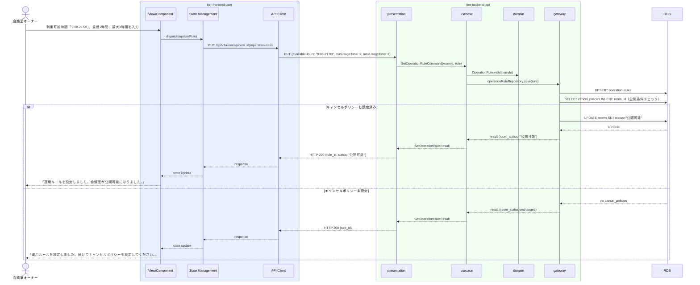

# 運用ルールを設定する

## 概要

会議室オーナーが会議室の利用可能時間帯・最低利用時間・最大利用時間・貸出可否などの運用ルールを設定する。運用ルールの設定は会議室公開条件の一部であり、設定完了後に会議室が「公開可能」状態に遷移できる前提条件となる。

## データフロー

```mermaid
graph LR
  subgraph FE["tier-frontend-user"]
    subgraph FE_V["view"]
      OperationRuleForm
    end
    subgraph FE_S["state"]
      OperationRuleState
    end
    subgraph FE_A["api-client"]
      SetOperationRuleRequest
    end
  end
  subgraph BE["tier-backend-api"]
    subgraph BE_P["presentation"]
      SetOperationRuleRequestDTO
    end
    subgraph BE_U["usecase"]
      SetOperationRuleCommand
    end
    subgraph BE_D["domain"]
      OperationRule
    end
    subgraph BE_G["gateway"]
      OperationRuleRecord
    end
  end
  subgraph DB["tier-datastore-rdb"]
    operation_rules[("operation_rules")]
    cancel_policies[("cancel_policies")]
    rooms[("rooms")]
  end
  OperationRuleForm --> OperationRuleState --> SetOperationRuleRequest
  SetOperationRuleRequest -->|"PUT /api/v1/rooms/{room_id}/operation-rules"| SetOperationRuleRequestDTO
  SetOperationRuleRequestDTO --> SetOperationRuleCommand
  SetOperationRuleCommand --> OperationRule
  OperationRule --> OperationRuleRecord
  OperationRuleRecord -->|"UPSERT"| operation_rules
  OperationRuleRecord -->|"SELECT"| cancel_policies
  OperationRuleRecord -->|"UPDATE"| rooms
  operation_rules --> OperationRuleRecord
  cancel_policies --> OperationRuleRecord
  OperationRuleRecord --> OperationRule
  OperationRule --> SetOperationRuleCommand --> SetOperationRuleRequestDTO
  SetOperationRuleRequestDTO -->|"HTTP 200"| SetOperationRuleRequest
  SetOperationRuleRequest --> OperationRuleState --> OperationRuleForm
```



| レイヤー | データモデル | 変換内容 |
|---------|------------|---------|
| FE view | OperationRuleForm | 利用可能時間帯・最低/最大利用時間・貸出可否入力フォーム |
| FE state | OperationRuleState | ルール設定値・送信状態を管理 |
| FE api-client | SetOperationRuleRequest | roomId をパスに付与 |
| BE presentation | SetOperationRuleRequestDTO | roomId + ルール値バリデーション |
| BE usecase | SetOperationRuleCommand | 公開条件充足チェック指示 |
| BE domain | OperationRule | 時間バリデーション付きエンティティ |
| BE gateway | OperationRuleRecord | UPSERT operation_rules + 公開条件チェック後 UPDATE rooms |
| DB | operation_rules | UPSERT (available_hours, min_usage_time, max_usage_time) |
| DB | cancel_policies | SELECT で公開条件充足確認 |
| DB | rooms | UPDATE (status=公開可能) 条件充足時 |

## 処理フロー



## バリエーション一覧

| バリエーション名 | 値 | 処理内容 | 適用 tier | 適用箇所 |
|----------------|---|---------|----------|---------|
| - | - | 本UCにはバリエーションなし | - | - |

## 分岐条件一覧

| 条件名 | 判定ルール | 適用 tier | 適用箇所 | BDD Scenario |
|--------|----------|----------|---------|-------------|
| 会議室公開条件（運用ルール） | 運用ルールが設定済みかつキャンセルポリシーが設定済みの場合、会議室状態を「公開可能」に更新する | tier-backend-api | PUT /api/v1/rooms/{room_id}/operation-rules | 両方設定済みで公開可能になる |
| 時間範囲バリデーション | 最低利用時間 ≤ 最大利用時間 でない場合はバリデーションエラー | tier-backend-api | PUT /api/v1/rooms/{room_id}/operation-rules | 最低>最大の時間設定でエラーが返る |

## 計算ルール一覧

| 計算名 | 入力情報 | 計算式/ロジック | 出力情報 | 適用 tier |
|--------|---------|---------------|---------|----------|
| - | - | 本UCには計算ルールなし | - | - |

## 状態遷移一覧

| 状態モデル | 遷移元 | 遷移先 | トリガー | 事前条件 | 事後処理 | 適用 tier |
|-----------|--------|--------|---------|---------|---------|----------|
| 会議室 | 非公開 | 公開可能 | 運用ルールとキャンセルポリシーが両方設定済み | 会議室公開条件を満たす | なし | tier-backend-api |

## 関連 RDRA モデル

| モデル種別 | 要素名 | 関連 |
|-----------|--------|------|
| 業務 | 会議室管理業務 | このUCが属する業務 |
| BUC | 会議室管理フロー | このUCを含むBUC |
| アクター | 会議室オーナー | 操作するアクター（社外） |
| 情報 | 運用ルール | 設定対象（ルールID、会議室ID、利用可能時間帯、最低利用時間、最大利用時間、貸出可否） |
| 情報 | 会議室情報 | 関連会議室の参照 |
| 状態 | 会議室 | 公開可能への遷移前提条件（会議室公開条件と連携） |
| 条件 | 会議室公開条件 | 運用ルールとキャンセルポリシーの登録完了が公開可能の条件 |

## E2E 完了条件（BDD）

### 正常系

```gherkin
Feature: 運用ルールを設定する

  Scenario: 運用ルールの設定が正常に完了する
    Given 会議室オーナー「田中一郎」がログイン済みで会議室「渋谷会議室A」（room_id: "room-001"）の運用ルール設定画面を開いている
    When 利用可能時間帯「9:00-21:00」、最低利用時間「2時間」、最大利用時間「8時間」、貸出可否「可」を入力して設定ボタンをクリックする
    Then 「運用ルールを設定しました」のメッセージが表示される

  Scenario: 運用ルールとキャンセルポリシーが両方設定済みで会議室が公開可能になる
    Given 会議室「渋谷会議室A」のキャンセルポリシーが設定済みで、運用ルールが未設定である
    When オーナー「田中一郎」が運用ルールを設定する
    Then 「会議室が公開可能になりました」のメッセージが表示され、会議室の状態が「公開可能」になる
```

### 異常系

```gherkin
  Scenario: 最低利用時間が最大利用時間を超えた場合にエラーが返る
    Given オーナー「田中一郎」が運用ルール設定画面を開いている
    When 最低利用時間「8時間」、最大利用時間「2時間」を入力して設定する
    Then 「最低利用時間は最大利用時間以下に設定してください」のエラーメッセージが表示される
```

## ティア別仕様

- [利用者・オーナー向けフロントエンド](tier-frontend-user.md)
- [バックエンドAPI](tier-backend-api.md)

### 統合 API Spec

- [OpenAPI Spec](../../../_cross-cutting/api/openapi.yaml)（全 UC 統合、Contract First 開発用）
