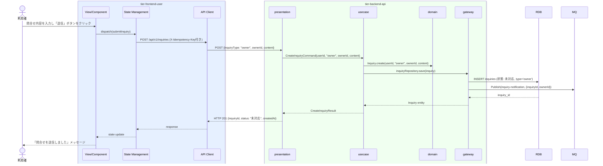

# オーナーへ問合せを送信する

## 概要

利用者が会議室オーナーに対して会議室利用に関する問合せを送信するUC。問合せを登録し、状態を「未対応」に遷移させる。問合せ種別「オーナー宛問合せ」として記録する。

## データフロー

```mermaid
graph LR
  subgraph FE["tier-frontend-user"]
    subgraph FE_V["view"]
      OwnerInquiryForm
    end
    subgraph FE_S["state"]
      InquiryState
    end
    subgraph FE_A["api-client"]
      CreateInquiryRequest
    end
  end
  subgraph BE["tier-backend-api"]
    subgraph BE_P["presentation"]
      CreateInquiryRequestDTO
    end
    subgraph BE_U["usecase"]
      CreateInquiryCommand
    end
    subgraph BE_D["domain"]
      Inquiry
    end
    subgraph BE_G["gateway"]
      InquiryRecord
    end
  end
  subgraph DB["tier-datastore-rdb"]
    inquiries[("inquiries")]
  end
  OwnerInquiryForm --> InquiryState --> CreateInquiryRequest
  CreateInquiryRequest -->|"POST /api/v1/inquiries"| CreateInquiryRequestDTO
  CreateInquiryRequestDTO --> CreateInquiryCommand
  CreateInquiryCommand --> Inquiry
  Inquiry --> InquiryRecord
  InquiryRecord -->|"INSERT"| inquiries
  inquiries --> InquiryRecord
  InquiryRecord --> Inquiry
  Inquiry --> CreateInquiryCommand --> CreateInquiryRequestDTO
  CreateInquiryRequestDTO -->|"HTTP 201"| CreateInquiryRequest
  CreateInquiryRequest --> InquiryState --> OwnerInquiryForm
```



| レイヤー | データモデル | 変換内容 |
|---------|------------|---------|
| FE view | OwnerInquiryForm | オーナー向け問合せフォーム。ownerId 表示 |
| FE state | InquiryState | 問合せ内容・送信状態を管理 |
| FE api-client | CreateInquiryRequest | inquiryType="owner" 固定。冪等キー付与 |
| BE presentation | CreateInquiryRequestDTO | inquiryType + ownerId + content バリデーション |
| BE usecase | CreateInquiryCommand | userId 注入。オーナー宛問合せとして区分設定 |
| BE domain | Inquiry | 新規エンティティ作成。type=owner, status=未対応 |
| BE gateway | InquiryRecord | Entity → DB カラム形式 DTO。MQ 発行（オーナー通知） |
| DB | inquiries | INSERT (type=owner, target_id=ownerId, status=未対応) |

## 処理フロー



## バリエーション一覧

| バリエーション名 | 値 | 処理内容 | 適用 tier | 適用箇所 |
|----------------|---|---------|----------|---------|
| 問合せ種別 | オーナー宛問合せ | 問合せ先IDをオーナーIDに設定し、問合せ先区分=ownerでレコード作成 | tier-backend-api | POST /api/v1/inquiries |
| 問合せ種別 | サービス運営宛問合せ | 本UCでは対象外。サービスへ問合せするUCで処理 | - | - |

## 分岐条件一覧

| 条件名 | 判定ルール | 適用 tier | 適用箇所 | BDD Scenario |
|--------|----------|----------|---------|-------------|
| 問合せ先区分 | 問合せ種別が「オーナー宛問合せ」の場合、問合せ先IDをオーナーIDに設定する。「サービス運営宛問合せ」はサービスへ問合せするUCで処理 | tier-backend-api | POST /api/v1/inquiries | 問合せが未対応状態で登録される |

## 計算ルール一覧

| 計算名 | 入力情報 | 計算式/ロジック | 出力情報 | 適用 tier |
|--------|---------|---------------|---------|----------|
| 問合せ日時の記録 | システム現在日時 | サーバータイムスタンプをそのまま記録 | 問合せ.問合せ日時 | tier-backend-api |

## 状態遷移一覧

| 状態モデル | 遷移元 | 遷移先 | トリガー | 事前条件 | 事後処理 | 適用 tier |
|-----------|--------|--------|---------|---------|---------|----------|
| 問合せ | （新規） | 未対応 | 利用者が問合せ送信ボタンをクリック | 利用者がログイン済みであること | オーナーに問合せ通知（非同期） | tier-backend-api |

## 関連 RDRA モデル

| モデル種別 | 要素名 | 関連 |
|-----------|--------|------|
| 業務 | 会議室貸出業務 | このUCが属する業務 |
| BUC | 会議室貸出管理フロー | このUCを含むBUC |
| アクター | 利用者 | 操作するアクター |
| 情報 | 問合せ | 送信する情報 |
| 状態 | 問合せ（→ 未対応） | 問合せ登録後の状態 |
| バリエーション | 問合せ種別（オーナー宛問合せ） | 問合せ先の区分 |

## E2E 完了条件（BDD）

### 正常系

```gherkin
Feature: オーナーへ問合せを送信する

  Scenario: 利用者「田中太郎」がオーナー「山田花子」に問合せを送信する
    Given 利用者「田中太郎」がログイン済みで、会議室オーナー「山田花子」（オーナーID: owner-001）に関連する予約が存在する
    When 利用者が問合せ送信画面で問合せ内容「駐車場はありますか？近くのコインパーキングがあれば教えてください」を入力し「送信」ボタンをクリックする
    Then 問合せが「未対応」状態で登録され、「問合せを送信しました」メッセージが表示される

  Scenario: InquiryThreadコンポーネントに送信した問合せが表示される
    Given 利用者「田中太郎」がオーナー「山田花子」への問合せを送信した直後である
    When 利用者が問合せ一覧を確認する
    Then 送信した問合せ「駐車場はありますか？」が InquiryThread コンポーネントに表示される
```

### 異常系

```gherkin
  Scenario: 問合せ内容が空の状態で送信しようとする
    Given 利用者「田中太郎」がログイン済みで問合せ送信画面を表示している
    When 問合せ内容を空のまま「送信」ボタンをクリックする
    Then 「問合せ内容を入力してください」バリデーションエラーが表示される
```

## ティア別仕様

- [利用者・オーナー向けフロントエンド](tier-frontend-user.md)
- [バックエンド API](tier-backend-api.md)

### 統合 API Spec

- [OpenAPI Spec](../../_cross-cutting/api/openapi.yaml)（全 UC 統合、Contract First 開発用）
- [AsyncAPI Spec](../../_cross-cutting/api/asyncapi.yaml)（inquiry-notification イベント）
