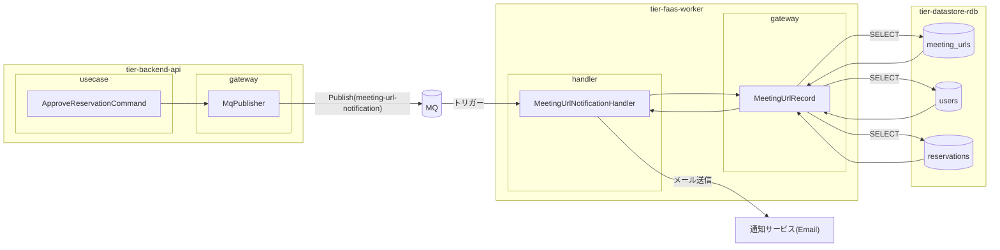
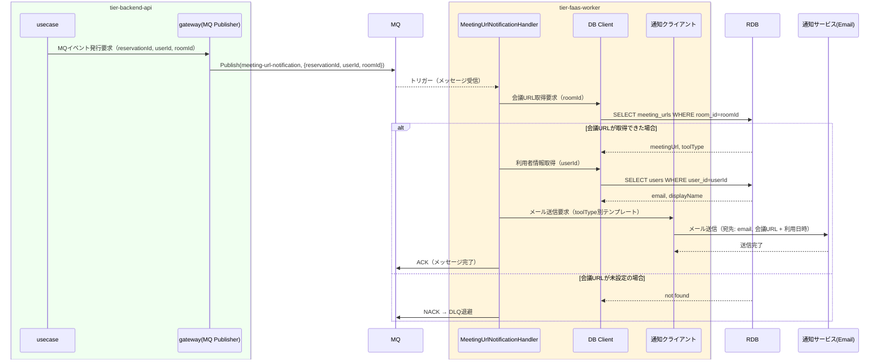

# 会議URLを通知する

## 概要

バーチャル会議室の予約確定時にオーナーが設定した会議URLを利用者にメール等で自動通知するUC。予約審査での許諾をトリガーに、MQイベント経由でFaaSワーカーが会議URLを取得して利用者へ通知する自動処理UC。画面操作なし（通知確認画面は参照のみ）。

## データフロー



| レイヤー | データモデル | 変換内容 |
|---------|------------|---------|
| BE usecase | ApproveReservationCommand | 予約許諾処理後に MQ イベント発行指示 |
| BE gateway | MqPublisher | Publish(meeting-url-notification, {reservationId, userId, roomId}) |
| FaaS handler | MeetingUrlNotificationHandler | MQ トリガー。会議 URL 取得・メール送信 |
| FaaS gateway | MeetingUrlRecord | SELECT meeting_urls + users + reservations |
| DB | meeting_urls | SELECT WHERE room_id → 会議URL, tool_type |
| DB | users | SELECT WHERE user_id → email, display_name |
| DB | reservations | SELECT WHERE reservation_id → 利用日時 |

## 処理フロー



## バリエーション一覧

| バリエーション名 | 値 | 処理内容 | 適用 tier | 適用箇所 |
|----------------|---|---------|----------|---------|
| 会議室種別 | バーチャル | Zoom/Teams/Google Meet の会議URLをメールで通知 | tier-faas-worker | MeetingUrlNotificationHandler |
| 会議室種別 | 物理 | 通知不要（イベントが発行されないため処理対象外） | - | - |
| 会議ツール種別 | Zoom, Teams, Google Meet | メール本文のテンプレートを会議ツール種別に合わせて切り替え | tier-faas-worker | メール本文生成 |

## 分岐条件一覧

| 条件名 | 判定ルール | 適用 tier | 適用箇所 | BDD Scenario |
|--------|----------|----------|---------|-------------|
| バーチャル会議室利用ポリシー | 会議室種別が「バーチャル」の予約のみを通知対象とする。物理会議室の予約確定では会議URL通知を行わない | tier-faas-worker | MeetingUrlNotificationHandler | バーチャル会議室の予約確定時に通知が送られる |
| バーチャル会議室利用ポリシー | 会議URLが設定されていない場合は通知をスキップしエラーログを記録する | tier-faas-worker | MeetingUrlNotificationHandler | 会議URL未設定時はDLQに退避 |

## 計算ルール一覧

| 計算名 | 入力情報 | 計算式/ロジック | 出力情報 | 適用 tier |
|--------|---------|---------------|---------|----------|
| 通知メール本文生成 | 予約情報.利用開始日時, 会議URL.会議URL, 会議URL.会議ツール種別 | テンプレートに値を埋め込み | メール本文（HTML/テキスト） | tier-faas-worker |

## 状態遷移一覧

| 状態モデル | 遷移元 | 遷移先 | トリガー | 事前条件 | 事後処理 | 適用 tier |
|-----------|--------|--------|---------|---------|---------|----------|
| 予約 | 申請 | 確定 | 予約審査でオーナーが許諾 | バーチャル会議室の予約であること | 会議URL通知イベントをMQに発行（tier-backend-api）→ FaaS が受信して通知送信 | tier-backend-api / tier-faas-worker |

## 関連 RDRA モデル

| モデル種別 | 要素名 | 関連 |
|-----------|--------|------|
| 業務 | 会議室貸出業務 | このUCが属する業務 |
| BUC | 会議室貸出管理フロー | このUCを含むBUC |
| アクター | 利用者 | 通知受信者 |
| 情報 | 会議URL | 通知する情報 |
| 情報 | 予約情報 | 通知の前提情報 |
| 状態 | 予約（確定） | 通知トリガーとなる状態 |
| 条件 | バーチャル会議室利用ポリシー | バーチャル会議室のみ通知対象 |

## E2E 完了条件（BDD）

### 正常系

```gherkin
Feature: 会議URLを通知する

  Scenario: バーチャル会議室の予約R-002が確定し、利用者「田中太郎」に会議URLが通知される
    Given バーチャル会議室（Zoom、会議URL: https://zoom.us/j/123456789）の予約R-002（利用者: 田中太郎、利用開始: 2026-04-01 14:00）が「申請」状態である
    When オーナー「山田花子」が予約R-002を許諾して予約が「確定」状態に遷移する
    Then FaaSワーカーがMQイベントを受信し、利用者「田中太郎」のメールアドレス（tanaka@example.com）に会議URL「https://zoom.us/j/123456789」と利用日時「2026-04-01 14:00」を含むメールが送信される
```

### 異常系

```gherkin
  Scenario: 会議URLが未設定のバーチャル会議室の予約が確定した場合、DLQに退避される
    Given 会議URLが未設定のバーチャル会議室の予約R-003が「確定」状態に遷移した
    When FaaSワーカーがmeeting-url-notificationイベントを受信する
    Then 会議URLが見つからないためメール送信がスキップされ、MQのDLQにメッセージが退避される
```

## ティア別仕様

- [利用者・オーナー向けフロントエンド（通知確認）](tier-frontend-user.md)
- [バックエンド API](tier-backend-api.md)
- [FaaS ワーカー](tier-faas-worker.md)

### 統合 API Spec

- [OpenAPI Spec](../../_cross-cutting/api/openapi.yaml)（全 UC 統合、Contract First 開発用）
- [AsyncAPI Spec](../../_cross-cutting/api/asyncapi.yaml)（meeting-url-notification イベント）
