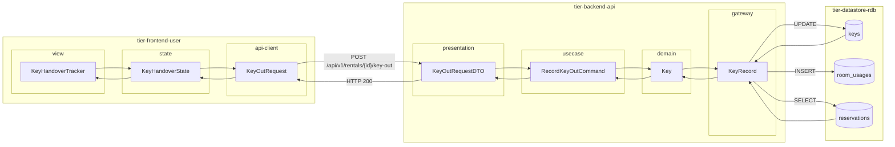
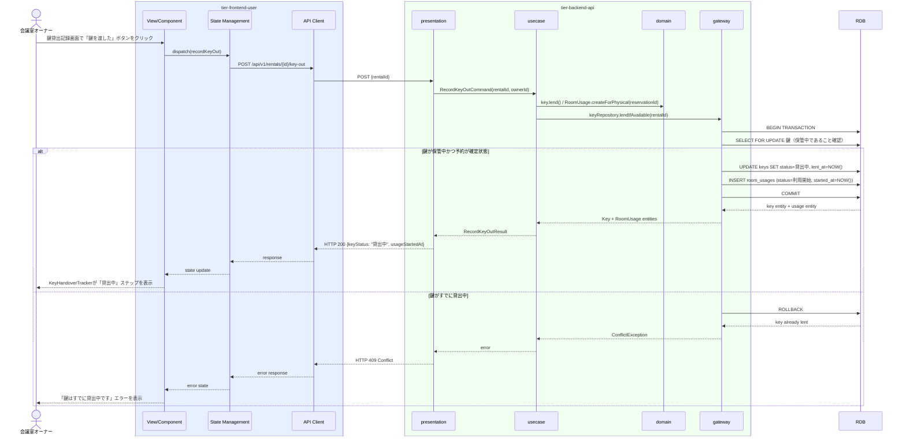

# 鍵の貸出を記録する

## 概要

会議室オーナーが利用者に鍵を渡し、鍵の貸出状態を「保管中」→「貸出中」に遷移させ、会議室利用を「利用開始」状態にするUC。会議室利用ポリシーに基づき、鍵の受け渡しをトリガーとして物理会議室の利用開始を制御する。

## データフロー



| レイヤー | データモデル | 変換内容 |
|---------|------------|---------|
| FE view | KeyHandoverTracker | 鍵受け渡し進捗表示 UI |
| FE state | KeyHandoverState | 貸出状態・処理中フラグを管理 |
| FE api-client | KeyOutRequest | rentalId をパスに付与 |
| BE presentation | KeyOutRequestDTO | rentalId + ownerId 認証情報 |
| BE usecase | RecordKeyOutCommand | 予約確認・トランザクション制御 |
| BE domain | Key | 状態遷移: 保管中 → 貸出中 |
| BE gateway | KeyRecord | TX: SELECT reservations + UPDATE keys + INSERT room_usages |
| DB | reservations | SELECT WHERE reservation_id（予約確認） |
| DB | keys | UPDATE (status=貸出中, lent_at) |
| DB | room_usages | INSERT (status=利用開始, started_at) |

## 処理フロー



## バリエーション一覧

| バリエーション名 | 値 | 処理内容 | 適用 tier | 適用箇所 |
|----------------|---|---------|----------|---------|
| 会議室種別 | 物理 | 鍵貸出操作を許可する | tier-backend-api | POST /api/v1/rentals/{id}/key-out |
| 会議室種別 | バーチャル | 鍵貸出操作を拒否（バーチャルは自動遷移のため） | tier-backend-api | POST /api/v1/rentals/{id}/key-out |

## 分岐条件一覧

| 条件名 | 判定ルール | 適用 tier | 適用箇所 | BDD Scenario |
|--------|----------|----------|---------|-------------|
| 会議室利用ポリシー | 鍵の状態が「保管中」であること、かつ予約状態が「確定」であることを確認してから貸出処理を実行する | tier-backend-api | POST /api/v1/rentals/{id}/key-out | 鍵貸出後に利用開始状態になる |
| 会議室利用ポリシー | バーチャル会議室の予約に対して鍵貸出操作を試みた場合はエラーを返す | tier-backend-api | POST /api/v1/rentals/{id}/key-out | バーチャル会議室への鍵貸出は不可 |

## 計算ルール一覧

| 計算名 | 入力情報 | 計算式/ロジック | 出力情報 | 適用 tier |
|--------|---------|---------------|---------|----------|
| 貸出日時の記録 | システム現在日時 | 操作実行時のサーバータイムスタンプをそのまま記録 | 鍵.貸出日時、会議室利用.利用開始日時 | tier-backend-api |

## 状態遷移一覧

| 状態モデル | 遷移元 | 遷移先 | トリガー | 事前条件 | 事後処理 | 適用 tier |
|-----------|--------|--------|---------|---------|---------|----------|
| 鍵 | 保管中 | 貸出中 | オーナーが鍵貸出記録ボタンをクリック | 鍵状態が「保管中」、予約状態が「確定」 | 会議室利用を「利用開始」状態に遷移 | tier-backend-api |
| 会議室利用 | （新規作成） | 利用開始 | 鍵貸出記録と同時 | 鍵状態が「保管中」 | 利用開始日時を記録、会議室利用レコード作成 | tier-backend-api |

## 関連 RDRA モデル

| モデル種別 | 要素名 | 関連 |
|-----------|--------|------|
| 業務 | 会議室貸出業務 | このUCが属する業務 |
| BUC | 会議室貸出管理フロー | このUCを含むBUC |
| アクター | 会議室オーナー | 操作するアクター |
| 情報 | 鍵 | 貸出対象の情報 |
| 情報 | 会議室利用 | 利用開始状態に遷移させる情報 |
| 状態 | 鍵（保管中 → 貸出中） | 鍵の状態遷移 |
| 状態 | 会議室利用（→ 利用開始） | 会議室利用状態の遷移 |
| 条件 | 会議室利用ポリシー | 鍵受け渡しで利用開始を定義 |

## E2E 完了条件（BDD）

### 正常系

```gherkin
Feature: 鍵の貸出を記録する

  Scenario: オーナー「山田花子」が利用者「田中太郎」に会議室001の鍵を渡す
    Given 会議室オーナー「山田花子」がログイン済みで、予約ID「R-001」（物理会議室: 渋谷会議室001、状態: 確定）の鍵が「保管中」状態である
    When オーナーが鍵貸出記録画面で「鍵を渡した」ボタンをクリックする
    Then 鍵の状態が「貸出中」に更新され、会議室利用が「利用開始」状態になり、貸出日時「2026-03-29 10:00」が記録される
```

### 異常系

```gherkin
  Scenario: バーチャル会議室の予約に対して鍵貸出を試みる
    Given 会議室オーナー「山田花子」がログイン済みで、予約ID「R-010」がバーチャル会議室の予約である
    When POST /api/v1/rentals/R-010/key-out をリクエストする
    Then 400 Bad Request が返され、「バーチャル会議室は鍵貸出が不要です」エラーが表示される
```

## ティア別仕様

- [利用者・オーナー向けフロントエンド](tier-frontend-user.md)
- [バックエンド API](tier-backend-api.md)

### 統合 API Spec

- [OpenAPI Spec](../../_cross-cutting/api/openapi.yaml)（全 UC 統合、Contract First 開発用）
