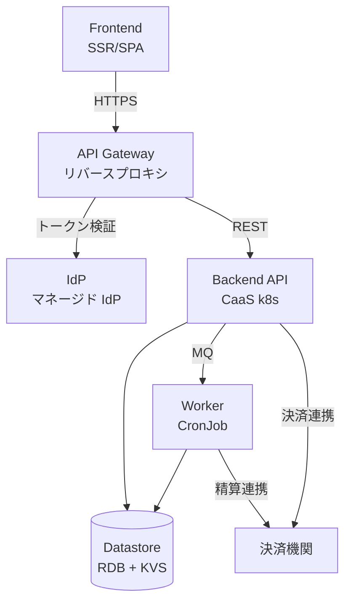
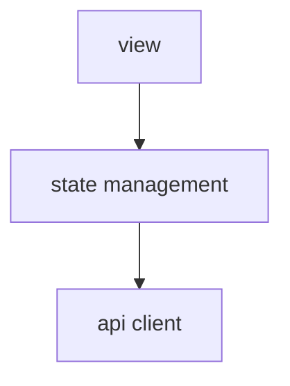
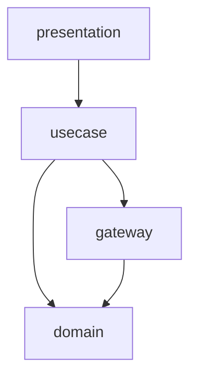
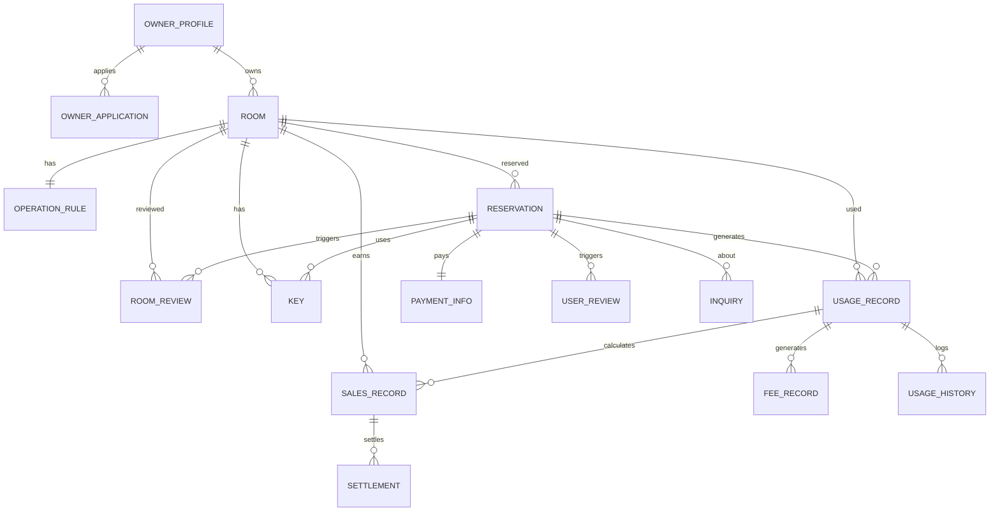

# アーキテクチャ設計書

## 概要

| 項目 | 内容 |
|------|------|
| イベントID | 20260330_104847_initial_arch |
| 作成日時 | 2026-03-30T10:48:47 |
| ソース | RDRA モデルと NFR グレードからの初期アーキテクチャ設計 |
| 言語 | TypeScript |
| フレームワーク | Next.js, NestJS |
| 技術的制約 | - |

## システムアーキテクチャ

### システム構成図

### ティア構成

| ID | ティア名 | 説明 | テクノロジー候補 |
|-----|---------|------|----------------|
| tier-frontend | フロントエンド | 利用者・オーナー・運営担当者向け Web UI。レスポンシブデザインでモバイル対応 | SSR, SPA |
| tier-api-gateway | API Gateway | トークン検証の一元化、経路制御、粗粒度 RBAC、レート制限を担うリバースプロキシ | API Gateway, リバースプロキシ |
| tier-idp | IdP | OAuth2/OIDC ベースの認証基盤。トークン発行・ユーザー登録・パスワードリセット・MFA 管理を担う | マネージド IdP |
| tier-backend-api | バックエンド API | ビジネスロジック、データアクセス、外部連携を担うモノリシック API サーバー | CaaS(k8s) |
| tier-worker | バックエンドワーカー | 月末精算バッチ処理を担う非同期ワーカー | CronJob(k8s), MQ |
| tier-datastore | データストア | トランザクションデータの永続化とキャッシュを担うストレージ層 | RDB, KVS |
| tier-external | 外部連携 | 決済機関との連携を担うアダプタ層。冪等性と障害耐性を確保 | アダプタパターン |

### フロントエンド (tier-frontend) の方針・ルール

#### 方針

| ID | 方針名 | 内容 | 根拠 | RDRA/NFR 要素 | 確信度 |
|-----|---------|------|------|--------------|:------:|
| SP-001 | レスポンシブデザイン | モバイル・デスクトップ両対応のレスポンシブ UI を提供する | NFR F.1.1.2 対応ブラウザ(Lv3)で主要ブラウザ+モバイルブラウザ対応、NFR F.1.1.3 対応デバイス(Lv2)でPC+スマートフォン対応が求められるため | NFR F.1.1.2, NFR F.1.1.3 | 高 |
| SP-002 | ロール別 UI 分離 | 利用者向け・オーナー向け・運営担当者向けの UI を論理的に分離する | アクター3種（利用者・オーナー・運営担当者）で操作権限と画面が明確に異なるため | アクター: 会議室オーナー, 利用者, サービス運営担当者 | 高 |
| SP-003 | ダブルクリック防止 | 予約登録・精算実行等の状態変更操作でダブルクリックを防止する UI 制御を実装する | 予約・精算等の金銭取引を伴う操作で重複送信を防止するため | BUC: 会議室予約フロー, BUC: オーナー精算フロー, NFR E.5.2.1 | 高 |

#### ルール

| ID | ルール名 | 内容 | 根拠 | RDRA/NFR 要素 | 確信度 |
|-----|---------|------|------|--------------|:------:|
| SR-001 | API 経由のデータアクセス | フロントエンドからデータストアへの直接アクセスを禁止し、必ず Backend API を経由する | セキュリティとデータ整合性の確保 | NFR E.6.1.2 | デフォルト |
| SR-002 | 冪等キー生成 | 状態変更リクエストごとに冪等キー（UUID）を生成し、リクエストヘッダー X-Idempotency-Key に付与する | 外部ユーザーのリトライによる重複送信リスクに対応 | アクター: 利用者（社外）, アクター: 会議室オーナー（社外） | 高 |
| SR-003 | trace_id 生成 | リクエストごとに trace_id（UUID）を生成し、リクエストヘッダーに付与する。冪等キーと共に送信する | リクエストの起点を一意に特定し、全ティア横断のトレーサビリティを確保 | NFR C.1.3.1, NFR C.6.1.1 | 中 |

### API Gateway (tier-api-gateway) の方針・ルール

#### 方針

| ID | 方針名 | 内容 | 根拠 | RDRA/NFR 要素 | 確信度 |
|-----|---------|------|------|--------------|:------:|
| SP-004 | トークン検証の一元化 | IdP が発行した JWT トークンを API Gateway で一元検証し、Backend API にはデコード済みユーザー情報を伝播する | 外部アクター2種（利用者・オーナー）+ 内部アクター1種の OAuth2/OIDC 認証でトークン検証を集約するため | アクター: 会議室オーナー（社外）, 利用者（社外）, NFR E.5.1.1 | 高 |
| SP-005 | 粗粒度 RBAC | API Gateway でロールベースの粗粒度アクセス制御を実施し、エンドポイント単位でアクセスを制御する | アクター3種で画面・機能が明確に分離されており、ロールベースの制御が必要 | NFR E.5.2.1, アクター: 会議室オーナー, 利用者, サービス運営担当者 | 高 |
| SP-006 | WAF 統合 | API Gateway 前段で WAF を統合し、OWASP Top 10 対策を実施する | NFR E.10.1.1 WAF(Lv2) でカスタムルール+定期チューニングが求められるため | NFR E.10.1.1 | 中 |

#### ルール

| ID | ルール名 | 内容 | 根拠 | RDRA/NFR 要素 | 確信度 |
|-----|---------|------|------|--------------|:------:|
| SR-004 | レート制限 | ロール別・エンドポイント別にレート制限を適用し、過剰リクエストを拒否する | 外部ユーザー向けサービスでの過負荷防止 | NFR B.1.1.1, アクター: 利用者（社外） | 中 |
| SR-005 | trace_id 伝播 | フロントエンドから受け取った trace_id をヘッダーから取得し、Backend API への転送リクエストに伝播する | 全ティア横断のトレーサビリティ確保 | NFR C.1.3.1, NFR C.6.1.1 | 中 |

### IdP (tier-idp) の方針・ルール

#### 方針

| ID | 方針名 | 内容 | 根拠 | RDRA/NFR 要素 | 確信度 |
|-----|---------|------|------|--------------|:------:|
| SP-007 | MFA 対応 | 多要素認証（MFA）をサポートし、セキュリティレベルを向上させる | NFR E.5.1.1 認証方式(Lv3) で多要素認証が求められるため | NFR E.5.1.1 | 高 |
| SP-008 | マルチロール対応 | 利用者・オーナー・運営担当者の3ロールを統一 IdP で管理する | アクター3種の認証を一元管理し、運用コストを低減するため | アクター: 会議室オーナー, 利用者, サービス運営担当者 | 中 |

#### ルール

| ID | ルール名 | 内容 | 根拠 | RDRA/NFR 要素 | 確信度 |
|-----|---------|------|------|--------------|:------:|
| SR-006 | トークンライフサイクル | アクセストークン有効期限は短期（15分〜1時間）、リフレッシュトークンは長期（7日〜30日）とする | セッションハイジャック防止とユーザビリティの両立 | NFR E.5.1.1 | 中 |

### バックエンド API (tier-backend-api) の方針・ルール

#### 方針

| ID | 方針名 | 内容 | 根拠 | RDRA/NFR 要素 | 確信度 |
|-----|---------|------|------|--------------|:------:|
| SP-009 | モノリシック API | 単一の API サーバーとして構築し、業務ドメインはモジュールで論理分割する | BUC 7業務で中規模。ドメイン境界は明確だが、サービス分割は過剰 | BUC: 7業務（オーナー管理, 会議室管理, 会議室貸出, 会議室予約, 評価, サービス運営, 精算） | 中 |
| SP-010 | 冪等性保証 | 状態変更 API（POST/PUT/DELETE）で冪等キーを KVS で管理し、重複リクエストを検知して前回レスポンスを返却する | 外部ユーザーの予約・精算操作で重複処理を防止するため | BUC: 会議室予約フロー, BUC: オーナー精算フロー, 外部システム: 決済機関 | 高 |

#### ルール

| ID | ルール名 | 内容 | 根拠 | RDRA/NFR 要素 | 確信度 |
|-----|---------|------|------|--------------|:------:|
| SR-007 | API バージョニング | URL パスベースのバージョニング（/api/v1/...）を採用する | 一般的なベストプラクティスとして適用 | なし | デフォルト |
| SR-008 | trace_id コンテキスト保持 | API Gateway から受け取った trace_id を処理コンテキストに保持し、後続ティア（Worker, 外部システム）への通信・MQ メッセージにも伝播する | 全ティア横断のトレーサビリティ確保 | NFR C.1.3.1, NFR C.6.1.1 | 中 |

### バックエンドワーカー (tier-worker) の方針・ルール

#### 方針

| ID | 方針名 | 内容 | 根拠 | RDRA/NFR 要素 | 確信度 |
|-----|---------|------|------|--------------|:------:|
| SP-011 | 精算バッチ処理 | 月末に会議室別の利用履歴からオーナーへの精算額を計算し、決済機関を通じて精算を実行する | BUC「オーナー精算フロー」に精算額計算・精算実行のアクティビティがあり、決済機関との連携が必要 | BUC: オーナー精算フロー, 外部システム: 決済機関 | 高 |
| SP-012 | ジョブ冪等性 | ジョブ実行 ID で重複実行を検知し、同一精算期間の二重精算を防止する | 金銭取引を伴うバッチ処理で二重実行を防止するため | BUC: オーナー精算フロー, 情報: 精算情報 | 高 |

#### ルール

| ID | ルール名 | 内容 | 根拠 | RDRA/NFR 要素 | 確信度 |
|-----|---------|------|------|--------------|:------:|
| SR-009 | バッチ処理時間制約 | 月末精算バッチは翌営業日開始前（8時間以内）に完了すること | NFR B.2.2.1 バッチ処理時間(Lv2) で8時間以内の制約 | NFR B.2.2.1 | 中 |
| SR-010 | trace_id 管理 | CronJob はジョブ実行ごとに新規 trace_id を生成する。MQ メッセージから処理する場合は trace_id を引き継ぐ | 非同期処理のトレーサビリティ確保 | NFR C.1.3.1, NFR C.6.1.1 | 中 |

### データストア (tier-datastore) の方針・ルール

#### 方針

| ID | 方針名 | 内容 | 根拠 | RDRA/NFR 要素 | 確信度 |
|-----|---------|------|------|--------------|:------:|
| SP-013 | トランザクション整合性 | 予約・決済・精算等の金銭取引に関するデータは RDB でトランザクション整合性を保証する | 情報「予約」「決済情報」「精算情報」が金銭取引に関わるため | 情報: 予約, 情報: 決済情報, 情報: 精算情報 | 高 |
| SP-014 | 冪等キー管理用 KVS | 冪等キーの管理と重複リクエスト検知に KVS を使用する。TTL 付きで自動失効 | 冪等性保証の基盤として高速な KVS が適切 | BUC: 会議室予約フロー, BUC: オーナー精算フロー | 中 |
| SP-015 | バックアップ方式 | フル+増分バックアップを日次で実施し、30日以上の世代管理を行う | NFR C.1.2.1 バックアップ方式(Lv3) および NFR C.1.2.3 世代管理(Lv3) への対応 | NFR C.1.2.1, NFR C.1.2.3 | 中 |
| SP-016 | 機密データ暗号化 | カード番号・個人情報（氏名・連絡先）等の機密データは保管時に暗号化する | NFR E.6.1.1 データ暗号化(Lv1) で機密データのみ暗号化が求められるため | NFR E.6.1.1, 情報: 決済情報（カード番号）, 情報: オーナープロフィール（氏名、連絡先） | 高 |

#### ルール

| ID | ルール名 | 内容 | 根拠 | RDRA/NFR 要素 | 確信度 |
|-----|---------|------|------|--------------|:------:|
| SR-011 | 冪等キー UNIQUE 制約 | RDB の冪等キーカラムに UNIQUE 制約を設定し、ON CONFLICT（UPSERT）で重複挿入を防止する | データ層での最終防衛として重複データ挿入を防止 | BUC: 会議室予約フロー, 情報: 予約 | 高 |
| SR-012 | ストレージ冗長化 | RDB はマネージド DB の同期レプリケーションによる冗長構成とする | NFR A.2.5.1 ストレージ冗長化(Lv3) で RAID6 相当の冗長化が求められるため | NFR A.2.5.1 | 中 |

### 外部連携 (tier-external) の方針・ルール

#### 方針

| ID | 方針名 | 内容 | 根拠 | RDRA/NFR 要素 | 確信度 |
|-----|---------|------|------|--------------|:------:|
| SP-017 | 冪等性確保 | 決済機関への精算実行で冪等性を確保し、リトライ時の二重精算を防止する | 外部システム「決済機関」との金銭取引連携で重複処理を防止するため | 外部システム: 決済機関, BUC: オーナー精算フロー | 高 |
| SP-018 | サーキットブレーカー | 決済機関への連携で障害検知時にサーキットブレーカーを発動し、後続リクエストの即時失敗を実現する | 決済系外部システムの障害時にシステム全体への影響を局所化するため | 外部システム: 決済機関, NFR A.2.1.1 | 中 |

#### ルール

| ID | ルール名 | 内容 | 根拠 | RDRA/NFR 要素 | 確信度 |
|-----|---------|------|------|--------------|:------:|
| SR-013 | リトライ方針 | 外部システム呼び出しは指数バックオフでリトライする。最大3回、初回待機1秒 | 一般的なベストプラクティスとして適用 | 外部システム: 決済機関 | デフォルト |

### ティア共通の方針

| ID | 方針名 | 内容 | 根拠 | RDRA/NFR 要素 | 確信度 |
|-----|---------|------|------|--------------|:------:|
| CTP-001 | 認証方式 | OAuth2/OIDC ベースの認証を全ティア共通で採用し、IdP ティアがトークン発行を担う | 外部アクター2種（利用者・オーナー）が利用するため、標準的な認証プロトコルが必要 | アクター: 利用者（社外）, 会議室オーナー（社外）, NFR E.5.1.1 | 高 |
| CTP-002 | 認可方式 | RBAC + Backend 作り込みを採用する。API Gateway で粗粒度 RBAC、Backend API で所有権チェック等の if 文作り込み | ロールベース認可が主（3ロール）、所有権ベース認可は限定的（オーナーの会議室・利用者の予約のみ）で、ReBAC は過剰 | NFR E.5.2.1, アクター: 会議室オーナー, 利用者, サービス運営担当者 | 中 |
| CTP-003 | 構造化ログと相関ID | 全ティアで JSON 形式の構造化ログを出力し、trace_id, span_id, service, timestamp を必須フィールドとする | NFR C.1.3.1 監視範囲(Lv3) および NFR C.6.1.1 ログ保管期間(Lv4) への対応。分散システムの横断トレーサビリティ確保 | NFR C.1.3.1, NFR C.6.1.1 | 中 |
| CTP-004 | 冪等性方針 | 状態変更操作は全ティアで冪等性を保証する。フロントエンドで冪等キー生成、Backend API で KVS 管理、RDB で UNIQUE 制約、ワーカーでジョブ実行 ID 管理 | 金銭取引（精算・決済）、外部システム連携（決済機関）、外部ユーザーのリトライリスク、予約・申請等の状態変更操作が全て該当するため | 外部システム: 決済機関, BUC: 会議室予約フロー, BUC: オーナー精算フロー, アクター: 利用者（社外） | 高 |
| CTP-005 | ヘルスチェック | 全ティアにヘルスチェックエンドポイントを実装し、ロードバランサーおよび監視ツールから定期確認する | NFR A.1.1.1 運用時間(Lv3) および NFR A.2.1.1 サーバ冗長化(Lv4) で高可用性が求められるため | NFR A.1.1.1, NFR A.2.1.1 | 中 |
| CTP-006 | IdP 方式 | 外部 IdP サービス（マネージド IdP）を採用する。ソーシャルログイン・MFA をサポート | 外部アクター2種が利用するサービスで、IdP 運用を外部委託して運用負荷を低減 | アクター: 利用者（社外）, 会議室オーナー（社外）, NFR E.5.1.1 | 中 |
| CTP-007 | 計画停止方針 | 不定期の計画停止を許容し、事前通知3日前で利用者・オーナーに告知する。メンテナンスウィンドウは深夜帯（0時〜6時） | NFR A.1.1.3 計画停止の有無(Lv3) で不定期計画停止あり（事前通知3日前）が求められるため | NFR A.1.1.3 | 中 |
| CTP-008 | サービス切替方式 | コールドスタンバイ構成とし、障害時60分未満でサービス切替を完了する | NFR A.1.2.1 サービス切替時間(Lv3) で60分未満のコールドスタンバイが求められるため | NFR A.1.2.1 | 中 |
| CTP-009 | 災害対策 | マルチ AZ 構成によるホットスタンバイ拠点を用意し、24時間以内に業務継続できる体制を確保する | NFR A.3.1.1 災害対策(Lv3) でホットスタンバイ拠点、NFR A.3.1.2 業務継続(Lv1) で24時間以内復旧が求められるため | NFR A.3.1.1, NFR A.3.1.2 | 中 |
| CTP-010 | 復旧目標 | RPO は数時間前まで（定期バックアップ）、RTO は2時間以内で復旧する設計とする | NFR A.4.1.1 RPO(Lv2) で数時間前、NFR A.4.1.2 RTO(Lv3) で2時間以内が求められるため | NFR A.4.1.1, NFR A.4.1.2 | 中 |
| CTP-011 | ネットワーク冗長化 | 全経路のネットワーク機器・回線を冗長化し、単一障害点を排除する | NFR A.2.3.1 ネットワーク機器冗長化(Lv3) で全経路の冗長化が求められるため | NFR A.2.3.1 | 中 |
| CTP-012 | 電源冗長化 | UPS（無停電電源装置）を導入し、電源障害時のサービス継続を確保する | NFR A.2.6.2 電源冗長化(Lv2) で UPS 導入が求められるため | NFR A.2.6.2 | デフォルト |
| CTP-013 | スループット目標 | オンライン処理で100 TPS 以上のスループットを確保する。CaaS(k8s) のスケールアウトで対応 | NFR B.2.1.2 スループット(Lv3) で100 TPS が求められるため | NFR B.2.1.2 | 中 |
| CTP-014 | 性能テスト方針 | リリース前にピーク時想定の負荷テストを実施し、性能目標値を検証する | NFR B.4.1.1 性能テスト(Lv3) でピーク時想定の負荷テストが求められるため | NFR B.4.1.1 | デフォルト |
| CTP-015 | セキュリティポリシー準拠 | 組織のセキュリティポリシーに準拠した設計・実装を行い、定期的なリスク評価を実施する | NFR E.1.1.1 セキュリティポリシー(Lv2) および NFR E.2.1.1 リスク分析(Lv2) への対応 | NFR E.1.1.1, NFR E.2.1.1 | デフォルト |
| CTP-016 | セキュリティ診断 | リリース前に手動脆弱性診断を実施し、OWASP Top 10 等の主要脆弱性を検証する | NFR E.3.1.1 セキュリティ診断(Lv2) で手動脆弱性診断が求められるため | NFR E.3.1.1 | デフォルト |
| CTP-017 | ファイアウォール | ステートフルインスペクション型ファイアウォールを導入し、不正アクセスを遮断する | NFR E.8.1.1 ファイアウォール(Lv2) でステートフルインスペクションが求められるため | NFR E.8.1.1 | デフォルト |
| CTP-018 | マルウェア対策 | 定義ファイル自動更新 + 定期スキャンによるマルウェア対策を全ティアに適用する | NFR E.9.1.1 マルウェア対策(Lv2) で定義ファイル自動更新+定期スキャンが求められるため | NFR E.9.1.1 | デフォルト |
| CTP-019 | インシデント対応 | インシデント対応手順書を整備し、定期訓練を実施する。エスカレーション体制を明確化 | NFR E.11.1.1 インシデント対応計画(Lv2) で対応手順書+定期訓練が求められるため | NFR E.11.1.1 | デフォルト |
| CTP-020 | スケールアウト方針 | CaaS(k8s) 環境でコンテナのスケールアウト（サーバ追加）により CPU・メモリリソースを拡張する | NFR B.3.1.1 CPU拡張性(Lv2) でスケールアウト対応が求められるため | NFR B.3.1.1 | 中 |
| CTP-021 | マルチプラットフォーム対応 | Web アプリケーションとして主要 OS（Windows, macOS, Linux）で動作する。レスポンシブ対応でモバイルもカバー | NFR F.1.1.1 対応OS(Lv2) で主要2-3 OS対応が求められるため | NFR F.1.1.1 | 中 |

### ティア共通のルール

| ID | ルール名 | 内容 | 根拠 | RDRA/NFR 要素 | 確信度 |
|-----|---------|------|------|--------------|:------:|
| CTR-001 | 通信暗号化 | 全ティア間の通信は TLS を必須とし、内部通信を含めて暗号化する | NFR E.6.1.2 データ暗号化・通信時(Lv2) で全通信暗号化が求められるため | NFR E.6.1.2 | 高 |
| CTR-002 | エラー通知 | 全ティアで異常検知時にアラート通知（メール+チャット）を発行する | NFR C.3.1.1 障害検知方式(Lv2) および NFR C.3.2.1 障害通知方式(Lv2) への対応 | NFR C.3.1.1, NFR C.3.2.1 | 中 |
| CTR-003 | API バージョニング方式 | 全 API は URL パスベースのバージョニング（/api/v1/...）を採用する | 一般的なベストプラクティスとして適用 | なし | デフォルト |
| CTR-004 | トークンライフサイクル管理 | アクセストークン有効期限は短期（15分〜1時間）、リフレッシュトークンは長期（7日〜30日）で管理する | セッションハイジャック防止とユーザビリティの両立 | NFR E.5.1.1 | 中 |
| CTR-005 | 運用監視時間 | 運用監視は A.1.1.1 運用時間と連動し、1時間程度の停止を許容する時間帯以外は常時監視する | NFR C.1.1.1 運用監視時間(Lv3) で1時間程度の停止あり運用と連動 | NFR C.1.1.1 | 中 |
| CTR-006 | パッチ適用方針 | 四半期ごとに定期パッチ適用を実施する。セキュリティパッチは緊急度に応じて随時適用 | NFR C.2.1.2 パッチ適用方針(Lv2) で定期的パッチ適用（四半期）が求められるため | NFR C.2.1.2 | デフォルト |
| CTR-007 | テスト環境 | 本番縮小構成の簡易テスト環境を用意し、リリース前検証を行う | NFR C.4.1.1 テスト環境(Lv2) で簡易テスト環境が求められるため | NFR C.4.1.1 | デフォルト |
| CTR-008 | サポート体制 | 平日24時間のサポート対応を確保し、2段階エスカレーション体制を整備する | NFR C.5.1.1 サポート時間(Lv3) で24時間対応（平日）が求められるため | NFR C.5.1.1 | デフォルト |
| CTR-009 | リクエスト処理量目標 | オンラインリクエスト10,000件/日、ピーク時同時アクセス通常時の2倍に対応する | NFR B.1.1.3 リクエスト件数(Lv2) で10,000件/日、NFR B.1.2.1 ピーク時(Lv2) で通常の2倍 | NFR B.1.1.3, NFR B.1.2.1 | 低 |
| CTR-010 | 移行方式 | 新規構築のため一括移行（ビッグバン方式）とする。データ移行は該当なし | NFR D.2.1.1 移行方式(Lv1) で一括移行、NFR D.4.1.1 データ移行量(Lv0) で移行データなし、NFR D.5.1.1 移行リハーサル(Lv0) でリハーサルなし | NFR D.2.1.1, NFR D.4.1.1, NFR D.5.1.1 | デフォルト |

## アプリケーションアーキテクチャ

### tier-frontend のレイヤー構成

#### レイヤー依存図

| ID | レイヤー名 | 責務 | 依存許可先 |
|-----|---------|------|----------|
| L-frontend-view | ビュー層 | UI コンポーネント、ページレイアウト、ユーザーインタラクション | L-frontend-state |
| L-frontend-state | 状態管理層 | アプリケーション状態管理、サーバー状態キャッシュ | L-frontend-api-client |
| L-frontend-api-client | API クライアント層 | Backend API との HTTP 通信、リクエスト/レスポンス変換、冪等キー・trace_id の付与 | - |

#### ビュー層 (L-frontend-view) の方針・ルール

**方針**

| ID | 方針名 | 内容 | 根拠 | RDRA/NFR 要素 | 確信度 |
|-----|---------|------|------|--------------|:------:|
| LP-001 | コンポーネント分割 | ロール別（利用者・オーナー・運営）にページコンポーネントを分割する | アクター3種で画面が明確に異なるため | アクター: 会議室オーナー, 利用者, サービス運営担当者 | 中 |

#### API クライアント層 (L-frontend-api-client) の方針・ルール

**方針**

| ID | 方針名 | 内容 | 根拠 | RDRA/NFR 要素 | 確信度 |
|-----|---------|------|------|--------------|:------:|
| LP-002 | 冪等キー・trace_id 自動付与 | 状態変更リクエスト（POST/PUT/DELETE）に冪等キーを、全リクエストに trace_id を自動付与する | 重複送信防止とトレーサビリティの確保 | BUC: 会議室予約フロー, NFR C.1.3.1 | 高 |

#### レイヤー共通の方針

| ID | 方針名 | 内容 | 根拠 | RDRA/NFR 要素 | 確信度 |
|-----|---------|------|------|--------------|:------:|
| CLP-001 | サーバーコンポーネント活用 | データ取得はサーバーコンポーネント、状態変更はクライアントコンポーネントで処理し、初回表示速度を最適化する | NFR B.2.1.1 レスポンスタイム(Lv3) で5秒以内が求められるため | NFR B.2.1.1 | 中 |

#### レイヤー共通のルール

| ID | ルール名 | 内容 | 根拠 | RDRA/NFR 要素 | 確信度 |
|-----|---------|------|------|--------------|:------:|
| CLR-001 | エラー表示方針 | API エラーはユーザーフレンドリーなメッセージに変換して表示する。技術的詳細はログに出力 | 一般的なベストプラクティスとして適用 | なし | デフォルト |

### tier-backend-api のレイヤー構成

#### レイヤー依存図

| ID | レイヤー名 | 責務 | 依存許可先 |
|-----|---------|------|----------|
| L-backend-api-presentation | プレゼンテーション層 | HTTP リクエスト/レスポンスの変換、入力バリデーション、アクセスログ出力 | L-backend-api-usecase |
| L-backend-api-usecase | ユースケース層 | ビジネスフロー制御、トランザクション境界、監査ログ出力 | L-backend-api-domain, L-backend-api-gateway |
| L-backend-api-domain | ドメイン層 | ビジネスルール、エンティティ、値オブジェクト、ドメインイベント。状態遷移整合性の保証 | - |
| L-backend-api-gateway | ゲートウェイ層 | データストアアクセス、外部システム連携、MQ 発行。イベント追記 + スナップショット更新の二重書き込みを隠蔽 | L-backend-api-domain |

#### プレゼンテーション層 (L-backend-api-presentation) の方針・ルール

**方針**

| ID | 方針名 | 内容 | 根拠 | RDRA/NFR 要素 | 確信度 |
|-----|---------|------|------|--------------|:------:|
| LP-003 | 入力バリデーション | API 境界で全入力をバリデーションする。キャンセル受付条件・精算実行条件等のビジネス条件は usecase/domain 層で検証 | 条件.tsv に4件の条件があり、API 境界での入力安全性確保が必要 | 条件: キャンセル受付条件, 精算実行条件, 使用許諾判定条件, オーナー審査条件 | 高 |
| LP-004 | アクセスログ | HTTP リクエスト/レスポンスのメタデータを構造化ログで出力する。trace_id を発行し後続レイヤーに伝播する | NFR C.1.3.1 監視範囲(Lv3) および外部アクターのアクセス監視 | NFR C.1.3.1, アクター: 利用者（社外）, 会議室オーナー（社外） | 中 |

#### ユースケース層 (L-backend-api-usecase) の方針・ルール

**方針**

| ID | 方針名 | 内容 | 根拠 | RDRA/NFR 要素 | 確信度 |
|-----|---------|------|------|--------------|:------:|
| LP-005 | トランザクション境界 | 金銭処理（予約登録・精算実行）のトランザクション整合性を usecase 層で保証する | 情報「予約」「決済情報」「精算情報」が金銭取引に関わるため | 情報: 予約, 情報: 決済情報, 情報: 精算情報 | 高 |
| LP-006 | 監査ログ | 状態遷移を伴うビジネスイベントを構造化ログで記録する（誰が、何を、どうしたか） | NFR E.7.1.1 監査ログ(Lv2) で操作ログ+データアクセスログが求められるため | NFR E.7.1.1, 状態: オーナー申請状態, 予約状態, 会議室利用状態, 鍵状態 | 高 |

#### ドメイン層 (L-backend-api-domain) の方針・ルール

**方針**

| ID | 方針名 | 内容 | 根拠 | RDRA/NFR 要素 | 確信度 |
|-----|---------|------|------|--------------|:------:|
| LP-007 | 状態遷移ガード | オーナー申請状態・予約状態・会議室利用状態・鍵状態の遷移をドメインモデル内で検証し、不正な遷移を拒否する | 状態.tsv に4つの状態モデル（24遷移パス）があり、ドメインモデル内での整合性保証が必要 | 状態: オーナー申請状態, 予約状態, 会議室利用状態, 鍵状態 | 高 |
| LP-008 | ログ出力禁止 | domain 層は直接ログ出力を行わない。ドメインイベントの発行または例外のスローで状態変化を通知する | ドメイン層の純粋性を維持し、インフラ依存を排除するため | なし | 高 |

#### ゲートウェイ層 (L-backend-api-gateway) の方針・ルール

**方針**

| ID | 方針名 | 内容 | 根拠 | RDRA/NFR 要素 | 確信度 |
|-----|---------|------|------|--------------|:------:|
| LP-009 | 外部システム冪等性 | 決済機関への呼び出しで冪等性を保証する。リトライ時の二重精算を防止 | 外部システム「決済機関」との金銭取引連携で重複処理を防止するため | 外部システム: 決済機関, BUC: オーナー精算フロー | 高 |
| LP-010 | 依存関係ログ | 外部 DB/API 呼び出しの開始・終了、処理時間、成否を構造化ログで出力する | NFR C.1.3.1 監視範囲(Lv3) への対応 | NFR C.1.3.1, 外部システム: 決済機関 | 中 |

#### レイヤー共通の方針

| ID | 方針名 | 内容 | 根拠 | RDRA/NFR 要素 | 確信度 |
|-----|---------|------|------|--------------|:------:|
| CLP-002 | IF なし（直接依存） | レイヤー間は直接依存とし、開発スピードを優先する。外部サービス API 変更や DB 製品乗り換え時に凹型（IF 導入）で依存を内側に向ける | 新規構築のため IF による疎結合化は過剰。前提条件が崩れた場合に凹型へ移行 | なし | デフォルト |

#### レイヤー共通のルール

| ID | ルール名 | 内容 | 根拠 | RDRA/NFR 要素 | 確信度 |
|-----|---------|------|------|--------------|:------:|
| CLR-002 | エラーハンドリング方針 | domain の例外は usecase でキャッチし、presentation で HTTP ステータスに変換する | レイヤー責務の分離 | なし | デフォルト |
| CLR-003 | ロギング方針 | presentation: アクセスログ、usecase: 監査ログ+ビジネスイベントログ、domain: ログ出力禁止、gateway: 依存関係ログ | NFR C.6.1.1 ログ保管期間(Lv4) および NFR C.6.1.2 ログ種別(Lv2) への対応 | NFR C.6.1.1, NFR C.6.1.2 | 中 |

### tier-worker のレイヤー構成

#### レイヤー依存図

| ID | レイヤー名 | 責務 | 依存許可先 |
|-----|---------|------|----------|
| L-worker-presentation | プレゼンテーション層 | CronJob/MQ メッセージの受信、ジョブパラメータの解析 | L-worker-usecase |
| L-worker-usecase | ユースケース層 | 精算ビジネスフロー制御、トランザクション境界 | L-worker-domain, L-worker-gateway |
| L-worker-domain | ドメイン層 | 精算ビジネスルール、精算実行条件の検証。Backend API と domain を共有 | - |
| L-worker-gateway | ゲートウェイ層 | データストアアクセス、決済機関連携。Backend API と gateway を共有 | L-worker-domain |

#### ユースケース層 (L-worker-usecase) の方針・ルール

**方針**

| ID | 方針名 | 内容 | 根拠 | RDRA/NFR 要素 | 確信度 |
|-----|---------|------|------|--------------|:------:|
| LP-011 | 精算トランザクション | 精算額計算と精算実行のトランザクション整合性を保証する | BUC「オーナー精算フロー」で金銭取引を伴うため | BUC: オーナー精算フロー, 情報: 精算情報 | 高 |

#### ドメイン層 (L-worker-domain) の方針・ルール

**方針**

| ID | 方針名 | 内容 | 根拠 | RDRA/NFR 要素 | 確信度 |
|-----|---------|------|------|--------------|:------:|
| LP-012 | 精算実行条件検証 | 月末時点の利用履歴に基づき、精算実行条件を検証する | 条件「精算実行条件」をドメイン層で検証するため | 条件: 精算実行条件 | 高 |

#### レイヤー共通の方針

| ID | 方針名 | 内容 | 根拠 | RDRA/NFR 要素 | 確信度 |
|-----|---------|------|------|--------------|:------:|
| CLP-003 | Backend API とドメイン・ゲートウェイ共有 | Worker の domain 層と gateway 層は Backend API のコードを共有し、ビジネスルールの二重管理を防止する | 精算ビジネスルールは Backend API と同一のドメインモデルで管理するため | BUC: オーナー精算フロー | 中 |

## データアーキテクチャ

### ER 図

### エンティティ一覧

#### E-001: オーナープロフィール

- **参照元**: 情報: オーナープロフィール
- **モデル種別**: イベント+スナップショット

| 属性名 | 型 | 説明 | NULL | PK |
|--------|-----|------|:----:|:--:|
| owner_id | string | オーナーID | No | Yes |
| full_name | string | 氏名 | No |  |
| contact | string | 連絡先 | No |  |
| introduction | text | 自己紹介 | Yes |  |
| current_status | string | 現在のオーナー申請状態 | No |  |

**リレーション**

| 対象エンティティ | カーディナリティ | 説明 |
|-----------------|:---------------:|------|
| E-002 | 1:N | オーナーが複数のオーナー申請を持つ |
| E-003 | 1:N | オーナーが複数の会議室を所有 |

#### E-002: オーナー申請

- **参照元**: 情報: オーナー申請
- **モデル種別**: イベント+スナップショット

| 属性名 | 型 | 説明 | NULL | PK |
|--------|-----|------|:----:|:--:|
| application_id | string | 申請ID | No | Yes |
| owner_id | string | オーナーID | No |  |
| review_result | string | 審査結果 | Yes |  |
| current_status | string | 現在のオーナー申請状態 | No |  |

**リレーション**

| 対象エンティティ | カーディナリティ | 説明 |
|-----------------|:---------------:|------|
| E-001 | N:1 | オーナープロフィールに紐づく |

#### E-003: 会議室

- **参照元**: 情報: 会議室
- **モデル種別**: リソース

| 属性名 | 型 | 説明 | NULL | PK |
|--------|-----|------|:----:|:--:|
| room_id | string | 会議室ID | No | Yes |
| room_name | string | 会議室名 | No |  |
| area | decimal | 広さ | No |  |
| price | decimal | 価格 | No |  |
| features | string | 機能性（バリエーション: プロジェクター、ホワイトボード、Wi-Fi、テレビ会議設備） | Yes |  |
| address | string | 住所 | No |  |
| owner_id | string | オーナーID | No |  |

**リレーション**

| 対象エンティティ | カーディナリティ | 説明 |
|-----------------|:---------------:|------|
| E-001 | N:1 | オーナーが所有 |
| E-004 | 1:1 | 会議室に運用ルールが紐づく |
| E-006 | 1:N | 会議室に複数の予約が紐づく |

#### E-004: 運用ルール

- **参照元**: 情報: 運用ルール
- **モデル種別**: リソース

| 属性名 | 型 | 説明 | NULL | PK |
|--------|-----|------|:----:|:--:|
| rule_id | string | ルールID | No | Yes |
| room_id | string | 会議室ID | No |  |
| cancel_policy | text | キャンセルポリシー | No |  |
| rental_availability | boolean | 貸出可否 | No |  |

**リレーション**

| 対象エンティティ | カーディナリティ | 説明 |
|-----------------|:---------------:|------|
| E-003 | 1:1 | 会議室に紐づく運用ルール |

#### E-005: セッション情報

- **参照元**: 情報: セッション情報（認証基盤から自動生成）
- **モデル種別**: リソース

| 属性名 | 型 | 説明 | NULL | PK |
|--------|-----|------|:----:|:--:|
| session_id | string | セッションID | No | Yes |
| user_id | string | ユーザーID | No |  |
| access_token | string | アクセストークン | No |  |
| refresh_token | string | リフレッシュトークン | No |  |
| role | string | ロール | No |  |
| expires_at | datetime | 有効期限 | No |  |

#### E-006: 予約

- **参照元**: 情報: 予約
- **モデル種別**: イベント+スナップショット

| 属性名 | 型 | 説明 | NULL | PK |
|--------|-----|------|:----:|:--:|
| reservation_id | string | 予約ID | No | Yes |
| user_id | string | 利用者ID | No |  |
| room_id | string | 会議室ID | No |  |
| start_datetime | datetime | 利用開始日時 | No |  |
| end_datetime | datetime | 利用終了日時 | No |  |
| current_status | string | 現在の予約状態 | No |  |

**リレーション**

| 対象エンティティ | カーディナリティ | 説明 |
|-----------------|:---------------:|------|
| E-003 | N:1 | 会議室に紐づく予約 |
| E-007 | 1:1 | 予約に決済情報が紐づく |

#### E-007: 決済情報

- **参照元**: 情報: 決済情報
- **モデル種別**: イベント+スナップショット

| 属性名 | 型 | 説明 | NULL | PK |
|--------|-----|------|:----:|:--:|
| payment_id | string | 決済ID | No | Yes |
| user_id | string | 利用者ID | No |  |
| payment_method | string | 決済方法（バリエーション: クレジットカード、電子マネー） | No |  |
| card_number | string | カード番号（暗号化保管） | Yes |  |
| current_status | string | 決済状況 | No |  |

**リレーション**

| 対象エンティティ | カーディナリティ | 説明 |
|-----------------|:---------------:|------|
| E-006 | 1:1 | 予約に紐づく決済情報 |

#### E-008: 会議室評価

- **参照元**: 情報: 会議室評価
- **モデル種別**: イベント

| 属性名 | 型 | 説明 | NULL | PK |
|--------|-----|------|:----:|:--:|
| review_id | string | 評価ID | No | Yes |
| user_id | string | 利用者ID | No |  |
| room_id | string | 会議室ID | No |  |
| score | decimal | 評価点 | No |  |
| comment | text | コメント | No |  |
| review_type | string | 評価種別（バリエーション: 会議室評価、オーナー評価） | No |  |
| reviewed_at | datetime | 評価日 | No |  |

**リレーション**

| 対象エンティティ | カーディナリティ | 説明 |
|-----------------|:---------------:|------|
| E-003 | N:1 | 会議室に紐づく評価 |
| E-006 | N:1 | 予約に紐づく評価 |

#### E-009: 利用者評価

- **参照元**: 情報: 利用者評価
- **モデル種別**: イベント

| 属性名 | 型 | 説明 | NULL | PK |
|--------|-----|------|:----:|:--:|
| review_id | string | 評価ID | No | Yes |
| owner_id | string | オーナーID | No |  |
| user_id | string | 利用者ID | No |  |
| score | decimal | 評価点 | No |  |
| comment | text | コメント | No |  |
| review_type | string | 評価種別（バリエーション: 利用者評価） | No |  |
| reviewed_at | datetime | 評価日 | No |  |

**リレーション**

| 対象エンティティ | カーディナリティ | 説明 |
|-----------------|:---------------:|------|
| E-006 | N:1 | 予約に紐づく利用者評価 |

#### E-010: 鍵

- **参照元**: 情報: 鍵
- **モデル種別**: イベント+スナップショット

| 属性名 | 型 | 説明 | NULL | PK |
|--------|-----|------|:----:|:--:|
| key_id | string | 鍵ID | No | Yes |
| room_id | string | 会議室ID | No |  |
| current_status | string | 現在の鍵状態 | No |  |

**リレーション**

| 対象エンティティ | カーディナリティ | 説明 |
|-----------------|:---------------:|------|
| E-003 | N:1 | 会議室に紐づく鍵 |
| E-006 | N:1 | 予約に紐づく鍵 |

#### E-011: 利用実績

- **参照元**: 情報: 利用実績
- **モデル種別**: イベント+スナップショット

| 属性名 | 型 | 説明 | NULL | PK |
|--------|-----|------|:----:|:--:|
| record_id | string | 実績ID | No | Yes |
| room_id | string | 会議室ID | No |  |
| reservation_id | string | 予約ID | No |  |
| usage_date | date | 利用日 | No |  |
| usage_hours | decimal | 利用時間 | No |  |
| current_status | string | 現在の会議室利用状態 | No |  |

**リレーション**

| 対象エンティティ | カーディナリティ | 説明 |
|-----------------|:---------------:|------|
| E-003 | N:1 | 会議室に紐づく利用実績 |
| E-006 | N:1 | 予約に紐づく利用実績 |

#### E-012: 売上実績

- **参照元**: 情報: 売上実績
- **モデル種別**: イベント

| 属性名 | 型 | 説明 | NULL | PK |
|--------|-----|------|:----:|:--:|
| sales_id | string | 売上ID | No | Yes |
| owner_id | string | オーナーID | No |  |
| room_id | string | 会議室ID | No |  |
| amount | decimal | 売上額 | No |  |
| target_month | string | 対象月 | No |  |
| recorded_at | datetime | 記録日時 | No |  |

**リレーション**

| 対象エンティティ | カーディナリティ | 説明 |
|-----------------|:---------------:|------|
| E-003 | N:1 | 会議室に紐づく売上実績 |
| E-011 | N:1 | 利用実績に紐づく売上実績 |

#### E-013: 手数料売上

- **参照元**: 情報: 手数料売上
- **モデル種別**: イベント

| 属性名 | 型 | 説明 | NULL | PK |
|--------|-----|------|:----:|:--:|
| fee_id | string | 手数料ID | No | Yes |
| amount | decimal | 売上額 | No |  |
| target_month | string | 対象月 | No |  |
| room_id | string | 会議室ID | No |  |
| recorded_at | datetime | 記録日時 | No |  |

**リレーション**

| 対象エンティティ | カーディナリティ | 説明 |
|-----------------|:---------------:|------|
| E-011 | N:1 | 利用実績に紐づく手数料売上 |

#### E-014: 利用履歴

- **参照元**: 情報: 利用履歴
- **モデル種別**: イベント

| 属性名 | 型 | 説明 | NULL | PK |
|--------|-----|------|:----:|:--:|
| history_id | string | 履歴ID | No | Yes |
| user_id | string | 利用者ID | No |  |
| room_id | string | 会議室ID | No |  |
| usage_date | date | 利用日 | No |  |
| usage_hours | decimal | 利用時間 | No |  |
| recorded_at | datetime | 記録日時 | No |  |

**リレーション**

| 対象エンティティ | カーディナリティ | 説明 |
|-----------------|:---------------:|------|
| E-011 | N:1 | 利用実績に紐づく利用履歴 |

#### E-015: 精算情報

- **参照元**: 情報: 精算情報
- **モデル種別**: イベント+スナップショット

| 属性名 | 型 | 説明 | NULL | PK |
|--------|-----|------|:----:|:--:|
| settlement_id | string | 精算ID | No | Yes |
| owner_id | string | オーナーID | No |  |
| target_month | string | 対象月 | No |  |
| settlement_amount | decimal | 精算額 | No |  |
| payment_status | string | 支払状況 | No |  |

**リレーション**

| 対象エンティティ | カーディナリティ | 説明 |
|-----------------|:---------------:|------|
| E-012 | N:1 | 売上実績に紐づく精算情報 |

#### E-016: 問合せ

- **参照元**: 情報: 問合せ
- **モデル種別**: イベント+スナップショット

| 属性名 | 型 | 説明 | NULL | PK |
|--------|-----|------|:----:|:--:|
| inquiry_id | string | 問合せID | No | Yes |
| sender_id | string | 送信者ID | No |  |
| receiver_id | string | 受信者ID | No |  |
| subject | string | 件名 | No |  |
| content | text | 内容 | No |  |
| reply | text | 回答 | Yes |  |

**リレーション**

| 対象エンティティ | カーディナリティ | 説明 |
|-----------------|:---------------:|------|
| E-006 | N:1 | 予約に紐づく問合せ |

### ストレージマッピング

| エンティティID | ストレージ種別 | 根拠 | 確信度 |
|---------------|:------------:|------|:------:|
| E-001 | RDB | オーナー申請状態遷移を伴い、個人情報（氏名・連絡先）を含むトランザクション管理が必要 | 高 |
| E-002 | RDB | オーナー申請状態遷移を伴い、審査業務のトランザクション管理が必要 | 高 |
| E-003 | RDB | 予約・売上等の複数エンティティとの外部キー関係があり、トランザクション整合性が必要 | 高 |
| E-004 | RDB | 会議室に紐づく運用ルールで、参照頻度が高い | 高 |
| E-005 | キャッシュ | セッション情報はアクセス頻度が高く、TTL 付き KVS で管理が適切 | 高 |
| E-006 | RDB | 予約状態遷移を伴い、金銭取引（決済情報）に関わるトランザクション管理が必要 | 高 |
| E-007 | RDB | 決済状態遷移を伴い、カード番号等の機密情報を含むトランザクション管理が必要 | 高 |
| E-008 | RDB | 会議室・予約との外部キー関係があり、一度登録したら変更しないイベントデータ | 高 |
| E-009 | RDB | 予約との外部キー関係があり、一度登録したら変更しないイベントデータ | 高 |
| E-010 | RDB | 鍵状態遷移を伴い、会議室利用管理のトランザクション管理が必要 | 高 |
| E-011 | RDB | 会議室利用状態遷移を伴い、売上・精算計算の基盤データ | 高 |
| E-012 | RDB | 金銭関連のイベントデータで、精算計算の入力 | 高 |
| E-013 | RDB | 金銭関連のイベントデータで、売上分析の基盤 | 高 |
| E-014 | RDB | 利用実績に紐づく履歴データで、利用状況分析の基盤 | 中 |
| E-015 | RDB | 決済機関連携を伴う金銭取引データで、トランザクション整合性が必要 | 高 |
| E-016 | RDB | 予約に紐づく問合せデータで、回答状態の管理が必要 | 中 |

## 凡例

### 確信度

| 確信度 | 意味 |
|:------:|------|
| 高 | RDRA/NFR モデルから明確に推論 |
| 中 | RDRA/NFR モデルから間接推論 |
| 低 | 弱い根拠での推論 |
| デフォルト | 一般的なベストプラクティスを適用 |
| ユーザー指定 | 対話でユーザーが指定 |
