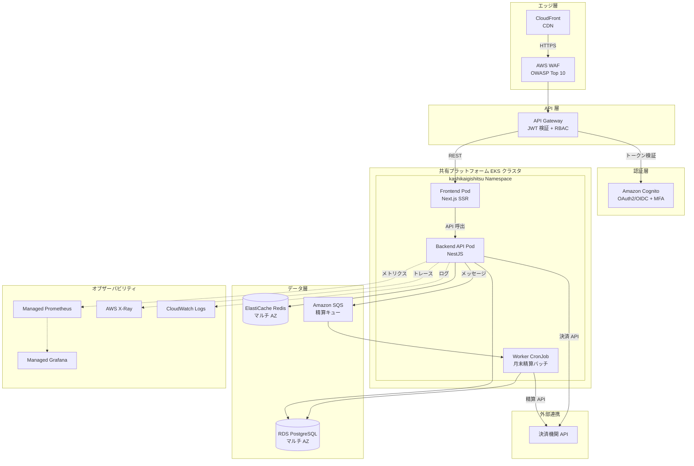
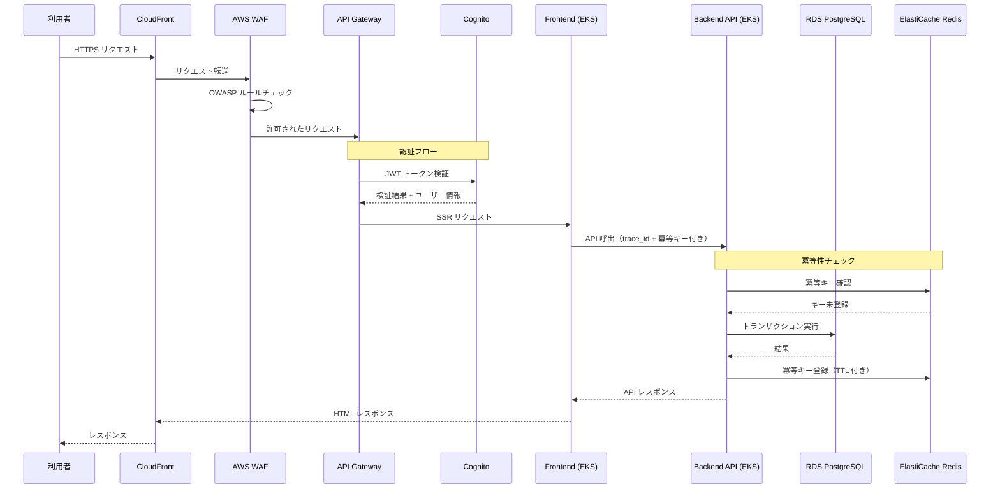
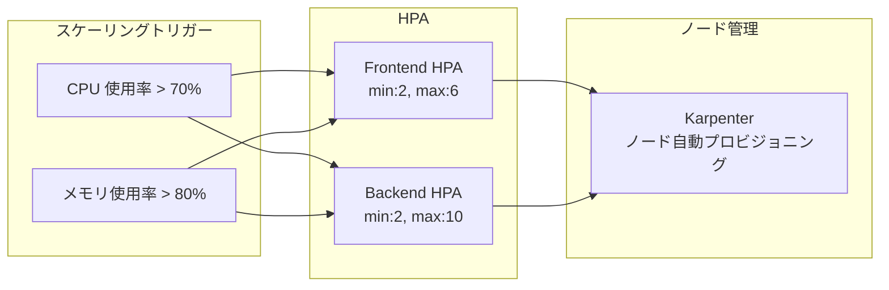
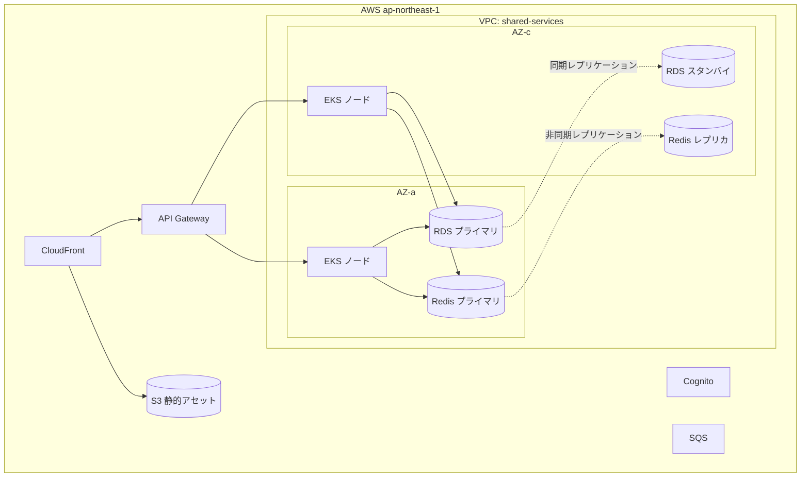

# 貸し会議室サービス ターゲットアーキテクチャ

## 概要

貸し会議室サービスは、会議室オーナーと利用者をマッチングするWebアプリケーションとしてAWS上に構築する。共有プラットフォームのEKSランタイムを基盤とし、RDS for PostgreSQLとElastiCache for Redisをデータ層に配置する。

## ワークロード全体構成図

## リクエストフロー図

## オートスケーリング構成図

## AWS デプロイメント図

## 主要設計判断

| # | 判断内容 | 選択 | 根拠 |
|---|---------|------|------|
| 1 | コンピュートモデル | EKS コンテナ中心 | 共有プラットフォーム活用 + 精算バッチ 8 時間制約 |
| 2 | データベース | RDS for PostgreSQL | コスト効率 + UPSERT 対応 + マルチ AZ |
| 3 | キャッシュ | ElastiCache for Redis | セッション + 冪等キー管理の高速処理 |
| 4 | 認証 | Amazon Cognito | マネージド IdP + MFA + OAuth2/OIDC |
| 5 | CDN | CloudFront | 静的アセット配信 + HTTPS 強制 |

## コスト概算（月額）

| サービス | カテゴリ | 月額 (USD) |
|---------|---------|-----------|
| EKS（共有クラスタ利用分） | コンピュート | 350 |
| RDS for PostgreSQL | データベース | 450 |
| ElastiCache for Redis | キャッシュ | 280 |
| API Gateway | ネットワーク | 50 |
| CloudFront | ネットワーク | 30 |
| SQS | メッセージング | 5 |
| Cognito | セキュリティ | 50 |
| WAF | セキュリティ | 20 |
| CloudWatch + S3 | オブザーバビリティ | 80 |
| その他 | その他 | 30 |
| **合計** | | **1,345** |
