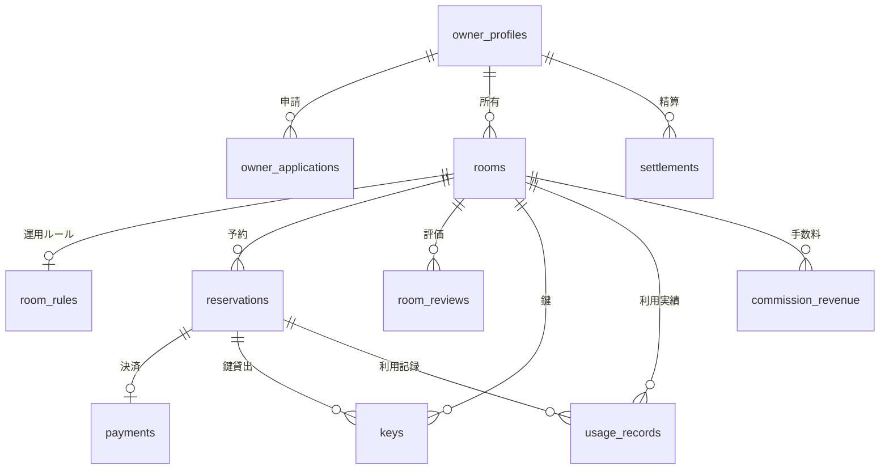

# データストアスキーマ

## サマリー

| データストア | 項目数 |
|------------|:------:|
| RDB テーブル | 15 |
| RDB インデックス | 23 |
| RDB 外部キー | 0 |
| KVS キーパターン | 2 |

## RDB

RoomConnect RDB テーブル定義

### ER 図


```

### テーブル一覧

| テーブル名 | RDRA 情報 | 説明 | カラム数 | インデックス数 | 利用 UC 数 |
|-----------|----------|------|:-------:|:----------:|:--------:|
| owner_profiles | オーナープロフィール |  | 7 | 1 | 0 |
| owner_applications | オーナー申請 |  | 5 | 1 | 0 |
| rooms | 会議室 |  | 8 | 3 | 0 |
| room_rules | 運用ルール |  | 4 | 1 | 0 |
| reservations | 予約 |  | 9 | 3 | 0 |
| payments | 決済情報 |  | 6 | 1 | 0 |
| room_reviews | 会議室評価 |  | 6 | 2 | 0 |
| user_reviews | 利用者評価 |  | 6 | 1 | 0 |
| keys | 鍵 |  | 6 | 1 | 0 |
| usage_records | 利用実績 |  | 5 | 2 | 0 |
| revenue_records | 売上実績 |  | 5 | 1 | 0 |
| commission_revenue | 手数料売上 |  | 4 | 1 | 0 |
| usage_history | 利用履歴 |  | 5 | 2 | 0 |
| settlements | 精算情報 |  | 8 | 1 | 0 |
| inquiries | 問合せ |  | 7 | 2 | 0 |

### owner_profiles

**RDRA 情報**: オーナープロフィール
**説明**: 

#### カラム

| カラム名 | 型 | NULL | 説明 |
|---------|---|:----:|------|
| id | string | NO |  |
| name | string | NO |  |
| contact | string | NO |  |
| introduction | string | NO |  |
| status | string | NO |  |
| created_at | timestamp | NO |  |
| updated_at | timestamp | NO |  |

#### インデックス

| 名前 | カラム | UNIQUE | 理由 | 利用 UC |
|------|-------|:------:|------|--------|
|  | id | NO |  |  |

### owner_applications

**RDRA 情報**: オーナー申請
**説明**: 

#### カラム

| カラム名 | 型 | NULL | 説明 |
|---------|---|:----:|------|
| id | string | NO |  |
| owner_id | string | NO |  |
| applied_at | timestamp | NO |  |
| review_result | string | NO |  |
| reviewed_at | timestamp | NO |  |

#### インデックス

| 名前 | カラム | UNIQUE | 理由 | 利用 UC |
|------|-------|:------:|------|--------|
|  | owner_id | NO |  |  |

### rooms

**RDRA 情報**: 会議室
**説明**: 

#### カラム

| カラム名 | 型 | NULL | 説明 |
|---------|---|:----:|------|
| id | string | NO |  |
| name | string | NO |  |
| address | string | NO |  |
| price | integer | NO |  |
| capacity | integer | NO |  |
| features | string[] | NO |  |
| owner_id | string | NO |  |
| created_at | timestamp | NO |  |

#### インデックス

| 名前 | カラム | UNIQUE | 理由 | 利用 UC |
|------|-------|:------:|------|--------|
|  | owner_id | NO |  |  |
|  | price | NO |  |  |
|  | features | NO |  |  |

### room_rules

**RDRA 情報**: 運用ルール
**説明**: 

#### カラム

| カラム名 | 型 | NULL | 説明 |
|---------|---|:----:|------|
| id | string | NO |  |
| room_id | string | NO |  |
| cancellation_policy | string | NO |  |
| is_available | boolean | NO |  |

#### インデックス

| 名前 | カラム | UNIQUE | 理由 | 利用 UC |
|------|-------|:------:|------|--------|
|  | room_id | NO |  |  |

### reservations

**RDRA 情報**: 予約
**説明**: 

#### カラム

| カラム名 | 型 | NULL | 説明 |
|---------|---|:----:|------|
| id | string | NO |  |
| user_id | string | NO |  |
| room_id | string | NO |  |
| start_at | timestamp | NO |  |
| end_at | timestamp | NO |  |
| status | string | NO |  |
| total_price | integer | NO |  |
| idempotency_key | string | NO |  |
| created_at | timestamp | NO |  |

#### インデックス

| 名前 | カラム | UNIQUE | 理由 | 利用 UC |
|------|-------|:------:|------|--------|
|  | room_id, start_at, end_at | NO |  |  |
|  | user_id | NO |  |  |
|  | idempotency_key | NO |  |  |

### payments

**RDRA 情報**: 決済情報
**説明**: 

#### カラム

| カラム名 | 型 | NULL | 説明 |
|---------|---|:----:|------|
| id | string | NO |  |
| reservation_id | string | NO |  |
| user_id | string | NO |  |
| payment_method | string | NO |  |
| card_number_encrypted | string | NO |  |
| status | string | NO |  |

#### インデックス

| 名前 | カラム | UNIQUE | 理由 | 利用 UC |
|------|-------|:------:|------|--------|
|  | reservation_id | NO |  |  |

### room_reviews

**RDRA 情報**: 会議室評価
**説明**: 

#### カラム

| カラム名 | 型 | NULL | 説明 |
|---------|---|:----:|------|
| id | string | NO |  |
| user_id | string | NO |  |
| room_id | string | NO |  |
| rating | integer | NO |  |
| comment | string | NO |  |
| created_at | timestamp | NO |  |

#### インデックス

| 名前 | カラム | UNIQUE | 理由 | 利用 UC |
|------|-------|:------:|------|--------|
|  | room_id | NO |  |  |
|  | user_id | NO |  |  |

### user_reviews

**RDRA 情報**: 利用者評価
**説明**: 

#### カラム

| カラム名 | 型 | NULL | 説明 |
|---------|---|:----:|------|
| id | string | NO |  |
| owner_id | string | NO |  |
| user_id | string | NO |  |
| rating | integer | NO |  |
| comment | string | NO |  |
| created_at | timestamp | NO |  |

#### インデックス

| 名前 | カラム | UNIQUE | 理由 | 利用 UC |
|------|-------|:------:|------|--------|
|  | user_id | NO |  |  |

### keys

**RDRA 情報**: 鍵
**説明**: 

#### カラム

| カラム名 | 型 | NULL | 説明 |
|---------|---|:----:|------|
| id | string | NO |  |
| room_id | string | NO |  |
| reservation_id | string | NO |  |
| status | string | NO |  |
| lend_at | timestamp | NO |  |
| return_at | timestamp | NO |  |

#### インデックス

| 名前 | カラム | UNIQUE | 理由 | 利用 UC |
|------|-------|:------:|------|--------|
|  | room_id | NO |  |  |

### usage_records

**RDRA 情報**: 利用実績
**説明**: 

#### カラム

| カラム名 | 型 | NULL | 説明 |
|---------|---|:----:|------|
| id | string | NO |  |
| room_id | string | NO |  |
| reservation_id | string | NO |  |
| usage_date | date | NO |  |
| usage_hours | decimal | NO |  |

#### インデックス

| 名前 | カラム | UNIQUE | 理由 | 利用 UC |
|------|-------|:------:|------|--------|
|  | room_id | NO |  |  |
|  | reservation_id | NO |  |  |

### revenue_records

**RDRA 情報**: 売上実績
**説明**: 

#### カラム

| カラム名 | 型 | NULL | 説明 |
|---------|---|:----:|------|
| id | string | NO |  |
| owner_id | string | NO |  |
| room_id | string | NO |  |
| amount | integer | NO |  |
| target_month | string | NO |  |

#### インデックス

| 名前 | カラム | UNIQUE | 理由 | 利用 UC |
|------|-------|:------:|------|--------|
|  | owner_id, target_month | NO |  |  |

### commission_revenue

**RDRA 情報**: 手数料売上
**説明**: 

#### カラム

| カラム名 | 型 | NULL | 説明 |
|---------|---|:----:|------|
| id | string | NO |  |
| amount | integer | NO |  |
| target_month | string | NO |  |
| room_id | string | NO |  |

#### インデックス

| 名前 | カラム | UNIQUE | 理由 | 利用 UC |
|------|-------|:------:|------|--------|
|  | target_month | NO |  |  |

### usage_history

**RDRA 情報**: 利用履歴
**説明**: 

#### カラム

| カラム名 | 型 | NULL | 説明 |
|---------|---|:----:|------|
| id | string | NO |  |
| user_id | string | NO |  |
| room_id | string | NO |  |
| usage_date | date | NO |  |
| usage_hours | decimal | NO |  |

#### インデックス

| 名前 | カラム | UNIQUE | 理由 | 利用 UC |
|------|-------|:------:|------|--------|
|  | user_id | NO |  |  |
|  | room_id | NO |  |  |

### settlements

**RDRA 情報**: 精算情報
**説明**: 

#### カラム

| カラム名 | 型 | NULL | 説明 |
|---------|---|:----:|------|
| id | string | NO |  |
| owner_id | string | NO |  |
| target_month | string | NO |  |
| amount | integer | NO |  |
| status | string | NO |  |
| payment_date | date | NO |  |
| payment_ref | string | NO |  |
| executed_at | timestamp | NO |  |

#### インデックス

| 名前 | カラム | UNIQUE | 理由 | 利用 UC |
|------|-------|:------:|------|--------|
|  | owner_id, target_month | NO |  |  |

### inquiries

**RDRA 情報**: 問合せ
**説明**: 

#### カラム

| カラム名 | 型 | NULL | 説明 |
|---------|---|:----:|------|
| id | string | NO |  |
| sender_id | string | NO |  |
| receiver_id | string | NO |  |
| subject | string | NO |  |
| content | string | NO |  |
| reply | string | NO |  |
| created_at | timestamp | NO |  |

#### インデックス

| 名前 | カラム | UNIQUE | 理由 | 利用 UC |
|------|-------|:------:|------|--------|
|  | sender_id | NO |  |  |
|  | receiver_id | NO |  |  |

## KVS

RoomConnect KVS キーパターン定義

| キーパターン | 用途 | 値の型 | TTL | 利用 UC |
|------------|------|-------|-----|--------|
| `idempotency:{idempotency_key}` | 冪等キー管理。予約登録・精算実行等の重複リクエスト検知 | JSON | 24h | 予約を登録する, 予約を変更する, 予約を取消する, 鍵の貸出を記録する, 鍵の返却を記録する, 精算を実行する |
| `session:{user_id}` | リフレッシュトークン管理 | string | 30d | 全UC（認証） |

### `idempotency:{idempotency_key}`

- **用途**: 冪等キー管理。予約登録・精算実行等の重複リクエスト検知
- **値の型**: JSON
- **TTL**: 24h
- **利用 UC**: 予約を登録する, 予約を変更する, 予約を取消する, 鍵の貸出を記録する, 鍵の返却を記録する, 精算を実行する

### `session:{user_id}`

- **用途**: リフレッシュトークン管理
- **値の型**: string
- **TTL**: 30d
- **利用 UC**: 全UC（認証）
