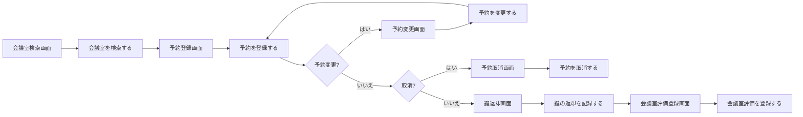
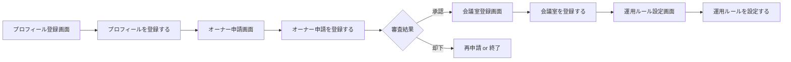
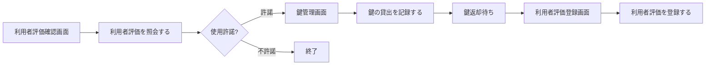
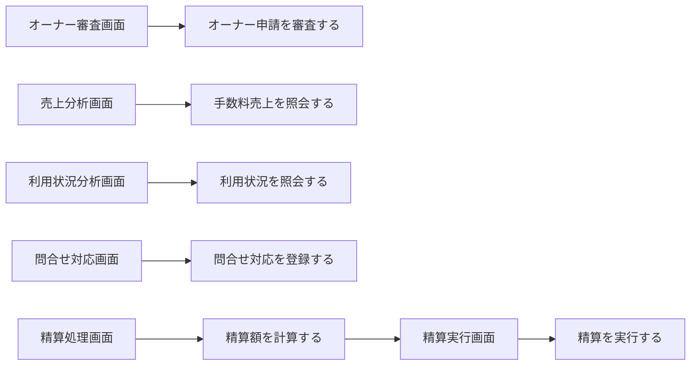
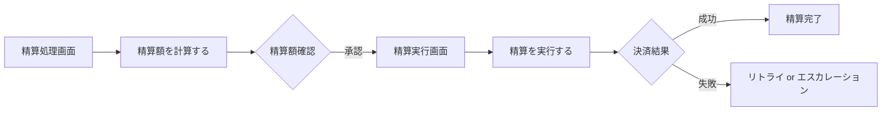
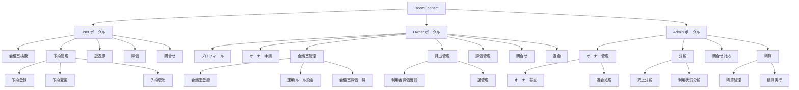

# UX デザイン仕様

## ユーザーフロー

### 会議室予約業務: 利用者予約フロー

**アクター**: 利用者
**ゴール**: 条件に合う会議室を見つけて予約し、利用後に評価する

**タッチポイント**:
| ステップ | 画面 | UC | 感情 | 改善機会 |
|---------|------|---|------|---------|
| 検索 | 会議室検索画面 | 会議室を検索する | ニュートラル | フィルター充実で期待感を高める |
| 予約 | 予約登録画面 | 予約を登録する | ポジティブ | カレンダーUIで直感的に日時選択 |
| 鍵返却 | 鍵返却画面 | 鍵の返却を記録する | ニュートラル | ワンタップで返却完了の手軽さ |
| 評価 | 会議室評価登録画面 | 会議室評価を登録する | ポジティブ | 星評価で簡単にフィードバック |

### オーナー管理業務: オーナー登録フロー

**アクター**: 会議室オーナー
**ゴール**: サービスに登録し会議室を提供開始する

**タッチポイント**:
| ステップ | 画面 | UC | 感情 | 改善機会 |
|---------|------|---|------|---------|
| プロフィール登録 | プロフィール登録画面 | プロフィールを登録する | ニュートラル | 必要最小限の入力で負担軽減 |
| 申請 | オーナー申請画面 | オーナー申請を登録する | 期待 | 審査プロセスの透明性を示す |
| 会議室登録 | 会議室登録画面 | 会議室を登録する | ポジティブ | ステップバイステップのガイド |

### 会議室貸出業務: 貸出管理フロー

**アクター**: 会議室オーナー
**ゴール**: 予約利用者への鍵貸出・返却管理と評価

### サービス運営業務: 運営管理フロー

**アクター**: サービス運営担当者
**ゴール**: サービス全体の健全な運営管理

### 精算業務: 月次精算フロー

**アクター**: サービス運営担当者
**ゴール**: 月末にオーナーへの精算を正確に処理する

## 情報アーキテクチャ（IA）

### サイトマップ

### ナビゲーション構造

| ポータル | プライマリナビ | セカンダリナビ |
|---------|-------------|-------------|
| User | 会議室検索, 予約一覧, 問合せ | 予約詳細, 鍵返却, 評価登録 |
| Owner | ダッシュボード, 会議室管理, 貸出管理, 評価, 問合せ, 設定 | 会議室登録, 運用ルール, 鍵管理, 利用者評価 |
| Admin | ダッシュボード, オーナー管理, 分析, 問合せ, 精算 | オーナー審査, 退会処理, 売上分析, 利用状況, 精算実行 |

### ページ間の遷移ルール

- User: 検索結果 → 会議室詳細 → 予約登録の直線的フロー
- Owner: ダッシュボードから各管理画面へのハブ型ナビゲーション
- Admin: サイドバーメニューからの直接アクセス
- 完了アクション後は一覧画面にリダイレクト（成功トースト表示）
- エラー時は同一画面に留まりエラーメッセージを表示

## UX 心理学に基づくインタラクション設計原則

### 適用する原則

| 原則 | 適用場面 | 具体的な設計 |
|------|---------|-----------|
| 認知負荷 (Cognitive Load) | 全画面 | 一画面の情報量を4-5項目に制限。段階的開示で詳細を折りたたみ |
| 段階的開示 (Progressive Disclosure) | オーナー申請、会議室登録 | ウィザード形式で段階的に入力。プログレスバーで進捗表示 |
| 社会的証明 (Social Proof) | 会議室検索画面 | 評価件数・平均評価を表示し信頼性を担保 |
| 希少性効果 (Scarcity) | 予約登録画面 | 「残り{N}枠」の空き枠表示で予約を促進 |
| ドハティの閾値 (Doherty Threshold) | 検索・一覧画面 | Skeleton UI で0.4秒以内の体感応答を実現 |
| ピーク・エンドの法則 (Peak-End Rule) | 予約完了、評価完了 | 完了画面で達成感を演出（チェックマークアニメーション） |
| 意図的な壁 (Intentional Friction) | 退会申請、予約取消、精算実行 | 確認ダイアログで誤操作を防止 |
| 目標勾配効果 (Goal Gradient Effect) | オーナー登録フロー | ステップバーで完了率を可視化し登録完了を促進 |

## アクセシビリティ方針

- **WCAG 準拠レベル**: AA
- **キーボード操作**: 全操作がキーボードのみで完結可能。フォーカスインジケーター必須
- **スクリーンリーダー**: ARIA ラベルを全インタラクティブ要素に設定。ライブリージョンで動的変更を通知
- **色覚多様性**: 色だけに依存しない情報伝達（アイコン・テキスト併用）。コントラスト比4.5:1以上
