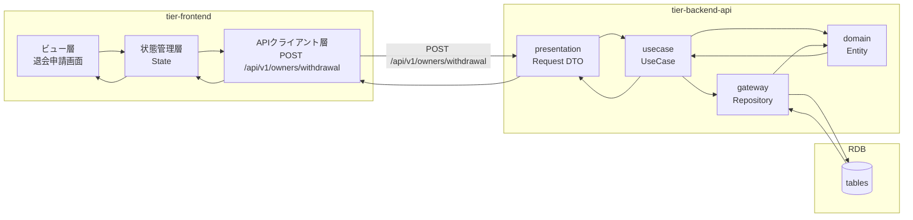
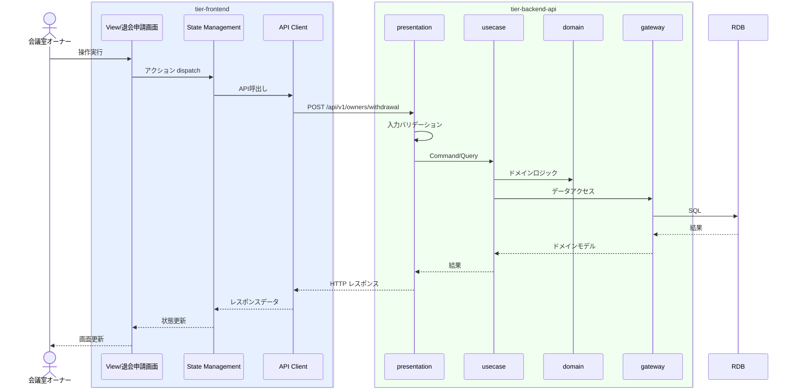

# 退会を申請する

## 概要

オーナーがサービスから退会手続きを行う

## データフロー



| レイヤー | データモデル | 変換内容 |
|---------|------------|---------|
| FE View | 退会申請画面の入力/表示 | ユーザー操作をリクエストに変換 |
| BE presentation | Request DTO | バリデーション + Command/Query変換 |
| BE gateway | SQL操作 | データ永続化/取得 |
| Response | レスポンスJSON | 表示用データ |

## 処理フロー



## バリエーション一覧

該当なし

## 分岐条件一覧

該当なし

## 計算ルール一覧

該当なし

## 状態遷移一覧

該当なし

## 関連 RDRA モデル

| モデル種別 | 要素名 | 関連 |
|-----------|--------|------|
| 業務 | オーナー管理業務 | このUCが属する業務 |
| BUC | オーナー退会フロー | このUCを含むBUC |
| アクター | 会議室オーナー | 操作するアクター |
| 情報 |  | 参照・更新する情報 |
| 状態 |  | 関連する状態遷移 |

## E2E 完了条件（BDD）

### 正常系

```gherkin
Feature: 退会を申請する

  Scenario: 退会を申請するの正常実行
    Given 会議室オーナー「テストユーザー」がログイン済み
    When 退会申請画面で操作を実行する
    Then 操作が正常に完了する
```

### 異常系

```gherkin
  Scenario: 未認証ユーザーのアクセス拒否
    Given ユーザーが未ログイン状態
    When 退会申請画面にアクセスする
    Then ログイン画面にリダイレクトされる
```

## ティア別仕様

- [フロントエンド](tier-frontend.md)
- [バックエンド API](tier-backend-api.md)

### 統合 API Spec

- [OpenAPI Spec](../../_cross-cutting/api/openapi.yaml)
