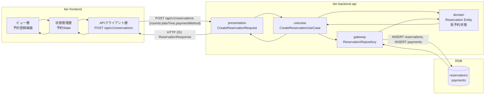
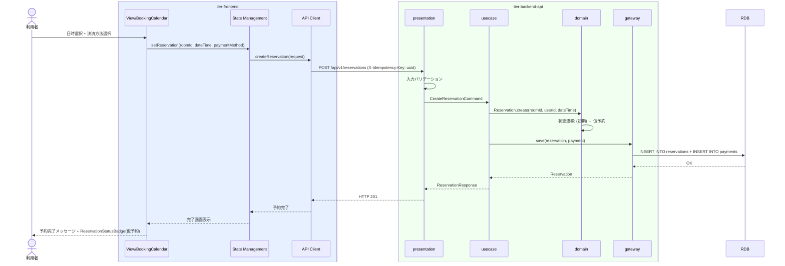

# 予約を登録する

## 概要

利用者が会議室を予約し決済方法を設定する。予約は仮予約状態で登録され、オーナーの使用許諾後に確定する。

## データフロー



| レイヤー | データモデル | 変換内容 |
|---------|------------|---------|
| FE View | BookingCalendar日時選択 + 決済方法選択 | フォーム入力をリクエストボディに変換 |
| BE presentation | CreateReservationRequest(roomId, startAt, endAt, paymentMethod) | 入力バリデーション + Command変換 |
| BE gateway | INSERT reservations + INSERT payments | 予約レコード + 決済情報レコード作成 |
| Response | ReservationResponse(id, status, room, dateTime) | 予約確認表示用データ |

## 処理フロー



## バリエーション一覧

| バリエーション名 | 値 | 処理内容 | 適用 tier | 適用箇所 |
|----------------|---|---------|----------|---------|
| 決済方法 | クレジットカード | カード番号入力フォーム表示 | tier-frontend | 予約登録画面 |
| 決済方法 | 電子マネー | 電子マネー選択UI表示 | tier-frontend | 予約登録画面 |

## 分岐条件一覧

該当なし

## 計算ルール一覧

| 計算名 | 入力情報 | 計算式/ロジック | 出力情報 | 適用 tier |
|--------|---------|---------------|---------|----------|
| 利用料金算出 | 会議室.価格, 利用時間 | 価格(円/時間) x 利用時間(時間) | 利用料金 | tier-backend-api |

## 状態遷移一覧

| 状態モデル | 遷移元 | 遷移先 | トリガー | 事前条件 | 事後処理 | 適用 tier |
|-----------|--------|--------|---------|---------|---------|----------|
| 予約状態 | (初期) | 仮予約 | 予約を登録する | 会議室が存在し空きあり | 決済情報の保存 | tier-backend-api |
| 会議室利用状態 | (初期) | 利用前 | 予約を登録する | 予約状態が仮予約 | 利用実績レコード作成 | tier-backend-api |

## 関連 RDRA モデル

| モデル種別 | 要素名 | 関連 |
|-----------|--------|------|
| 業務 | 会議室予約業務 | このUCが属する業務 |
| BUC | 会議室予約フロー | このUCを含むBUC |
| アクター | 利用者 | 操作するアクター |
| 情報 | 予約 | 作成する情報 |
| 情報 | 決済情報 | 作成する情報 |
| 状態 | 予約状態 | 仮予約への遷移 |
| 状態 | 会議室利用状態 | 利用前への遷移 |

## E2E 完了条件（BDD）

### 正常系

```gherkin
Feature: 予約を登録する

  Scenario: クレジットカードで会議室を予約する
    Given 利用者「田中太郎」がログイン済み
    And 会議室「新宿会議室A」が価格3000円/時間で登録済み
    When 「新宿会議室A」を2026年4月15日 10:00-12:00で予約する
    And 決済方法で「クレジットカード」を選択し、カード番号「4111-1111-1111-1111」を入力する
    Then 予約が「仮予約」状態で登録される
    And 利用料金が6000円と表示される
    And ReservationStatusBadge に「仮予約」が表示される

  Scenario: 電子マネーで会議室を予約する
    Given 利用者「田中太郎」がログイン済み
    And 会議室「渋谷会議室B」が価格2000円/時間で登録済み
    When 「渋谷会議室B」を2026年4月16日 14:00-16:00で予約する
    And 決済方法で「電子マネー」を選択する
    Then 予約が「仮予約」状態で登録される
    And 利用料金が4000円と表示される
```

### 異常系

```gherkin
  Scenario: 過去の日時で予約を試みる
    Given 利用者「田中太郎」がログイン済み
    When 「新宿会議室A」を2025年1月1日 10:00-12:00で予約する
    Then 「過去の日時は指定できません」とエラーが表示される

  Scenario: 冪等キーの重複で二重予約を防止する
    Given 利用者「田中太郎」が同一の冪等キーで予約リクエストを2回送信する
    When 2回目のリクエストが処理される
    Then 1回目と同じ予約レスポンスが返される
    And 予約は1件のみ作成される
```

## ティア別仕様

- [フロントエンド](tier-frontend.md)
- [バックエンド API](tier-backend-api.md)

### 統合 API Spec

- [OpenAPI Spec](../../_cross-cutting/api/openapi.yaml)
