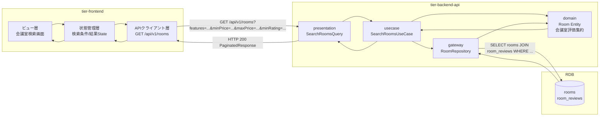
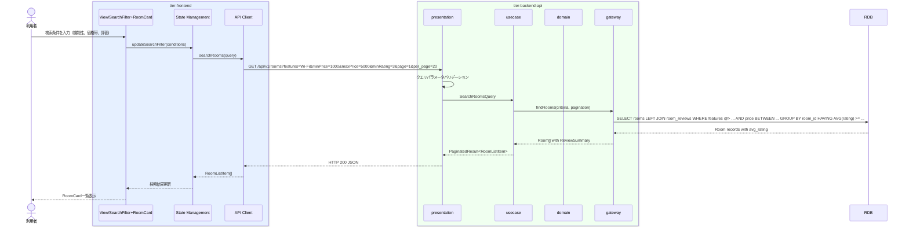

# 会議室を検索する

## 概要

利用者が広さ・価格・機能性・評価などの条件で会議室を検索し、一覧から候補を選定する。

## データフロー



| レイヤー | データモデル | 変換内容 |
|---------|------------|---------|
| FE View | SearchFilter入力値 + RoomCard表示データ | フィルター条件をクエリパラメータに変換 |
| BE presentation | SearchRoomsQuery(features, minPrice, maxPrice, minRating, page, per_page) | クエリパラメータのバリデーション |
| BE gateway | SELECT rooms LEFT JOIN room_reviews GROUP BY room_id | 平均評価の集約クエリ |
| Response | PaginatedResponse<RoomListItem>(items, total, page, per_page) | 一覧表示用データ |

## 処理フロー



## バリエーション一覧

| バリエーション名 | 値 | 処理内容 | 適用 tier | 適用箇所 |
|----------------|---|---------|----------|---------|
| 会議室機能性 | プロジェクター | 機能フィルター条件（複数選択可） | tier-backend-api | SearchRoomsQuery.features |
| 会議室機能性 | ホワイトボード | 機能フィルター条件（複数選択可） | tier-backend-api | SearchRoomsQuery.features |
| 会議室機能性 | Wi-Fi | 機能フィルター条件（複数選択可） | tier-backend-api | SearchRoomsQuery.features |
| 会議室機能性 | テレビ会議設備 | 機能フィルター条件（複数選択可） | tier-backend-api | SearchRoomsQuery.features |

## 分岐条件一覧

該当なし（検索は条件.tsvに定義された条件を使用しない）

## 計算ルール一覧

| 計算名 | 入力情報 | 計算式/ロジック | 出力情報 | 適用 tier |
|--------|---------|---------------|---------|----------|
| 平均評価算出 | 会議室評価.評価点 | AVG(評価点) WHERE 会議室ID = target | 平均評価 | tier-backend-api |

## 状態遷移一覧

該当なし（検索は状態遷移を伴わない）

## 関連 RDRA モデル

| モデル種別 | 要素名 | 関連 |
|-----------|--------|------|
| 業務 | 会議室予約業務 | このUCが属する業務 |
| BUC | 会議室予約フロー | このUCを含むBUC |
| アクター | 利用者 | 操作するアクター |
| 情報 | 会議室 | 検索対象の情報 |
| 情報 | 会議室評価 | 評価フィルター・表示に使用 |

## E2E 完了条件（BDD）

### 正常系

```gherkin
Feature: 会議室を検索する

  Scenario: 条件なしで全会議室を検索する
    Given 利用者「田中太郎」がログイン済み
    When 会議室検索画面を表示する
    Then 登録済みの全会議室がRoomCard一覧で表示される
    And ページネーションで1ページあたり20件表示される

  Scenario: 機能性フィルターで会議室を検索する
    Given 利用者「田中太郎」がログイン済み
    And 「Wi-Fi」「プロジェクター」を備えた会議室「新宿会議室A」が登録済み
    When 機能性フィルターで「Wi-Fi」「プロジェクター」を選択して検索する
    Then 「新宿会議室A」が検索結果に含まれる
    And 「Wi-Fi」を備えていない会議室は結果に含まれない

  Scenario: 価格帯で会議室を検索する
    Given 利用者「田中太郎」がログイン済み
    And 価格1000円の会議室「格安会議室B」と価格10000円の会議室「高級会議室C」が登録済み
    When 価格帯を1000円〜5000円に設定して検索する
    Then 「格安会議室B」が検索結果に含まれる
    And 「高級会議室C」は検索結果に含まれない

  Scenario: 評価で会議室をフィルターする
    Given 利用者「田中太郎」がログイン済み
    And 平均評価4.5の会議室「高評価会議室D」と平均評価2.0の会議室「低評価会議室E」が登録済み
    When 最低評価3.0以上でフィルターして検索する
    Then 「高評価会議室D」が検索結果に含まれる
    And 「低評価会議室E」は検索結果に含まれない
```

### 異常系

```gherkin
  Scenario: 検索条件に合致する会議室がない場合
    Given 利用者「田中太郎」がログイン済み
    When 価格帯を1円〜2円に設定して検索する
    Then 「条件に一致する会議室が見つかりませんでした」と表示される
    And 検索条件の変更が促される

  Scenario: 未認証ユーザーが検索を試みる場合
    Given ユーザーが未ログイン状態
    When 会議室検索画面にアクセスする
    Then ログイン画面にリダイレクトされる
```

## ティア別仕様

- [フロントエンド](tier-frontend.md)
- [バックエンド API](tier-backend-api.md)

### 統合 API Spec

- [OpenAPI Spec](../../_cross-cutting/api/openapi.yaml)（全 UC 統合、Contract First 開発用）
