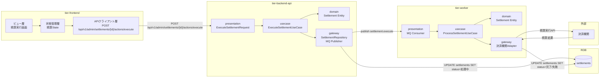
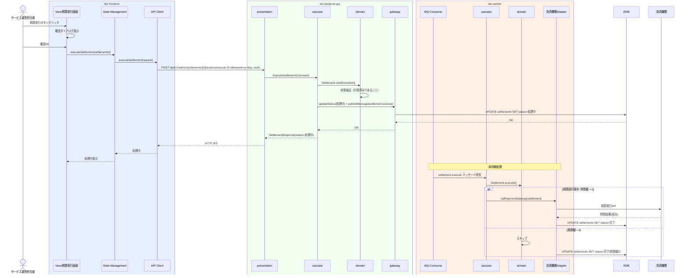

# 精算を実行する

## 概要

オーナーへの精算を決済機関を通じて実行する。運営担当者が精算実行画面で実行し、バックエンドワーカーが決済機関と非同期で連携する。

## データフロー



| レイヤー | データモデル | 変換内容 |
|---------|------------|---------|
| FE View | 精算情報表示 + 実行ボタン | 精算ID → 実行リクエスト |
| BE presentation | ExecuteSettlementRequest(settlementId) | バリデーション + MQ パブリッシュ |
| Worker gateway | 決済機関API呼出し | 精算実行 + 結果更新 |
| Response | SettlementResponse(id, status) | 処理中ステータス表示 |

## 処理フロー



## バリエーション一覧

該当なし

## 分岐条件一覧

| 条件名 | 判定ルール | 適用 tier | 適用箇所 | BDD Scenario |
|--------|----------|----------|---------|-------------|
| 精算実行条件 | 月末時点の利用履歴に基づき精算額が0より大きいこと | tier-worker | ProcessSettlementUseCase | 精算額0のオーナーはスキップ |

## 計算ルール一覧

該当なし（計算は「精算額を計算する」UCの責務）

## 状態遷移一覧

該当なし（精算情報は状態.tsvに定義なし。内部的に「計算済み→処理中→完了/失敗」を管理）

## 関連 RDRA モデル

| モデル種別 | 要素名 | 関連 |
|-----------|--------|------|
| 業務 | 精算業務 | このUCが属する業務 |
| BUC | オーナー精算フロー | このUCを含むBUC |
| アクター | サービス運営担当者 | 操作するアクター |
| 情報 | 精算情報 | 更新する情報 |
| 条件 | 精算実行条件 | 適用される条件 |
| 外部システム | 決済機関 | 精算実行の連携先 |

## E2E 完了条件（BDD）

### 正常系

```gherkin
Feature: 精算を実行する

  Scenario: 精算を正常に実行する
    Given サービス運営担当者「管理太郎」がログイン済み
    And オーナー「鈴木花子」の2026年3月分の精算額150000円が計算済み
    When 精算実行画面で「鈴木花子」の精算を実行する
    Then 精算状態が「処理中」に変わる
    And 決済機関への精算が非同期で実行される
    And 精算完了後に状態が「完了」に更新される

  Scenario: 精算額0のオーナーはスキップされる
    Given オーナー「田中次郎」の2026年3月分の精算額が0円
    When 精算を実行する
    Then 精算状態が「完了（精算額0）」に更新される
    And 決済機関への連携は行われない
```

### 異常系

```gherkin
  Scenario: 決済機関エラー時のリトライ
    Given オーナー「鈴木花子」の精算を実行中
    When 決済機関から一時的なエラーが返る
    Then 指数バックオフで最大3回リトライされる
    And 全リトライ失敗後は精算状態が「失敗」に更新される

  Scenario: 冪等キーによる二重精算防止
    Given 同一の冪等キーで精算実行リクエストを2回送信する
    When 2回目のリクエストが処理される
    Then 1回目と同じレスポンスが返される
    And 精算は1回のみ実行される
```

## ティア別仕様

- [フロントエンド](tier-frontend.md)
- [バックエンド API](tier-backend-api.md)
- [バックエンドワーカー](tier-worker.md)

### 統合 API Spec

- [OpenAPI Spec](../../_cross-cutting/api/openapi.yaml)
- [AsyncAPI Spec](../../_cross-cutting/api/asyncapi.yaml)
