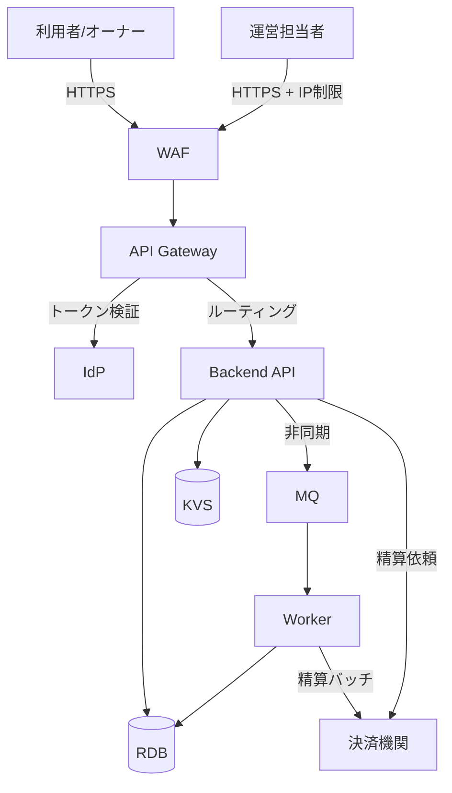
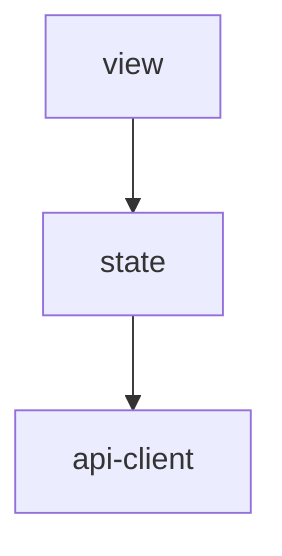
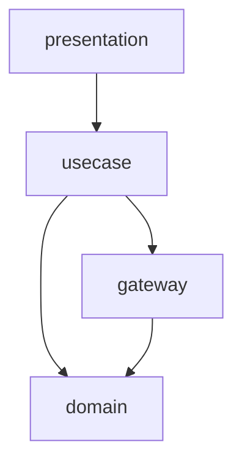
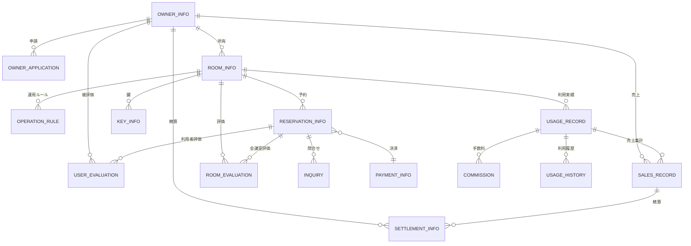

# アーキテクチャ設計書

## 概要

| 項目 | 内容 |
|------|------|
| イベントID | 20260330_153500_infra_feedback |
| 作成日時 | 2026-03-30T15:35:00 |
| ソース | インフラ設計 20260330_152948_infra_product_design に基づくアーキテクチャフィードバック |
| 言語 | TypeScript |
| フレームワーク | Next.js, Hono |
| 技術的制約 | モノレポ構成, ベンダーニュートラル（クラウドベンダー固有サービス名を使用しない）, RDB 接続プール上限 200（マネージド RDB 共通制約。接続プーリングミドルウェアの導入を検討すること）, MQ メッセージ保持期間 最大14日（マネージド MQ 共通制約）, MQ メッセージ可視性タイムアウト 300秒（ワーカー処理時間に応じて調整すること）, API Gateway バースト上限 200 req/s、定常レート上限 100 req/s（マネージド API Gateway 共通制約） |

## システムアーキテクチャ

### システム構成図

### ティア構成

| ID | ティア名 | 説明 | テクノロジー候補 |
|-----|---------|------|----------------|
| tier-frontend | フロントエンド | 利用者・会議室オーナー・サービス運営担当者向け Web UI。レスポンシブデザインでモバイル対応 | SSR, SPA |
| tier-api-gateway | API Gateway | 全ティアへのリクエストルーティング、トークン検証、粗粒度 RBAC、レート制限、WAF 統合 | API Gateway, リバースプロキシ |
| tier-idp | IdP | 認証基盤。トークン発行・ユーザー登録・パスワードリセット・MFA 管理を担う | マネージド IdP |
| tier-backend-api | バックエンド API | ビジネスロジック処理。予約管理・オーナー管理・評価管理・精算管理等の業務ロジックを集約 | CaaS(k8s) |
| tier-backend-worker | バックエンドワーカー | 非同期処理・バッチ処理。月末精算処理、通知メール送信等を実行 | CronJob(k8s), MQ |
| tier-datastore | データストア | データ永続化層。RDB をメインストレージとし、KVS でキャッシュ・セッション管理を行う | RDB, KVS |
| tier-external | 外部連携 | 決済機関との連携。精算依頼・利用料引き落としを処理するアダプタ | アダプタパターン |

### フロントエンド (tier-frontend) の方針・ルール

#### 方針

| ID | 方針名 | 内容 | 根拠 | RDRA/NFR 要素 | 確信度 |
|-----|---------|------|------|--------------|:------:|
| SP-001 | レスポンシブデザイン | モバイル・デスクトップ両対応のレスポンシブ UI を提供する | 利用者がモバイルブラウザからも会議室検索・予約を行うため | NFR F.1.1.2, NFR F.1.1.3, BUC: 会議室予約フロー | 高 |
| SP-002 | アクター別 UI 分離 | 利用者向け画面・オーナー向け画面・運営管理画面を分離する | アクター3種が異なるロールと操作権限を持つため | アクター: 利用者, 会議室オーナー, サービス運営担当者 | 高 |
| SP-003 | アクセシビリティ対応 | JIS X 8341-3 レベル AA 準拠のアクセシビリティを確保する | 一般利用者向け Web サービスのため | NFR F.3.1.2 | 低 |

#### ルール

| ID | ルール名 | 内容 | 根拠 | RDRA/NFR 要素 | 確信度 |
|-----|---------|------|------|--------------|:------:|
| SR-001 | API 経由のデータアクセス | フロントエンドからデータストアへの直接アクセスを禁止し、必ず Backend API を経由する | セキュリティとデータ整合性の確保 | NFR E.6.1.2 | 高 |
| SR-002 | 冪等キー生成 | 状態変更リクエストごとに冪等キー（UUID）を生成し、リクエストヘッダー X-Idempotency-Key に付与する。ダブルクリック防止の UI 制御も併用する | 予約・決済等の状態変更操作で重複送信を防止するため | BUC: 会議室予約フロー, 予約変更取消フロー, 情報: 決済情報 | 高 |
| SR-003 | トレースID生成 | リクエストごとに trace_id（UUID）を生成し、リクエストヘッダーに付与する | リクエストの起点を一意に特定し、全ティア横断のトレーサビリティを確保するため | NFR C.1.3.1, NFR C.6.1.1 | 中 |

### API Gateway (tier-api-gateway) の方針・ルール

#### 方針

| ID | 方針名 | 内容 | 根拠 | RDRA/NFR 要素 | 確信度 |
|-----|---------|------|------|--------------|:------:|
| SP-004 | トークン検証の一元化 | IdP が発行した JWT トークンを API Gateway で一元検証し、Backend API にはユーザー情報をヘッダーで伝播する | 外部アクター2種（利用者・オーナー）と内部アクター1種の認証を集約するため | アクター: 利用者, 会議室オーナー, サービス運営担当者, NFR E.5.1.1 | 高 |
| SP-005 | 粗粒度 RBAC | API Gateway レベルでロールベースのアクセス制御を実施し、エンドポイントごとに許可ロールを定義する | アクター3種の操作権限が明確に分離されているため | NFR E.5.2.1, アクター: 利用者, 会議室オーナー, サービス運営担当者 | 高 |
| SP-006 | WAF 統合 | API Gateway 前段で WAF を統合し、OWASP Top 10 対策を実施する | C2C プラットフォームとしてブラウザからのアクセスが多いため | NFR E.10.1.1, NFR E.10.2.1 | 中 |
| SP-007 | レート制限 | API Gateway でエンドポイントごとのレート制限を実施する | 不正アクセス防止と外部ユーザーからの過負荷を防ぐため | NFR E.5.3.1, NFR B.1.2.1 | 中 |

#### ルール

| ID | ルール名 | 内容 | 根拠 | RDRA/NFR 要素 | 確信度 |
|-----|---------|------|------|--------------|:------:|
| SR-004 | 管理画面接続元制限 | サービス運営担当者向けの管理画面 API は接続元 IP アドレスを制限する | 管理画面は社内からのアクセスに限定すべきため | NFR E.5.3.1, アクター: サービス運営担当者 | 低 |

### IdP (tier-idp) の方針・ルール

#### 方針

| ID | 方針名 | 内容 | 根拠 | RDRA/NFR 要素 | 確信度 |
|-----|---------|------|------|--------------|:------:|
| SP-008 | MFA 対応 | 全アクター種別に対して多要素認証（MFA）を提供する | 決済・精算を伴うサービスであり、セキュリティリスクが高いため | NFR E.5.1.1, 外部システム: 決済機関 | 中 |
| SP-009 | OAuth2/OIDC 準拠 | OAuth2/OIDC プロトコルに準拠した認証フローを提供する | 外部アクターが利用するため、標準的な認証プロトコルが必要 | NFR E.5.1.1, アクター: 利用者, 会議室オーナー | 高 |

### バックエンド API (tier-backend-api) の方針・ルール

#### 方針

| ID | 方針名 | 内容 | 根拠 | RDRA/NFR 要素 | 確信度 |
|-----|---------|------|------|--------------|:------:|
| SP-010 | モノリシック API | 単一のアプリケーションとして全業務ロジックを集約する。業務境界はモジュール分割で対応する | BUC が7業務で独立ドメインが少ないため、初期段階ではモノリシック構成が適切 | BUC: オーナー管理業務, 会議室管理業務, 会議室貸出業務, 会議室予約業務, 評価管理業務, 利用実績管理業務, サービス運営業務 | 中 |
| SP-011 | 冪等性保証 | 冪等キーを KVS で管理し、重複リクエストを検知して前回レスポンスを返却する。状態変更を伴う操作（POST/PUT/DELETE）が対象 | 予約・決済・精算等の状態変更操作で重複処理を防止するため | 状態: 予約状態, 情報: 決済情報, 精算情報, 外部システム: 決済機関 | 高 |
| SP-021 | オートスケーリング方針 | CPU 使用率 70% をターゲットとしたトラッキングスケーリングを採用する。スケールアウト冷却期間 60秒、スケールイン冷却期間 300秒とし、フラッピングを防止する。ベースライン 2 インスタンスは常時稼働、スケールアウト分のみスポット適性を検討する | インフラ設計（MCL product-design）の結果に基づく: ベースライン 50 RPS、ピーク 100 RPS のトラフィックパターンに最適化 | infra: product-cost-hints.yaml → auto_scaling.comp-api, product-impl-aws.yaml → comp-api.auto_scaling | 中 |

#### ルール

| ID | ルール名 | 内容 | 根拠 | RDRA/NFR 要素 | 確信度 |
|-----|---------|------|------|--------------|:------:|
| SR-005 | トレースID伝播 | trace_id をリクエストヘッダーから取得し、処理コンテキストに保持する。後続ティアへの内部通信・MQ メッセージにも伝播する | 全ティア横断のトレーサビリティを確保するため | NFR C.1.3.1, NFR C.6.1.1 | 中 |
| SR-006 | 冪等キー UNIQUE 制約 | データストア（RDB）で冪等キーカラムに UNIQUE 制約を設定し、ON CONFLICT（UPSERT）で重複挿入を防止する | データ層での重複防止による最終防衛線 | 状態: 予約状態, 情報: 決済情報 | 高 |

### バックエンドワーカー (tier-backend-worker) の方針・ルール

#### 方針

| ID | 方針名 | 内容 | 根拠 | RDRA/NFR 要素 | 確信度 |
|-----|---------|------|------|--------------|:------:|
| SP-012 | 精算バッチ処理 | 月末に精算処理をバッチで一括実行する。オーナー数分の精算を処理する | BUC「オーナー精算フロー」に月末精算処理が定義されているため | BUC: オーナー精算フロー, NFR B.2.2.1 | 高 |
| SP-013 | ジョブ冪等性 | ジョブ実行 ID で重複実行を検知する。CronJob はジョブ実行ごとに新規 trace_id を生成する | バッチ処理の重複実行を防止するため | BUC: オーナー精算フロー, 条件: 精算ルール | 中 |
| SP-020 | バッチジョブのスポット/プリエンプティブル適性 | 月末精算バッチはジョブ冪等性が保証されているため、スポットインスタンス（プリエンプティブル VM）で実行可能とする。中断時は自動再実行で対応する | インフラ設計（MCL product-design）の結果に基づく: ジョブ冪等性保証済みのため、スポット中断時の再実行が安全 | infra: product-cost-hints.yaml → compute_savings.comp-worker | 中 |

#### ルール

| ID | ルール名 | 内容 | 根拠 | RDRA/NFR 要素 | 確信度 |
|-----|---------|------|------|--------------|:------:|
| SR-007 | ワーカートレースID | MQ メッセージまたはジョブパラメータから trace_id を取得する。CronJob はジョブ実行ごとに新規 trace_id を生成する | 非同期処理のトレーサビリティを確保するため | NFR C.1.3.1, NFR C.6.1.1 | 中 |

### データストア (tier-datastore) の方針・ルール

#### 方針

| ID | 方針名 | 内容 | 根拠 | RDRA/NFR 要素 | 確信度 |
|-----|---------|------|------|--------------|:------:|
| SP-014 | RDB メインストレージ | トランザクション整合性が必要な予約・決済・精算関連データは RDB に格納する | 金銭取引を伴うデータのトランザクション整合性が必須のため | 情報: 予約情報, 決済情報, 精算情報, NFR A.4.1.1 | 高 |
| SP-015 | KVS キャッシュ・セッション | セッション情報・冪等キーの管理に KVS を使用する | セッション管理と冪等キーの高速参照が必要なため | NFR B.2.1.1, アクター: 利用者, 会議室オーナー | 中 |
| SP-016 | 日次バックアップ | フル+差分バックアップを日次で実施し、7世代管理する | 決済・精算データを含むため日次バックアップが必要 | NFR C.1.2.1, NFR C.1.2.3 | 中 |
| SP-017 | 機密データ暗号化 | カード番号・個人情報（氏名、メールアドレス、電話番号）は保管時に暗号化する | 個人情報保護法準拠および決済情報のセキュリティ確保のため | NFR E.6.1.1, NFR E.1.2.1, 情報: 決済情報, オーナー情報 | 高 |

#### ルール

| ID | ルール名 | 内容 | 根拠 | RDRA/NFR 要素 | 確信度 |
|-----|---------|------|------|--------------|:------:|
| SR-008 | テスト環境マスキング | テスト環境では個人情報およびカード番号をマスキングする | テスト環境での個人情報漏洩を防止するため | NFR E.6.2.1 | 高 |

### 外部連携 (tier-external) の方針・ルール

#### 方針

| ID | 方針名 | 内容 | 根拠 | RDRA/NFR 要素 | 確信度 |
|-----|---------|------|------|--------------|:------:|
| SP-018 | 冪等性確保 | 決済機関への精算依頼は冪等キーを付与し、重複処理を防止する | 金銭取引の重複処理は致命的なため | 外部システム: 決済機関, BUC: オーナー精算フロー | 高 |
| SP-019 | リトライ・サーキットブレーカー | 外部システム呼び出しにリトライとサーキットブレーカーを適用する | 外部システム障害時の連鎖障害を防止するため | 外部システム: 決済機関, NFR A.1.2.1 | 高 |

#### ルール

| ID | ルール名 | 内容 | 根拠 | RDRA/NFR 要素 | 確信度 |
|-----|---------|------|------|--------------|:------:|
| SR-009 | 外部連携ログ | 決済機関との全通信内容（リクエスト/レスポンス）を監査ログとして記録する | 金銭取引の監査証跡を確保するため | NFR E.7.1.1, 外部システム: 決済機関 | 高 |

### ティア共通の方針

| ID | 方針名 | 内容 | 根拠 | RDRA/NFR 要素 | 確信度 |
|-----|---------|------|------|--------------|:------:|
| CTP-001 | 認証方式 | OAuth2/OIDC ベースの認証を全ティア共通で採用する。IdP ティアがトークン発行を担い、API Gateway がトークン検証を行う | 外部アクター2種と内部アクター1種が利用するため、標準的な認証プロトコルが必要 | アクター: 利用者, 会議室オーナー, サービス運営担当者, NFR E.5.1.1 | 高 |
| CTP-002 | 認可方式 | RBAC + Backend 作り込みを採用する。API Gateway で粗粒度 RBAC を実施し、Backend API で所有権ベース・条件ベースの認可を if 文で作り込む | 所有権ベース2パターン、条件ベース2パターンと少数であり、RBAC + Backend 作り込みで十分対応可能 | NFR E.5.2.1, 条件: オーナー審査基準, 利用者許諾条件 | 中 |
| CTP-003 | 構造化ログと相関ID | 全ティアで JSON 形式の構造化ログを出力する。trace_id, span_id, service, timestamp を必須フィールドとして含める | 分散システムの横断的なトレーサビリティ確保のため | NFR C.1.3.1, NFR C.6.1.1, NFR C.6.1.2 | 中 |
| CTP-004 | 冪等性方針 | 全ティアで冪等性を確保する。フロントエンドで冪等キー生成、Backend API で KVS 管理、RDB で UNIQUE 制約、ワーカーでジョブ ID 管理を行う | 予約・決済・精算の状態変更操作、外部ユーザーからのリトライ、外部システム連携での重複処理リスクがあるため | 状態: 予約状態, 情報: 決済情報, 精算情報, 外部システム: 決済機関, アクター: 利用者 | 高 |
| CTP-005 | ヘルスチェック | 全ティアにヘルスチェックエンドポイントを実装する。LB からの定期的なヘルスチェックに応答する | 高可用性の基盤としてヘルスチェックが必要 | NFR A.1.1.1, NFR A.2.1.1 | 中 |
| CTP-006 | IdP 方式 | マネージド IdP サービスを採用する。ソーシャルログイン・MFA・ユーザー管理を IdP に委譲する | 外部アクター2種が利用し、MFA 対応が求められるため、マネージド IdP が適切 | NFR E.5.1.1, アクター: 利用者, 会議室オーナー | 中 |
| CTP-007 | トークンライフサイクル管理 | アクセストークン有効期限を短期（15分〜1時間）、リフレッシュトークンを長期（7日〜30日）に設定する。リフレッシュトークンローテーションを実施する | セッションハイジャック防止のため | NFR E.5.1.1, NFR E.7.1.1 | 中 |
| CTP-008 | SLI/SLO ベースのオブザーバビリティ | 可用性 99%（30日ローリング）、p99 レイテンシ 500ms 以内、5xx エラー率 1% 以内を SLO として定義する。エラーバジェット消費速度（burn rate）に基づくアラートを設定する | インフラ設計（MCL product-design）の結果に基づく: SLI/SLO 定義が明確化され、burn rate アラート（fast burn: 14.4x / 5m-1h、slow burn: 1x / 6h-3d）が設計された | infra: product-observability.yaml → sli_definitions, slo_definitions | 中 |
| CTP-009 | 構造化ログカテゴリ分類 | ログをアクセスログ（保持180日）、監査ログ（保持365日）、診断ログ（保持90日）、依存関係ログ（保持180日）の4カテゴリに分類し、保持期間を用途別に設定する | インフラ設計（MCL product-design）の結果に基づく: observability 仕様でログカテゴリと保持期間が具体化された | infra: product-observability.yaml → logging.log_groups | 中 |
| CTP-010 | コスト最適化方針 | 初期はライトサイジング（小さく始めて計測後にスケール）を基本方針とする。3ヶ月間の利用パターン安定後にリザーブドインスタンス購入を検討する。月額推定 $800-$1,500（AWS 単一クラウド時） | インフラ設計（MCL product-design）の結果に基づく: コスト最適化ヒントでライトサイジングと RI 購入タイミングが明確化された | infra: product-cost-hints.yaml → optimization_strategies | 中 |

### ティア共通のルール

| ID | ルール名 | 内容 | 根拠 | RDRA/NFR 要素 | 確信度 |
|-----|---------|------|------|--------------|:------:|
| CTR-001 | 通信暗号化 | 全ティア間の通信を TLS で暗号化する。内部通信を含む全通信が対象 | 外部システム（決済機関）との通信および外部ユーザーとの通信があるため全通信暗号化が必要 | NFR E.6.1.2 | 高 |
| CTR-002 | エラー通知 | 全ティアで障害検知時にアラート通知を送信する。監視ツールからメール+チャット通知を行う | 運用監視要件としてアラート基盤が必要 | NFR C.3.1.1, NFR C.3.2.1 | 中 |
| CTR-003 | API バージョニング | REST API は URL パスベースのバージョニング（/v1/）を採用する | 一般的なベストプラクティスとして適用 | なし | デフォルト |
| CTR-004 | ネットワーク分離 | DMZ + 内部セグメント分離を行い、外部からの直接アクセスを API Gateway のみに制限する | セキュリティ要件としてネットワーク分離が必要 | NFR E.8.3.1, NFR E.8.1.1 | 中 |
| CTR-005 | 計画停止運用 | 不定期の計画停止を事前通知3日前に告知し、メンテナンスウィンドウ内で実施する | NFR A.1.1.3 Lv3（計画停止あり）への対応 | NFR A.1.1.3 | デフォルト |
| CTR-006 | N+1冗長構成 | アプリケーションサーバはN+1冗長構成とし、ネットワーク機器は一部冗長化、ストレージはRAID5構成とする | NFR A.2.1.1 Lv3（N+1冗長）、A.2.3.1 Lv2（一部冗長）、A.2.5.1 Lv2（RAID5）への対応 | NFR A.2.1.1, NFR A.2.3.1, NFR A.2.5.1 | デフォルト |
| CTR-007 | 電源冗長化 | UPS（無停電電源装置）を導入し、瞬間停電によるサービス中断を防止する | NFR A.2.6.2 Lv2（UPS）への対応 | NFR A.2.6.2 | デフォルト |
| CTR-008 | 災害対策 | コールドスタンバイ拠点を用意し、災害時24時間以内に業務を復旧する | NFR A.3.1.1 Lv2（コールドスタンバイ拠点）、A.3.1.2 Lv1（24時間以内復旧）への対応 | NFR A.3.1.1, NFR A.3.1.2 | デフォルト |
| CTR-009 | RTO目標 | 障害発生時、2時間以内にサービスを復旧する | NFR A.4.1.2 Lv3（2時間以内）への対応 | NFR A.4.1.2 | デフォルト |
| CTR-010 | スケーラビリティ設計 | 同時アクセス10,000、オンラインリクエスト100,000件/日に対応するスケールアウト構成とする。CPU/メモリのスケールアウトを可能にする | NFR B.1.1.1 Lv3、B.1.1.3 Lv3、B.3.1.1 Lv2（スケールアウト）への対応 | NFR B.1.1.1, NFR B.1.1.3, NFR B.3.1.1 | 中 |
| CTR-011 | スループット目標 | オンラインAPIのスループット目標を100 TPS以上とする | NFR B.2.1.2 Lv3（100 TPS）への対応 | NFR B.2.1.2 | デフォルト |
| CTR-012 | 性能テスト方針 | リリース前にピーク時想定の負荷テストを実施する | NFR B.4.1.1 Lv3（負荷テスト）への対応 | NFR B.4.1.1 | デフォルト |
| CTR-013 | 運用監視時間 | 運用監視は1時間程度の停止を許容し、監視ツールによる自動検知を基本とする | NFR C.1.1.1 Lv3（1時間程度の停止あり）への対応 | NFR C.1.1.1 | デフォルト |
| CTR-014 | パッチ適用方針 | OS/ミドルウェアのパッチを四半期ごとに計画的に適用する。EOL管理と計画的バージョンアップを実施する | NFR C.2.1.2 Lv2（四半期パッチ適用）への対応 | NFR C.2.1.2 | デフォルト |
| CTR-015 | テスト環境 | 本番縮小構成の簡易テスト環境と専用開発環境を用意する | NFR C.4.1.1 Lv2（簡易テスト環境）への対応 | NFR C.4.1.1 | デフォルト |
| CTR-016 | サポート体制 | 平日24時間対応のサポート体制を構築し、2段階エスカレーションを運用する | NFR C.5.1.1 Lv3（24時間対応）への対応 | NFR C.5.1.1 | デフォルト |
| CTR-017 | 移行方式 | 新規構築のため一括移行（ビッグバン方式）を採用する。移行リハーサルを2回実施する | NFR D.2.1.1 Lv1（一括移行）、D.5.1.1 Lv2（2回リハーサル）への対応 | NFR D.2.1.1, NFR D.5.1.1 | デフォルト |
| CTR-018 | 初期データ移行 | 初期データのみの移行（100GB以下）。データ変換・クレンジングは不要 | NFR D.4.1.1 Lv1（初期データのみ）への対応 | NFR D.4.1.1 | デフォルト |
| CTR-019 | セキュリティポリシー準拠 | 組織のセキュリティポリシーに準拠し、個人情報保護法に対応する | NFR E.1.1.1 Lv2（セキュリティポリシー準拠）への対応 | NFR E.1.1.1 | デフォルト |
| CTR-020 | セキュリティリスク分析 | リリース前に脅威・脆弱性評価を含むリスク分析を実施する | NFR E.2.1.1 Lv2（リスク分析）への対応 | NFR E.2.1.1 | デフォルト |
| CTR-021 | セキュリティ診断 | リリース前に手動による脆弱性診断を実施する | NFR E.3.1.1 Lv2（手動脆弱性診断）への対応 | NFR E.3.1.1 | デフォルト |
| CTR-022 | マルウェア対策 | 定義ファイル自動更新と定期スキャンによるマルウェア対策を実施する | NFR E.9.1.1 Lv2（定義ファイル自動更新+定期スキャン）への対応 | NFR E.9.1.1 | デフォルト |
| CTR-023 | インシデント対応 | インシデント対応手順書を整備し、定期訓練を実施する | NFR E.11.1.1 Lv2（手順書+定期訓練）への対応 | NFR E.11.1.1 | デフォルト |
| CTR-024 | マルチOS対応 | 主要2-3 OS（Windows、macOS、Linux）でのアクセスに対応する | NFR F.1.1.1 Lv2（主要OS対応）への対応 | NFR F.1.1.1 | デフォルト |
| CTR-025 | Dead Letter Queue 監視 | MQ の Dead Letter Queue にメッセージが到達した場合、即時アラートを発報する。DLQ メッセージは手動確認後に再処理または破棄する | インフラ設計（MCL product-design）の結果に基づく: DLQ 設計（最大3回リトライ後に DLQ 転送）が具体化され、監視ルールの明示が必要 | infra: product-impl-aws.yaml → comp-sqs.dead_letter_queue, product-observability.yaml → alerting.rules.sqs_dlq_messages | 中 |
| CTR-026 | VPC エンドポイント利用 | マネージドサービスへのアクセスは VPC エンドポイント（プライベートリンク）経由とし、NAT Gateway 経由のデータ転送を削減する | インフラ設計（MCL product-design）の結果に基づく: コスト最適化とセキュリティ強化の両面からプライベートリンクが推奨された | infra: product-cost-hints.yaml → data_transfer, product-impl-aws.yaml → comp-vpc | 中 |

## アプリケーションアーキテクチャ

### tier-frontend のレイヤー構成

#### レイヤー依存図

| ID | レイヤー名 | 責務 | 依存許可先 |
|-----|---------|------|----------|
| L-frontend-view | ビュー層 | UI コンポーネント、画面レイアウト、ユーザー操作の受付 | L-frontend-state |
| L-frontend-state | 状態管理層 | アプリケーション状態管理、API 呼び出しの抽象化 | L-frontend-api-client |
| L-frontend-api-client | API クライアント層 | Backend API との通信、リクエスト/レスポンスの型変換 | - |

#### ビュー層 (L-frontend-view) の方針・ルール

**方針**

| ID | 方針名 | 内容 | 根拠 | RDRA/NFR 要素 | 確信度 |
|-----|---------|------|------|--------------|:------:|
| LP-001 | コンポーネント設計 | 再利用可能な UI コンポーネントを設計し、アクター別画面で共有する | 3アクター向けの画面で共通 UI パーツを再利用するため | アクター: 利用者, 会議室オーナー, サービス運営担当者 | 中 |

#### API クライアント層 (L-frontend-api-client) の方針・ルール

**方針**

| ID | 方針名 | 内容 | 根拠 | RDRA/NFR 要素 | 確信度 |
|-----|---------|------|------|--------------|:------:|
| LP-002 | 冪等キー・トレースID付与 | 状態変更リクエストに冪等キー、全リクエストに trace_id を HTTP ヘッダーで付与する | 重複送信防止とトレーサビリティ確保のため | BUC: 会議室予約フロー, NFR C.1.3.1 | 高 |

#### レイヤー共通の方針

| ID | 方針名 | 内容 | 根拠 | RDRA/NFR 要素 | 確信度 |
|-----|---------|------|------|--------------|:------:|
| CLP-001 | IF なし（直接依存） | レイヤー間は直接依存とし、開発スピードを優先する | 新規構築のため IF による疎結合化は過剰 | なし | デフォルト |

#### レイヤー共通のルール

| ID | ルール名 | 内容 | 根拠 | RDRA/NFR 要素 | 確信度 |
|-----|---------|------|------|--------------|:------:|
| CLR-001 | エラーハンドリング | API エラーは api-client 層でキャッチし、state 層でユーザー向けメッセージに変換し、view 層で表示する | レイヤー責務の分離 | なし | デフォルト |

### tier-backend-api のレイヤー構成

#### レイヤー依存図

| ID | レイヤー名 | 責務 | 依存許可先 |
|-----|---------|------|----------|
| L-backend-api-presentation | プレゼンテーション層 | HTTP リクエスト/レスポンスの変換、入力バリデーション、アクセスログ出力 | L-backend-api-usecase |
| L-backend-api-usecase | ユースケース層 | ビジネスフロー制御、トランザクション境界、監査ログ出力 | L-backend-api-domain, L-backend-api-gateway |
| L-backend-api-domain | ドメイン層 | ビジネスルール、エンティティ、値オブジェクト、ドメインイベント。状態遷移の整合性保証 | - |
| L-backend-api-gateway | ゲートウェイ層 | データストアアクセス、外部システム連携、MQ 発行。イベント追記+スナップショット更新の二重書き込みを隠蔽 | L-backend-api-domain |

#### プレゼンテーション層 (L-backend-api-presentation) の方針・ルール

**方針**

| ID | 方針名 | 内容 | 根拠 | RDRA/NFR 要素 | 確信度 |
|-----|---------|------|------|--------------|:------:|
| LP-003 | 入力バリデーション | API 境界で全入力をバリデーションする | 外部入力の安全性確保 | 条件: キャンセルポリシー, 精算ルール, 利用者許諾条件, オーナー審査基準 | 高 |
| LP-004 | アクセスログ | HTTP リクエスト/レスポンスのメタデータを構造化ログで出力する。trace_id を発行し後続レイヤーに伝播する | アプリケーション監視と不正アクセス検知のため | NFR C.1.3.1, NFR E.7.1.1 | 中 |

#### ユースケース層 (L-backend-api-usecase) の方針・ルール

**方針**

| ID | 方針名 | 内容 | 根拠 | RDRA/NFR 要素 | 確信度 |
|-----|---------|------|------|--------------|:------:|
| LP-005 | トランザクション整合性 | 金銭処理のトランザクション整合性を保証する。決済・精算に関わる操作は単一トランザクション内で完結させる | 予約・決済・精算で金銭取引の整合性が必須のため | 情報: 決済情報, 精算情報, 予約情報 | 高 |
| LP-006 | 監査ログ | 状態遷移を伴うビジネスイベントを構造化ログで記録する（誰が、何を、どうしたか） | 金銭取引・個人情報操作の監査証跡を確保するため | NFR E.7.1.1, 状態: 予約状態, オーナー状態 | 高 |

#### ドメイン層 (L-backend-api-domain) の方針・ルール

**方針**

| ID | 方針名 | 内容 | 根拠 | RDRA/NFR 要素 | 確信度 |
|-----|---------|------|------|--------------|:------:|
| LP-007 | 状態遷移 | ドメインモデル内で状態整合性を保証する。許可されていない状態遷移を拒否する | オーナー状態（6遷移）、予約状態（7遷移）、鍵状態（3遷移）、会議室利用状態（2遷移）、会議室状態（3遷移）の複雑な状態遷移があるため | 状態: オーナー状態, 予約状態, 鍵状態, 会議室利用状態, 会議室状態 | 高 |
| LP-008 | ログ出力禁止 | domain 層は直接ログ出力を行わない。ドメインイベントの発行または例外のスローで状態変化を通知する | domain 層の純粋性を保つため | なし | 高 |

#### ゲートウェイ層 (L-backend-api-gateway) の方針・ルール

**方針**

| ID | 方針名 | 内容 | 根拠 | RDRA/NFR 要素 | 確信度 |
|-----|---------|------|------|--------------|:------:|
| LP-009 | 外部連携冪等性 | 外部呼出し（決済機関）の冪等性を保証する | 金銭取引の重複処理を防止するため | 外部システム: 決済機関, BUC: オーナー精算フロー | 高 |
| LP-010 | 依存関係ログ | 外部 DB/API 呼び出しの開始・終了、処理時間、成否を構造化ログで出力する | 外部システム連携のトレーサビリティ確保のため | NFR C.1.3.1, 外部システム: 決済機関 | 中 |
| LP-011 | イベント+スナップショット二重書き込み | event_snapshot 型エンティティでは、イベント追記とスナップショット更新を1トランザクションで実行する | イミュータブルデータモデルの整合性を保つため | 状態: 予約状態, オーナー状態, 鍵状態, 会議室利用状態, 会議室状態 | 高 |

#### レイヤー共通の方針

| ID | 方針名 | 内容 | 根拠 | RDRA/NFR 要素 | 確信度 |
|-----|---------|------|------|--------------|:------:|
| CLP-002 | IF なし（直接依存） | レイヤー間は直接依存とし、開発スピードを優先する。外部サービス API 変更や DB 製品乗り換え時に凹型（IF 導入）で依存を内側に向ける | 新規構築のため IF による疎結合化は過剰。前提条件が崩れた場合に凹型へ移行 | なし | デフォルト |
| CLP-003 | ロギング方針 | レイヤーごとに責務に応じたログカテゴリを出力する。presentation: アクセスログ、usecase: 監査ログ、domain: ログ出力禁止、gateway: 依存関係ログ | 運用監視とトレーサビリティの確保のため | NFR C.6.1.1, NFR C.6.1.2, NFR C.1.3.1 | 中 |

#### レイヤー共通のルール

| ID | ルール名 | 内容 | 根拠 | RDRA/NFR 要素 | 確信度 |
|-----|---------|------|------|--------------|:------:|
| CLR-002 | エラーハンドリング方針 | domain の例外は usecase でキャッチし、presentation で HTTP ステータスに変換する | レイヤー責務の分離 | なし | デフォルト |

### tier-backend-worker のレイヤー構成

#### レイヤー依存図

| ID | レイヤー名 | 責務 | 依存許可先 |
|-----|---------|------|----------|
| L-worker-presentation | プレゼンテーション層 | MQ メッセージ/CronJob パラメータの受付、バリデーション | L-worker-usecase |
| L-worker-usecase | ユースケース層 | バッチ処理フロー制御、トランザクション境界 | L-worker-domain, L-worker-gateway |
| L-worker-domain | ドメイン層 | 精算ルール等のビジネスルール。Backend API と domain を共有する | - |
| L-worker-gateway | ゲートウェイ層 | データストアアクセス、外部システム（決済機関）連携 | L-worker-domain |

#### ユースケース層 (L-worker-usecase) の方針・ルール

**方針**

| ID | 方針名 | 内容 | 根拠 | RDRA/NFR 要素 | 確信度 |
|-----|---------|------|------|--------------|:------:|
| LP-012 | バッチトランザクション | 精算バッチはオーナー単位でトランザクションを分離し、個別エラーが全体に波及しないようにする | 月末精算処理の部分障害耐性を確保するため | BUC: オーナー精算フロー, 条件: 精算ルール | 中 |

#### レイヤー共通の方針

| ID | 方針名 | 内容 | 根拠 | RDRA/NFR 要素 | 確信度 |
|-----|---------|------|------|--------------|:------:|
| CLP-004 | IF なし（直接依存） | レイヤー間は直接依存とし、開発スピードを優先する | 新規構築のため IF による疎結合化は過剰 | なし | デフォルト |

#### レイヤー共通のルール

| ID | ルール名 | 内容 | 根拠 | RDRA/NFR 要素 | 確信度 |
|-----|---------|------|------|--------------|:------:|
| CLR-003 | エラーハンドリング方針 | domain の例外は usecase でキャッチし、presentation でエラーログ出力+リトライ判定を行う | レイヤー責務の分離 | なし | デフォルト |

## データアーキテクチャ

### ER 図

### エンティティ一覧

#### E-001: オーナー情報

- **参照元**: 情報: オーナー情報
- **モデル種別**: イベント+スナップショット

| 属性名 | 型 | 説明 | NULL | PK |
|--------|-----|------|:----:|:--:|
| owner_id | string | オーナーID | No | Yes |
| name | string | 氏名 | No |  |
| email | string | メールアドレス | No |  |
| phone | string | 電話番号 | No |  |
| profile | text | プロフィール | Yes |  |
| current_status | string | 現在のオーナー状態 | No |  |

**リレーション**

| 対象エンティティ | カーディナリティ | 説明 |
|-----------------|:---------------:|------|
| E-002 | 1:N | オーナーが複数の申請を持つ |
| E-003 | 1:N | オーナーが複数の会議室を所有 |

#### E-002: オーナー申請

- **参照元**: 情報: オーナー申請
- **モデル種別**: イベント

| 属性名 | 型 | 説明 | NULL | PK |
|--------|-----|------|:----:|:--:|
| application_id | string | 申請ID | No | Yes |
| owner_id | string | オーナーID | No |  |
| review_result | string | 審査結果 | No |  |
| terms_confirmed_at | datetime | 規約確認日時 | No |  |

**リレーション**

| 対象エンティティ | カーディナリティ | 説明 |
|-----------------|:---------------:|------|
| E-001 | N:1 | 申請がオーナーに紐づく |

#### E-003: 会議室情報

- **参照元**: 情報: 会議室情報
- **モデル種別**: イベント+スナップショット

| 属性名 | 型 | 説明 | NULL | PK |
|--------|-----|------|:----:|:--:|
| room_id | string | 会議室ID | No | Yes |
| room_name | string | 会議室名 | No |  |
| location | string | 所在地 | No |  |
| size | string | 広さ | No |  |
| price | decimal | 価格 | No |  |
| functionality | text | 機能性 | Yes |  |
| owner_id | string | オーナーID | No |  |
| current_status | string | 現在の会議室状態 | No |  |

**リレーション**

| 対象エンティティ | カーディナリティ | 説明 |
|-----------------|:---------------:|------|
| E-001 | N:1 | 会議室がオーナーに所有される |
| E-004 | 1:N | 会議室が複数の運用ルールを持つ |
| E-006 | 1:N | 会議室が複数の予約を受ける |

#### E-004: 運用ルール

- **参照元**: 情報: 運用ルール
- **モデル種別**: リソース

| 属性名 | 型 | 説明 | NULL | PK |
|--------|-----|------|:----:|:--:|
| rule_id | string | ルールID | No | Yes |
| room_id | string | 会議室ID | No |  |
| cancellation_policy | text | キャンセルポリシー | No |  |
| availability | boolean | 貸出可否 | No |  |
| min_usage_time | integer | 最低利用時間（分） | No |  |

**リレーション**

| 対象エンティティ | カーディナリティ | 説明 |
|-----------------|:---------------:|------|
| E-003 | N:1 | 運用ルールが会議室に紐づく |

#### E-005: 鍵

- **参照元**: 情報: 鍵
- **モデル種別**: イベント+スナップショット

| 属性名 | 型 | 説明 | NULL | PK |
|--------|-----|------|:----:|:--:|
| key_id | string | 鍵ID | No | Yes |
| room_id | string | 会議室ID | No |  |
| key_type | string | 鍵種別 | No |  |
| current_status | string | 現在の鍵状態 | No |  |

**リレーション**

| 対象エンティティ | カーディナリティ | 説明 |
|-----------------|:---------------:|------|
| E-003 | N:1 | 鍵が会議室に紐づく |

#### E-006: 予約情報

- **参照元**: 情報: 予約情報
- **モデル種別**: イベント+スナップショット

| 属性名 | 型 | 説明 | NULL | PK |
|--------|-----|------|:----:|:--:|
| reservation_id | string | 予約ID | No | Yes |
| user_id | string | 利用者ID | No |  |
| room_id | string | 会議室ID | No |  |
| start_datetime | datetime | 利用開始日時 | No |  |
| end_datetime | datetime | 利用終了日時 | No |  |
| payment_method | string | 決済方法（クレジットカード/電子マネー） | No |  |
| current_status | string | 現在の予約状態 | No |  |

**リレーション**

| 対象エンティティ | カーディナリティ | 説明 |
|-----------------|:---------------:|------|
| E-003 | N:1 | 予約が会議室に紐づく |
| E-015 | N:1 | 予約が決済情報に紐づく |

#### E-007: 利用者評価

- **参照元**: 情報: 利用者評価
- **モデル種別**: イベント

| 属性名 | 型 | 説明 | NULL | PK |
|--------|-----|------|:----:|:--:|
| evaluation_id | string | 評価ID | No | Yes |
| owner_id | string | オーナーID | No |  |
| user_id | string | 利用者ID | No |  |
| reservation_id | string | 予約ID | No |  |
| score | decimal | 評価点 | No |  |
| comment | text | コメント | Yes |  |

**リレーション**

| 対象エンティティ | カーディナリティ | 説明 |
|-----------------|:---------------:|------|
| E-006 | N:1 | 評価が予約に紐づく |
| E-001 | N:1 | 評価がオーナーに紐づく |

#### E-008: 会議室評価

- **参照元**: 情報: 会議室評価
- **モデル種別**: イベント

| 属性名 | 型 | 説明 | NULL | PK |
|--------|-----|------|:----:|:--:|
| evaluation_id | string | 評価ID | No | Yes |
| user_id | string | 利用者ID | No |  |
| room_id | string | 会議室ID | No |  |
| reservation_id | string | 予約ID | No |  |
| room_score | decimal | 会議室評価点 | No |  |
| host_score | decimal | ホスト評価点 | No |  |
| comment | text | コメント | Yes |  |

**リレーション**

| 対象エンティティ | カーディナリティ | 説明 |
|-----------------|:---------------:|------|
| E-006 | N:1 | 評価が予約に紐づく |
| E-003 | N:1 | 評価が会議室に紐づく |

#### E-009: 問合せ

- **参照元**: 情報: 問合せ
- **モデル種別**: イベント+スナップショット

| 属性名 | 型 | 説明 | NULL | PK |
|--------|-----|------|:----:|:--:|
| inquiry_id | string | 問合せID | No | Yes |
| sender_id | string | 送信者ID | No |  |
| recipient_type | string | 宛先種別（会議室オーナー宛/サービス運営宛） | No |  |
| recipient_id | string | 宛先ID | No |  |
| subject | string | 件名 | No |  |
| content | text | 内容 | No |  |
| answer | text | 回答 | Yes |  |

**リレーション**

| 対象エンティティ | カーディナリティ | 説明 |
|-----------------|:---------------:|------|
| E-006 | N:1 | 問合せが予約に紐づく |

#### E-010: 利用実績

- **参照元**: 情報: 利用実績
- **モデル種別**: イベント+スナップショット

| 属性名 | 型 | 説明 | NULL | PK |
|--------|-----|------|:----:|:--:|
| record_id | string | 実績ID | No | Yes |
| room_id | string | 会議室ID | No |  |
| reservation_id | string | 予約ID | No |  |
| usage_time | integer | 利用時間（分） | No |  |
| usage_fee | decimal | 利用料金 | No |  |
| current_status | string | 現在の会議室利用状態 | No |  |

**リレーション**

| 対象エンティティ | カーディナリティ | 説明 |
|-----------------|:---------------:|------|
| E-003 | N:1 | 利用実績が会議室に紐づく |
| E-006 | N:1 | 利用実績が予約に紐づく |

#### E-011: 売上実績

- **参照元**: 情報: 売上実績
- **モデル種別**: イベント

| 属性名 | 型 | 説明 | NULL | PK |
|--------|-----|------|:----:|:--:|
| sales_id | string | 売上ID | No | Yes |
| room_id | string | 会議室ID | No |  |
| owner_id | string | オーナーID | No |  |
| month | string | 対象月 | No |  |
| sales_amount | decimal | 売上金額 | No |  |
| commission_amount | decimal | 手数料金額 | No |  |

**リレーション**

| 対象エンティティ | カーディナリティ | 説明 |
|-----------------|:---------------:|------|
| E-010 | N:1 | 売上実績が利用実績を集計したもの |
| E-001 | N:1 | 売上実績がオーナーに紐づく |

#### E-012: 手数料売上

- **参照元**: 情報: 手数料売上
- **モデル種別**: イベント

| 属性名 | 型 | 説明 | NULL | PK |
|--------|-----|------|:----:|:--:|
| commission_id | string | 手数料ID | No | Yes |
| room_id | string | 会議室ID | No |  |
| reservation_id | string | 予約ID | No |  |
| commission_amount | decimal | 手数料金額 | No |  |
| commission_rate | decimal | 手数料率 | No |  |

**リレーション**

| 対象エンティティ | カーディナリティ | 説明 |
|-----------------|:---------------:|------|
| E-010 | N:1 | 手数料が利用実績に紐づく |

#### E-013: 精算情報

- **参照元**: 情報: 精算情報
- **モデル種別**: イベント

| 属性名 | 型 | 説明 | NULL | PK |
|--------|-----|------|:----:|:--:|
| settlement_id | string | 精算ID | No | Yes |
| owner_id | string | オーナーID | No |  |
| settlement_month | string | 精算月 | No |  |
| settlement_amount | decimal | 精算金額 | No |  |
| payment_status | string | 支払状態 | No |  |

**リレーション**

| 対象エンティティ | カーディナリティ | 説明 |
|-----------------|:---------------:|------|
| E-011 | N:1 | 精算が売上実績を集計したもの |
| E-001 | N:1 | 精算がオーナーに紐づく |

#### E-014: 利用履歴

- **参照元**: 情報: 利用履歴
- **モデル種別**: イベント

| 属性名 | 型 | 説明 | NULL | PK |
|--------|-----|------|:----:|:--:|
| history_id | string | 履歴ID | No | Yes |
| user_id | string | 利用者ID | No |  |
| room_id | string | 会議室ID | No |  |
| usage_datetime | datetime | 利用日時 | No |  |
| usage_time | integer | 利用時間（分） | No |  |

**リレーション**

| 対象エンティティ | カーディナリティ | 説明 |
|-----------------|:---------------:|------|
| E-010 | N:1 | 利用履歴が利用実績に紐づく |

#### E-015: 決済情報

- **参照元**: 情報: 決済情報
- **モデル種別**: リソース

| 属性名 | 型 | 説明 | NULL | PK |
|--------|-----|------|:----:|:--:|
| payment_id | string | 決済ID | No | Yes |
| user_id | string | 利用者ID | No |  |
| payment_method | string | 決済方法（クレジットカード/電子マネー） | No |  |
| card_number | string | カード番号（暗号化） | Yes |  |
| emoney_id | string | 電子マネーID | Yes |  |

**リレーション**

| 対象エンティティ | カーディナリティ | 説明 |
|-----------------|:---------------:|------|
| E-006 | 1:N | 決済情報が複数の予約で使用される |

#### E-016: セッション情報

- **参照元**: なし（アーキテクチャ推論で追加）
- **モデル種別**: リソース

| 属性名 | 型 | 説明 | NULL | PK |
|--------|-----|------|:----:|:--:|
| session_id | string | セッションID | No | Yes |
| user_id | string | ユーザーID | No |  |
| access_token | string | アクセストークン | No |  |
| refresh_token | string | リフレッシュトークン | No |  |
| role | string | ロール | No |  |
| expires_at | datetime | 有効期限 | No |  |

### ストレージマッピング

| エンティティID | ストレージ種別 | 根拠 | 確信度 |
|---------------|:------------:|------|:------:|
| E-001 | RDB | 状態モデル（オーナー状態）を持ち、トランザクション整合性が必要 | 高 |
| E-002 | RDB | オーナー申請はイベント型で、オーナー情報との外部キー関係を持つ | 高 |
| E-003 | RDB | 状態モデル（会議室状態）を持ち、予約・評価との外部キー関係がある | 高 |
| E-004 | RDB | 会議室との外部キー関係を持つマスタデータ（MCL mapping で exact fidelity 確認済み） | 高 |
| E-005 | RDB | 状態モデル（鍵状態）を持ち、トランザクション整合性が必要 | 高 |
| E-006 | RDB | 状態モデル（予約状態）を持ち、金銭・取引に関するエンティティ | 高 |
| E-007 | RDB | 評価はイベント型で、予約・オーナーとの外部キー関係を持つ | 高 |
| E-008 | RDB | 評価はイベント型で、予約・会議室との外部キー関係を持つ | 高 |
| E-009 | RDB | 問合せは予約との外部キー関係を持つ（MCL mapping で exact fidelity 確認済み） | 高 |
| E-010 | RDB | 状態モデル（会議室利用状態）を持ち、精算の基礎データ | 高 |
| E-011 | RDB | 金銭に関するイベント型エンティティ。精算の入力データ | 高 |
| E-012 | RDB | 金銭に関するイベント型エンティティ | 高 |
| E-013 | RDB | 金銭に関するイベント型エンティティ。決済機関への精算依頼 | 高 |
| E-014 | RDB | 利用実績との外部キー関係を持つイベント型エンティティ（MCL mapping で exact fidelity 確認済み） | 高 |
| E-015 | RDB | 決済手段の登録情報。カード番号等の機密データを含む | 高 |
| E-016 | キャッシュ | セッション情報はアクセス頻度が高く、TTL による自動削除が適切 | 高 |

## 凡例

### 確信度

| 確信度 | 意味 |
|:------:|------|
| 高 | RDRA/NFR モデルから明確に推論 |
| 中 | RDRA/NFR モデルから間接推論 |
| 低 | 弱い根拠での推論 |
| デフォルト | 一般的なベストプラクティスを適用 |
| ユーザー指定 | 対話でユーザーが指定 |
