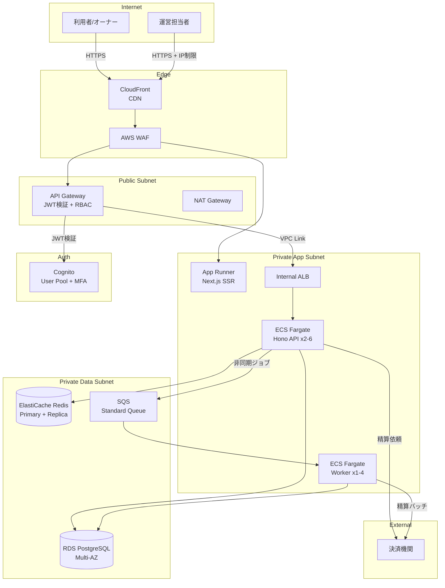
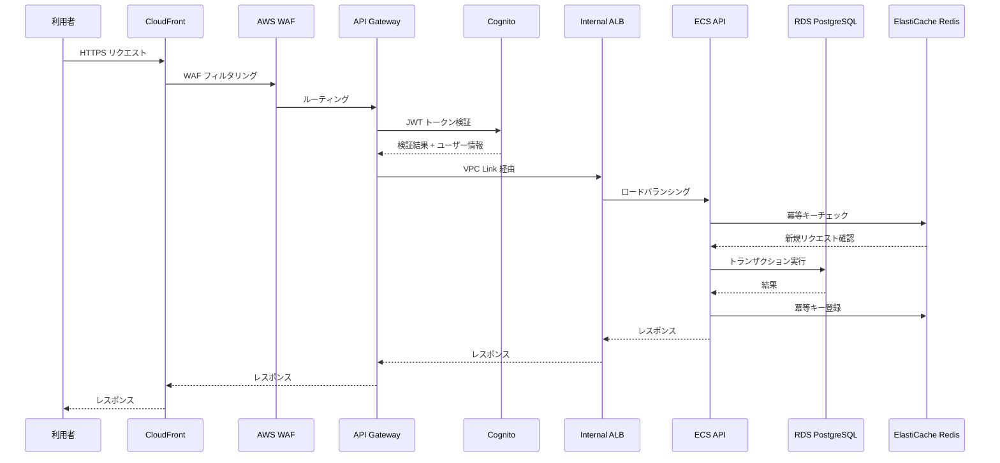
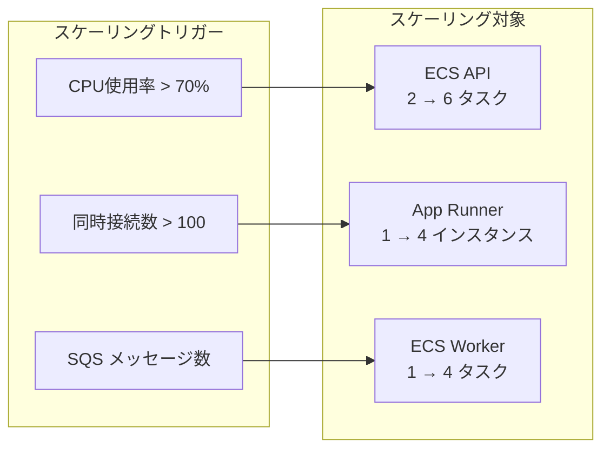

# 貸し会議室サービス - AWS ターゲットアーキテクチャ

## 概要

C2C 貸し会議室プラットフォームの AWS インフラアーキテクチャ。
利用者・会議室オーナー・サービス運営担当者の3アクターが利用する Web アプリケーション。

### ワークロード特性

| 項目 | 値 |
|------|-----|
| ワークロードタイプ | Web App |
| SLA | 99% |
| フェイルオーバー | Warm Standby |
| レイテンシ (p99) | 500ms |
| トラフィック | Steady (50 RPS baseline, x2 spike) |
| データ機密性 | Restricted (PII + PCI DSS) |
| 整合性 | Strong |
| RPO / RTO | 24h / 4h |
| コスト方針 | Balanced |

## ワークロード全体構成図

## リクエストフロー図

## オートスケーリング構成図

## AWS サービス一覧

| カテゴリ | サービス | 用途 |
|---------|---------|------|
| コンピュート | App Runner | フロントエンド (Next.js SSR) |
| コンピュート | ECS Fargate | バックエンド API + ワーカー |
| ネットワーク | API Gateway | JWT 検証、RBAC、レート制限 |
| ネットワーク | CloudFront | CDN、静的アセット配信 |
| ネットワーク | ALB | 内部ロードバランシング |
| ネットワーク | VPC | ネットワーク分離 |
| セキュリティ | WAF | OWASP Top 10 対策 |
| セキュリティ | Cognito | OAuth2/OIDC 認証、MFA |
| データベース | RDS PostgreSQL | メインストレージ (Multi-AZ) |
| キャッシュ | ElastiCache Redis | セッション、冪等キー管理 |
| メッセージング | SQS | 非同期ジョブキュー |
| スケジューリング | EventBridge Scheduler | 月末精算バッチ |
| 監視 | CloudWatch | メトリクス、ログ、アラート |

## コスト見積もり（月額）

| コンポーネント | 見積もり範囲 (USD) |
|--------------|-------------------|
| ECS Fargate | $150 - $300 |
| App Runner | $50 - $100 |
| RDS PostgreSQL | $250 - $400 |
| ElastiCache Redis | $100 - $150 |
| その他 (API GW, CDN, WAF, VPC等) | $115 - $285 |
| **合計** | **$800 - $1,500** |
