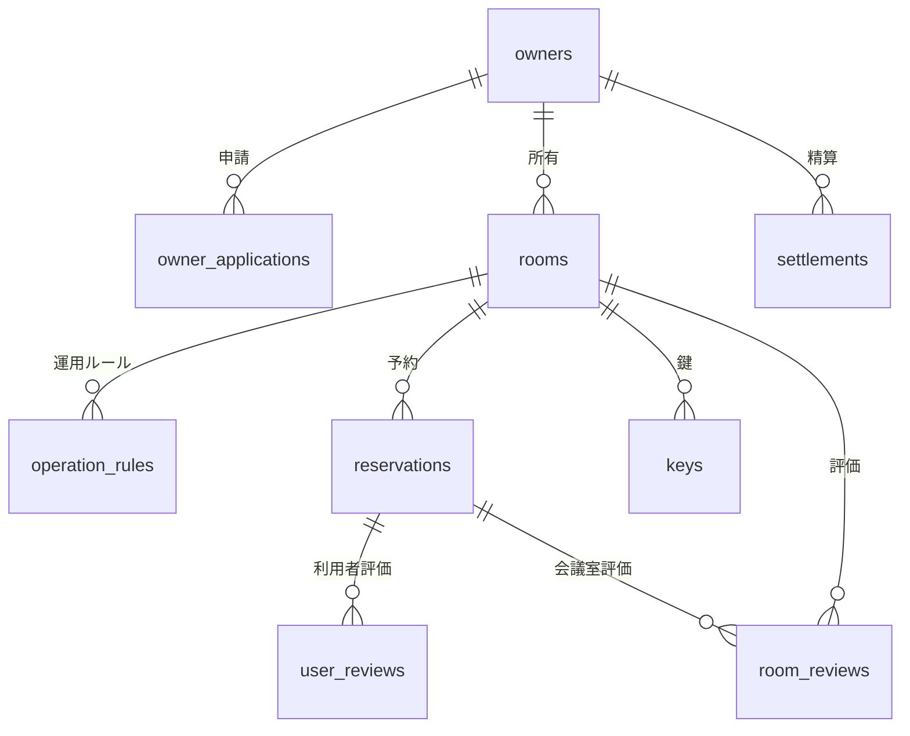

# データストアスキーマ

## サマリー

| データストア | 項目数 |
|------------|:------:|
| RDB テーブル | 15 |
| RDB インデックス | 24 |
| RDB 外部キー | 10 |
| KVS キーパターン | 6 |

## RDB

### ER 図

### テーブル一覧

| テーブル名 | RDRA 情報 | 説明 | カラム数 | インデックス数 | 利用 UC 数 |
|-----------|----------|------|:-------:|:----------:|:--------:|
| owners | オーナー情報 | 会議室オーナーの登録情報。プロフィール、申請状態を管理する | 8 | 2 | 3 |
| owner_applications | オーナー申請 | オーナー登録申請の情報。規約確認状態と審査結果を含む | 6 | 1 | 3 |
| rooms | 会議室情報 | 会議室の物件情報。広さ、価格、機能性を管理する | 9 | 2 | 3 |
| operation_rules | 運用ルール | 会議室の運用ルール。キャンセルポリシーと貸出可否を管理する | 5 | 1 | 1 |
| reservations | 予約情報 | 会議室の予約情報。利用者、会議室、日時、決済方法を管理する | 9 | 3 | 4 |
| keys | 鍵 | 会議室の鍵の管理情報。貸出状態を管理する | 4 | 1 | 2 |
| user_reviews | 利用者評価 | オーナーが利用者に対して登録する評価情報 | 7 | 2 | 2 |
| room_reviews | 会議室評価 | 利用者が会議室とホストに対して登録する評価情報 | 8 | 2 | 3 |
| inquiries | 問合せ | 利用者からの問合せ情報。オーナーまたはサービス運営担当者への質問と回答を管理する | 9 | 2 | 4 |
| usage_records | 利用実績 | 会議室の利用実績情報。利用履歴を管理する | 6 | 1 | 2 |
| revenue_records | 売上実績 | 会議室の売上実績情報。オーナーの収益を管理する | 6 | 1 | 1 |
| commission_records | 手数料売上 | サービス運営の手数料売上情報 | 5 | 1 | 1 |
| settlements | 精算情報 | オーナーへの精算情報。月末の利用料支払い額を管理する | 6 | 2 | 2 |
| usage_history | 利用履歴 | サービス全体の利用履歴。会員別・物件別の利用状況を管理する | 5 | 2 | 2 |
| payment_methods | 決済情報 | 決済手段の情報。クレジットカード・電子マネーの登録情報を管理する | 6 | 1 | 1 |

### owners

**RDRA 情報**: オーナー情報
**説明**: 会議室オーナーの登録情報。プロフィール、申請状態を管理する

#### カラム

| カラム名 | 型 | NULL | 説明 |
|---------|---|:----:|------|
| **owner_id** (PK) | uuid | NO | オーナーID。主キー |
| name | string | NO | 氏名 |
| email | string | NO | メールアドレス。暗号化対象 |
| phone | string | NO | 電話番号。暗号化対象 |
| profile | text | YES | プロフィール |
| current_status | string | NO | 現在のオーナー状態。値: 申請中, 審査中, 承認済, 却下, 退会 |
| registered_at | datetime | NO | 登録日時 |
| updated_at | datetime | NO | 更新日時 |

#### インデックス

| 名前 | カラム | UNIQUE | 理由 | 利用 UC |
|------|-------|:------:|------|--------|
| uq_owners_email | email | YES | メールアドレスの一意性制約 | オーナーを登録する |
| idx_owners_status | current_status | NO | 状態別のオーナー一覧検索 | オーナー申請を審査する |

#### 利用 UC

| UC | 操作 |
|---|------|
| オーナーを登録する | INSERT |
| オーナー申請を審査する | UPDATE |
| オーナー退会する | UPDATE |

### owner_applications

**RDRA 情報**: オーナー申請
**説明**: オーナー登録申請の情報。規約確認状態と審査結果を含む

#### カラム

| カラム名 | 型 | NULL | 説明 |
|---------|---|:----:|------|
| **application_id** (PK) | uuid | NO | 申請ID。主キー |
| owner_id | uuid | NO | オーナーID。外部キー |
| review_result | string | YES | 審査結果。値: approved, rejected |
| terms_confirmed_at | datetime | YES | 規約確認日時 |
| applied_at | datetime | NO | 申請日時 |
| reviewed_at | datetime | YES | 審査日時 |

#### 外部キー

| カラム | 参照先テーブル | 参照先カラム | ON DELETE |
|-------|-------------|------------|----------|
| owner_id | owners | owner_id | CASCADE |

#### インデックス

| 名前 | カラム | UNIQUE | 理由 | 利用 UC |
|------|-------|:------:|------|--------|
| fk_owner_applications_owners | owner_id | NO | オーナーIDでの申請検索 | オーナー申請する, オーナー申請を審査する |

#### 利用 UC

| UC | 操作 |
|---|------|
| 規約を参照する | SELECT |
| オーナー申請する | INSERT |
| オーナー申請を審査する | UPDATE |

### rooms

**RDRA 情報**: 会議室情報
**説明**: 会議室の物件情報。広さ、価格、機能性を管理する

#### カラム

| カラム名 | 型 | NULL | 説明 |
|---------|---|:----:|------|
| **room_id** (PK) | uuid | NO | 会議室ID。主キー |
| room_name | string | NO | 会議室名 |
| location | string | NO | 所在地 |
| size | string | NO | 広さ |
| price | decimal | NO | 価格(円/時間) |
| functionality | text | YES | 機能性(プロジェクター、ホワイトボード等) |
| owner_id | uuid | NO | オーナーID。外部キー |
| current_status | string | NO | 現在の会議室状態。値: 未公開, 公開中, 貸出停止 |
| created_at | datetime | NO | 登録日時 |

#### 外部キー

| カラム | 参照先テーブル | 参照先カラム | ON DELETE |
|-------|-------------|------------|----------|
| owner_id | owners | owner_id | CASCADE |

#### インデックス

| 名前 | カラム | UNIQUE | 理由 | 利用 UC |
|------|-------|:------:|------|--------|
| idx_rooms_owner_id_status | owner_id, current_status | NO | オーナー別の公開中会議室検索 | 会議室を登録する, 会議室を照会する |
| idx_rooms_location | location | NO | 所在地での会議室検索 | 会議室を照会する |

#### 利用 UC

| UC | 操作 |
|---|------|
| 会議室を登録する | INSERT |
| 運用ルールを設定する | UPDATE |
| 会議室を照会する | SELECT |

### operation_rules

**RDRA 情報**: 運用ルール
**説明**: 会議室の運用ルール。キャンセルポリシーと貸出可否を管理する

#### カラム

| カラム名 | 型 | NULL | 説明 |
|---------|---|:----:|------|
| **rule_id** (PK) | uuid | NO | ルールID。主キー |
| room_id | uuid | NO | 会議室ID。外部キー |
| cancellation_policy | text | NO | キャンセルポリシー |
| availability | boolean | NO | 貸出可否 |
| min_usage_time | integer | NO | 最低利用時間(分) |

#### 外部キー

| カラム | 参照先テーブル | 参照先カラム | ON DELETE |
|-------|-------------|------------|----------|
| room_id | rooms | room_id | CASCADE |

#### インデックス

| 名前 | カラム | UNIQUE | 理由 | 利用 UC |
|------|-------|:------:|------|--------|
| fk_operation_rules_rooms | room_id | NO | 会議室IDでのルール検索 | 運用ルールを設定する |

#### 利用 UC

| UC | 操作 |
|---|------|
| 運用ルールを設定する | INSERT |

### reservations

**RDRA 情報**: 予約情報
**説明**: 会議室の予約情報。利用者、会議室、日時、決済方法を管理する

#### カラム

| カラム名 | 型 | NULL | 説明 |
|---------|---|:----:|------|
| **reservation_id** (PK) | uuid | NO | 予約ID。主キー |
| user_id | uuid | NO | 利用者ID |
| room_id | uuid | NO | 会議室ID。外部キー |
| start_at | datetime | NO | 利用開始日時 |
| end_at | datetime | NO | 利用終了日時 |
| payment_method | string | NO | 決済方法。値: credit_card, e_money |
| current_status | string | NO | 予約状態。値: 予約申請中, 予約確定, 変更中, 取消済, 利用済 |
| idempotency_key | uuid | NO | 冪等キー。重複予約防止 |
| created_at | datetime | NO | 予約作成日時 |

#### 外部キー

| カラム | 参照先テーブル | 参照先カラム | ON DELETE |
|-------|-------------|------------|----------|
| room_id | rooms | room_id | RESTRICT |

#### インデックス

| 名前 | カラム | UNIQUE | 理由 | 利用 UC |
|------|-------|:------:|------|--------|
| uq_reservations_idempotency_key | idempotency_key | YES | ユニーク制約: 冪等キーによる重複予約防止 | 会議室を予約する |
| uq_reservations_room_time | room_id, start_at, end_at | YES | ユニーク制約: 同一会議室の同時間帯の重複予約防止 | 会議室を予約する |
| idx_reservations_user_id | user_id | NO | 利用者IDでの予約検索 | 予約を変更する, 予約を取消する |

#### 利用 UC

| UC | 操作 |
|---|------|
| 会議室を予約する | INSERT |
| 予約を変更する | UPDATE |
| 予約を取消する | UPDATE |
| 鍵を返却する | UPDATE |

### keys

**RDRA 情報**: 鍵
**説明**: 会議室の鍵の管理情報。貸出状態を管理する

#### カラム

| カラム名 | 型 | NULL | 説明 |
|---------|---|:----:|------|
| **key_id** (PK) | uuid | NO | 鍵ID。主キー |
| room_id | uuid | NO | 会議室ID。外部キー |
| key_type | string | NO | 鍵種別 |
| current_status | string | NO | 現在の鍵状態。値: 保管中, 貸出中, 返却済 |

#### 外部キー

| カラム | 参照先テーブル | 参照先カラム | ON DELETE |
|-------|-------------|------------|----------|
| room_id | rooms | room_id | CASCADE |

#### インデックス

| 名前 | カラム | UNIQUE | 理由 | 利用 UC |
|------|-------|:------:|------|--------|
| fk_keys_rooms | room_id | NO | 会議室IDでの鍵検索 | 鍵を貸し出す, 鍵を返却する |

#### 利用 UC

| UC | 操作 |
|---|------|
| 鍵を貸し出す | UPDATE |
| 鍵を返却する | UPDATE |

### user_reviews

**RDRA 情報**: 利用者評価
**説明**: オーナーが利用者に対して登録する評価情報

#### カラム

| カラム名 | 型 | NULL | 説明 |
|---------|---|:----:|------|
| **review_id** (PK) | uuid | NO | 評価ID。主キー |
| owner_id | uuid | NO | オーナーID |
| user_id | uuid | NO | 利用者ID |
| reservation_id | uuid | NO | 予約ID。外部キー |
| rating | integer | NO | 評価点(1-5) |
| comment | text | YES | コメント |
| reviewed_at | datetime | NO | 評価日時 |

#### 外部キー

| カラム | 参照先テーブル | 参照先カラム | ON DELETE |
|-------|-------------|------------|----------|
| reservation_id | reservations | reservation_id | CASCADE |

#### インデックス

| 名前 | カラム | UNIQUE | 理由 | 利用 UC |
|------|-------|:------:|------|--------|
| uq_user_reviews_reservation | reservation_id, owner_id | YES | ユニーク制約: 同一予約に対するオーナーの重複評価防止 | 利用者評価を登録する |
| idx_user_reviews_user_id | user_id | NO | 利用者IDでの評価検索(許諾時の過去評価参照) | 利用者使用許諾する |

#### 利用 UC

| UC | 操作 |
|---|------|
| 利用者評価を登録する | INSERT |
| 利用者使用許諾する | SELECT |

### room_reviews

**RDRA 情報**: 会議室評価
**説明**: 利用者が会議室とホストに対して登録する評価情報

#### カラム

| カラム名 | 型 | NULL | 説明 |
|---------|---|:----:|------|
| **review_id** (PK) | uuid | NO | 評価ID。主キー |
| user_id | uuid | NO | 利用者ID |
| room_id | uuid | NO | 会議室ID。外部キー |
| reservation_id | uuid | NO | 予約ID。外部キー |
| room_rating | integer | NO | 会議室評価点(1-5) |
| host_rating | integer | NO | ホスト評価点(1-5) |
| comment | text | YES | コメント |
| reviewed_at | datetime | NO | 評価日時 |

#### 外部キー

| カラム | 参照先テーブル | 参照先カラム | ON DELETE |
|-------|-------------|------------|----------|
| reservation_id | reservations | reservation_id | CASCADE |
| room_id | rooms | room_id | CASCADE |

#### インデックス

| 名前 | カラム | UNIQUE | 理由 | 利用 UC |
|------|-------|:------:|------|--------|
| uq_room_reviews_reservation | reservation_id, user_id | YES | ユニーク制約: 同一予約に対する利用者の重複評価防止 | 評価を登録する |
| idx_room_reviews_room_id | room_id | NO | 会議室IDでの評価一覧検索 | 会議室評価を確認する, 会議室を照会する |

#### 利用 UC

| UC | 操作 |
|---|------|
| 評価を登録する | INSERT |
| 会議室評価を確認する | SELECT |
| 会議室を照会する | SELECT |

### inquiries

**RDRA 情報**: 問合せ
**説明**: 利用者からの問合せ情報。オーナーまたはサービス運営担当者への質問と回答を管理する

#### カラム

| カラム名 | 型 | NULL | 説明 |
|---------|---|:----:|------|
| **inquiry_id** (PK) | uuid | NO | 問合せID。主キー |
| sender_id | uuid | NO | 送信者ID |
| target_type | string | NO | 宛先種別。値: owner, service |
| target_id | uuid | YES | 宛先ID(オーナー宛の場合) |
| subject | string | NO | 件名 |
| content | text | NO | 内容 |
| reply | text | YES | 回答 |
| created_at | datetime | NO | 問合せ日時 |
| replied_at | datetime | YES | 回答日時 |

#### インデックス

| 名前 | カラム | UNIQUE | 理由 | 利用 UC |
|------|-------|:------:|------|--------|
| idx_inquiries_target | target_type, target_id | NO | 宛先別の問合せ検索 | 問合せに回答する, サービス問合せに対応する |
| idx_inquiries_sender | sender_id | NO | 送信者別の問合せ検索 | 問合せを送信する, サービス問合せを送信する |

#### 利用 UC

| UC | 操作 |
|---|------|
| 問合せを送信する | INSERT |
| 問合せに回答する | UPDATE |
| サービス問合せを送信する | INSERT |
| サービス問合せに対応する | UPDATE |

### usage_records

**RDRA 情報**: 利用実績
**説明**: 会議室の利用実績情報。利用履歴を管理する

#### カラム

| カラム名 | 型 | NULL | 説明 |
|---------|---|:----:|------|
| **record_id** (PK) | uuid | NO | 実績ID。主キー |
| room_id | uuid | NO | 会議室ID。外部キー |
| reservation_id | uuid | NO | 予約ID。外部キー |
| usage_datetime | datetime | NO | 利用日時 |
| usage_hours | decimal | NO | 利用時間(時間) |
| usage_fee | decimal | NO | 利用料金 |

#### 外部キー

| カラム | 参照先テーブル | 参照先カラム | ON DELETE |
|-------|-------------|------------|----------|
| room_id | rooms | room_id | CASCADE |

#### インデックス

| 名前 | カラム | UNIQUE | 理由 | 利用 UC |
|------|-------|:------:|------|--------|
| idx_usage_records_room_month | room_id, usage_datetime | NO | 会議室別月次利用実績集計 | 利用実績を確認する, オーナー精算を実行する |

#### 利用 UC

| UC | 操作 |
|---|------|
| 利用実績を確認する | SELECT |
| オーナー精算を実行する | SELECT |

### revenue_records

**RDRA 情報**: 売上実績
**説明**: 会議室の売上実績情報。オーナーの収益を管理する

#### カラム

| カラム名 | 型 | NULL | 説明 |
|---------|---|:----:|------|
| **revenue_id** (PK) | uuid | NO | 売上ID。主キー |
| room_id | uuid | NO | 会議室ID |
| owner_id | uuid | NO | オーナーID |
| month | string | NO | 対象月(YYYY-MM) |
| revenue_amount | decimal | NO | 売上金額 |
| commission_amount | decimal | NO | 手数料金額 |

#### インデックス

| 名前 | カラム | UNIQUE | 理由 | 利用 UC |
|------|-------|:------:|------|--------|
| idx_revenue_records_owner_month | owner_id, month | NO | オーナー別月次売上集計 | 売上実績を確認する |

#### 利用 UC

| UC | 操作 |
|---|------|
| 売上実績を確認する | SELECT |

### commission_records

**RDRA 情報**: 手数料売上
**説明**: サービス運営の手数料売上情報

#### カラム

| カラム名 | 型 | NULL | 説明 |
|---------|---|:----:|------|
| **commission_id** (PK) | uuid | NO | 手数料ID。主キー |
| room_id | uuid | NO | 会議室ID |
| reservation_id | uuid | NO | 予約ID |
| commission_amount | decimal | NO | 手数料金額 |
| commission_rate | decimal | NO | 手数料率 |

#### インデックス

| 名前 | カラム | UNIQUE | 理由 | 利用 UC |
|------|-------|:------:|------|--------|
| idx_commission_records_room | room_id | NO | 会議室別手数料集計 | 手数料売上を分析する |

#### 利用 UC

| UC | 操作 |
|---|------|
| 手数料売上を分析する | SELECT |

### settlements

**RDRA 情報**: 精算情報
**説明**: オーナーへの精算情報。月末の利用料支払い額を管理する

#### カラム

| カラム名 | 型 | NULL | 説明 |
|---------|---|:----:|------|
| **settlement_id** (PK) | uuid | NO | 精算ID。主キー |
| owner_id | uuid | NO | オーナーID。外部キー |
| settlement_month | string | NO | 精算月(YYYY-MM) |
| settlement_amount | decimal | NO | 精算金額 |
| payment_date | datetime | YES | 支払日 |
| payment_status | string | NO | 支払状態。値: pending, paid, failed |

#### 外部キー

| カラム | 参照先テーブル | 参照先カラム | ON DELETE |
|-------|-------------|------------|----------|
| owner_id | owners | owner_id | RESTRICT |

#### インデックス

| 名前 | カラム | UNIQUE | 理由 | 利用 UC |
|------|-------|:------:|------|--------|
| uq_settlements_owner_month | owner_id, settlement_month | YES | ユニーク制約: 同一オーナー・同一月の重複精算防止 | オーナー精算を実行する |
| idx_settlements_owner | owner_id | NO | オーナー別精算一覧検索 | 精算内容を確認する |

#### 利用 UC

| UC | 操作 |
|---|------|
| 精算内容を確認する | SELECT |
| オーナー精算を実行する | INSERT |

### usage_history

**RDRA 情報**: 利用履歴
**説明**: サービス全体の利用履歴。会員別・物件別の利用状況を管理する

#### カラム

| カラム名 | 型 | NULL | 説明 |
|---------|---|:----:|------|
| **history_id** (PK) | uuid | NO | 履歴ID。主キー |
| user_id | uuid | NO | 利用者ID |
| room_id | uuid | NO | 会議室ID |
| usage_datetime | datetime | NO | 利用日時 |
| usage_hours | decimal | NO | 利用時間(時間) |

#### インデックス

| 名前 | カラム | UNIQUE | 理由 | 利用 UC |
|------|-------|:------:|------|--------|
| idx_usage_history_user | user_id, usage_datetime | NO | 会員別利用履歴検索 | 利用履歴を管理する |
| idx_usage_history_room | room_id, usage_datetime | NO | 物件別利用履歴検索 | 利用状況を分析する |

#### 利用 UC

| UC | 操作 |
|---|------|
| 利用履歴を管理する | SELECT |
| 利用状況を分析する | SELECT |

### payment_methods

**RDRA 情報**: 決済情報
**説明**: 決済手段の情報。クレジットカード・電子マネーの登録情報を管理する

#### カラム

| カラム名 | 型 | NULL | 説明 |
|---------|---|:----:|------|
| **payment_id** (PK) | uuid | NO | 決済ID。主キー |
| user_id | uuid | NO | 利用者ID |
| payment_method | string | NO | 決済方法。値: credit_card, e_money |
| card_number_masked | string | YES | マスク済みカード番号(下4桁のみ表示)。暗号化対象 |
| e_money_id | string | YES | 電子マネーID |
| registered_at | datetime | NO | 登録日時 |

#### インデックス

| 名前 | カラム | UNIQUE | 理由 | 利用 UC |
|------|-------|:------:|------|--------|
| idx_payment_methods_user | user_id | NO | 利用者別決済方法検索 | 会議室を予約する |

#### 利用 UC

| UC | 操作 |
|---|------|
| 会議室を予約する | SELECT |

## KVS

| キーパターン | 用途 | 値の型 | TTL | 利用 UC |
|------------|------|-------|-----|--------|
| `session:user:{user_id}` | session | JSON (user profile, role, token metadata) | 1h | 会議室を照会する, 会議室を予約する |
| `session:owner:{owner_id}` | session | JSON (owner profile, role, token metadata) | 1h | オーナーを登録する, 会議室を登録する |
| `session:admin:{admin_id}` | session | JSON (admin profile, role, token metadata) | 30m | オーナー申請を審査する, オーナー精算を実行する |
| `idempotency:{idempotency_key}` | lock | JSON (request hash, response, created_at) | 24h | 会議室を予約する, オーナー精算を実行する |
| `cache:room:{room_id}` | cache | JSON (room detail with reviews) | 15m | 会議室を照会する |
| `rate-limit:api:{client_ip}` | rate-limit | integer (request count) | 1m | 会議室を照会する |

### `session:user:{user_id}`

- **用途**: session
- **値の型**: JSON (user profile, role, token metadata)
- **TTL**: 1h
- **説明**: 利用者セッション情報。JWT リフレッシュトークン管理
- **利用 UC**: 会議室を照会する, 会議室を予約する

### `session:owner:{owner_id}`

- **用途**: session
- **値の型**: JSON (owner profile, role, token metadata)
- **TTL**: 1h
- **説明**: オーナーセッション情報。JWT リフレッシュトークン管理
- **利用 UC**: オーナーを登録する, 会議室を登録する

### `session:admin:{admin_id}`

- **用途**: session
- **値の型**: JSON (admin profile, role, token metadata)
- **TTL**: 30m
- **説明**: 管理者セッション情報。より短い TTL でセキュリティ強化
- **利用 UC**: オーナー申請を審査する, オーナー精算を実行する

### `idempotency:{idempotency_key}`

- **用途**: lock
- **値の型**: JSON (request hash, response, created_at)
- **TTL**: 24h
- **説明**: 冪等キー管理。重複リクエスト検知用
- **利用 UC**: 会議室を予約する, オーナー精算を実行する

### `cache:room:{room_id}`

- **用途**: cache
- **値の型**: JSON (room detail with reviews)
- **TTL**: 15m
- **説明**: 会議室詳細キャッシュ。検索結果の高速化
- **利用 UC**: 会議室を照会する

### `rate-limit:api:{client_ip}`

- **用途**: rate-limit
- **値の型**: integer (request count)
- **TTL**: 1m
- **説明**: APIレート制限カウンター。IP単位
- **利用 UC**: 会議室を照会する
