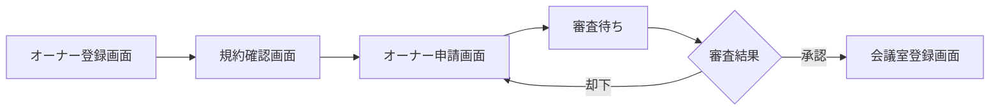
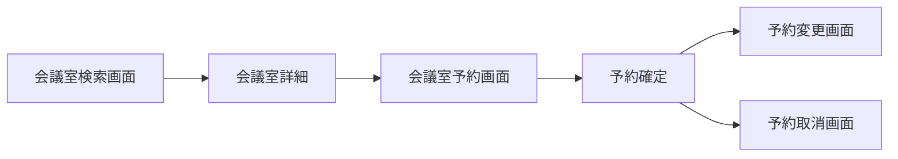
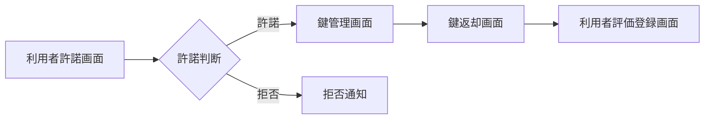
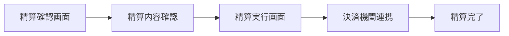
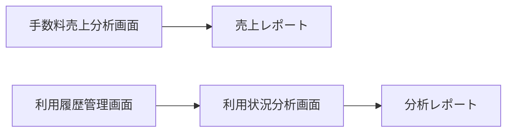
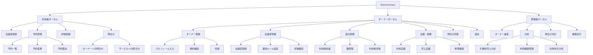

# UX デザイン仕様

## ユーザーフロー

### オーナー管理業務: オーナー登録フロー

**アクター**: 会議室オーナー
**ゴール**: 会議室オーナーとしてサービスに登録し、会議室貸出を開始する

**タッチポイント**:
| ステップ | 画面 | UC | 感情 | 改善機会 |
|---------|------|---|------|---------|
| プロフィール入力 | オーナー登録画面 | オーナーを登録する | ニュートラル | 入力項目の段階的開示で負担軽減 |
| 規約確認 | 規約確認画面 | 規約を参照する | ネガティブ | 要約表示で読みやすく |
| 申請提出 | オーナー申請画面 | オーナー申請する | ポジティブ | 完了メッセージで達成感 |
| 審査完了通知 | - | オーナー申請を審査する | ポジティブ/ネガティブ | 却下理由の明確な提示 |

### 会議室予約業務: 会議室予約フロー

**アクター**: 利用者
**ゴール**: 条件に合う会議室を見つけて予約する

**タッチポイント**:
| ステップ | 画面 | UC | 感情 | 改善機会 |
|---------|------|---|------|---------|
| 会議室検索 | 会議室検索画面 | 会議室を照会する | ポジティブ | フィルターの直感的操作 |
| 予約入力 | 会議室予約画面 | 会議室を予約する | ニュートラル | カレンダーの空き状況表示 |
| 予約確定 | 予約確定画面 | 会議室を予約する | ポジティブ | 確定アニメーションで達成感 |
| 予約変更 | 予約変更画面 | 予約を変更する | ネガティブ | 変更可能範囲の明示 |
| 予約取消 | 予約取消画面 | 予約を取消する | ネガティブ | キャンセル料の事前表示 |

### 会議室貸出業務: 会議室貸出フロー

**アクター**: 会議室オーナー
**ゴール**: 利用者への会議室貸出を安全に管理する

**タッチポイント**:
| ステップ | 画面 | UC | 感情 | 改善機会 |
|---------|------|---|------|---------|
| 利用者確認 | 利用者許諾画面 | 利用者使用許諾する | ニュートラル | 利用者評価の見やすい表示 |
| 鍵貸出 | 鍵管理画面 | 鍵を貸し出す | ニュートラル | ワンタップ操作 |
| 鍵返却 | 鍵返却画面 | 鍵を返却する | ポジティブ | 返却確認の簡素化 |
| 利用者評価 | 利用者評価登録画面 | 利用者評価を登録する | ポジティブ | 星評価のタップ操作 |

### 精算業務: オーナー精算フロー

**アクター**: 会議室オーナー / サービス運営担当者
**ゴール**: 月末の利用料精算を正確に実行する

**タッチポイント**:
| ステップ | 画面 | UC | 感情 | 改善機会 |
|---------|------|---|------|---------|
| 精算額確認 | 精算確認画面 | 精算内容を確認する | ニュートラル | 明細の分かりやすい表示 |
| 精算実行 | 精算実行画面 | オーナー精算を実行する | ニュートラル | 実行前の確認ダイアログ |
| 精算完了 | - | オーナー精算を実行する | ポジティブ | 完了通知 |

### サービス運営業務: サービス運営管理フロー

**アクター**: サービス運営担当者
**ゴール**: サービス全体の利用状況・売上を把握し運営に活かす

**タッチポイント**:
| ステップ | 画面 | UC | 感情 | 改善機会 |
|---------|------|---|------|---------|
| 売上分析 | 手数料売上分析画面 | 手数料売上を分析する | ポジティブ | ダッシュボードの階層化 |
| 利用履歴管理 | 利用履歴管理画面 | 利用履歴を管理する | ニュートラル | 検索・フィルターの充実 |
| 利用状況分析 | 利用状況分析画面 | 利用状況を分析する | ポジティブ | トレンド可視化 |

## 情報アーキテクチャ（IA）

### サイトマップ

### ナビゲーション構造

| ポータル | プライマリナビ | セカンダリナビ |
|---------|-------------|-------------|
| 利用者ポータル | 会議室検索, 予約管理, 問合せ | 評価登録(予約完了後), サービス問合せ |
| オーナーポータル | ダッシュボード, 会議室管理, 貸出管理, 実績・精算, 問合せ | 設定(退会), プロフィール編集 |
| 管理者ポータル | ダッシュボード, オーナー審査, 分析, 問合せ対応, 精算 | 利用履歴管理 |

### ページ間の遷移ルール

- 認証前ページ(ログイン/登録)から認証後ページへはリダイレクト
- 予約完了後に評価登録への導線を表示（利用済み後のみ）
- オーナー未承認状態では会議室管理以降のメニューを非表示
- 管理者ポータルは社内IP制限下でのみアクセス可能
- モバイルではボトムナビゲーション（利用者ポータル）

## UX 心理学に基づくインタラクション設計原則

### 適用する原則

| 原則 | 適用場面 | 具体的な設計 |
|------|---------|-----------|
| 認知負荷 (Cognitive Load) | 全画面共通 | 一画面の情報量を4-5項目に制限。フォーム入力は段階的に表示 |
| 目標勾配効果 (Goal Gradient Effect) | オーナー登録フロー | StepTrackerで進捗率を表示し、完了への動機を高める |
| 社会的証明 (Social Proof) | 会議室検索画面 | StarRatingでレビュー数と平均評価を表示 |
| 損失回避 (Loss Aversion) | 予約取消画面 | キャンセル料の発生を事前に明示し、慎重な判断を促す |
| ドハティの閾値 (Doherty Threshold) | 全API呼び出し | Skeleton UIでパーシーブドパフォーマンスを改善 |
| ピーク・エンドの法則 (Peak-End Rule) | 予約完了、精算完了 | 完了画面での達成感演出（チェックマークアニメーション） |
| 段階的開示 (Progressive Disclosure) | 会議室詳細、精算明細 | 概要→詳細の折りたたみ表示 |
| 意図的な壁 (Intentional Friction) | 退会、予約取消、精算実行 | 確認ダイアログでの二段階確認 |
| 希少性効果 (Scarcity) | 会議室予約画面 | 「残り枠」の表示で予約を促進 |
| デフォルト効果 (Default Bias) | 運用ルール設定 | 推奨設定をデフォルト値として提供 |

## アクセシビリティ方針

- **WCAG 準拠レベル**: AA（JIS X 8341-3 レベル AA 準拠、arch-design.yaml SP-003）
- **キーボード操作**: 全操作をキーボードのみで完結可能にする。タブ順序を論理的に設定
- **スクリーンリーダー**: ARIA ラベルを全インタラクティブ要素に設定。状態変更時にライブリージョンで通知
- **色覚多様性**: 色だけでなくアイコン・テキストでも状態を伝達する。コントラスト比 4.5:1 以上を確保
