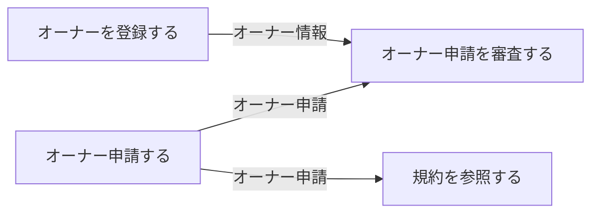
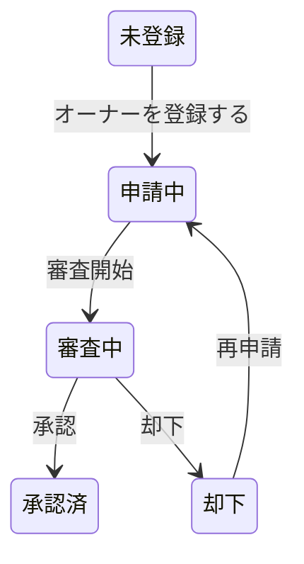

# オーナー登録フロー

## 概要

会議室オーナーがサービスに登録し、審査を経て承認されるまでのフロー。プロフィール入力、規約確認、申請、審査の4ステップで構成される。

## 所属 UC 一覧

| UC名 | アクター | 主な操作 | 関連情報 |
|------|---------|---------|---------|
| [オーナーを登録する](オーナーを登録する/spec.md) | 会議室オーナー | プロフィール入力・登録 | オーナー情報 |
| [規約を参照する](規約を参照する/spec.md) | 会議室オーナー | 利用規約の確認 | オーナー申請 |
| [オーナー申請する](オーナー申請する/spec.md) | 会議室オーナー | オーナー申請提出 | オーナー申請 |
| [オーナー申請を審査する](オーナー申請を審査する/spec.md) | サービス運営担当者 | 申請の審査・承認/却下 | オーナー申請 |

## UC 横断データフロー

### データフロー図

### 情報 CRUD マトリクス

| 情報名 | オーナーを登録する | 規約を参照する | オーナー申請する | オーナー申請を審査する |
|--------|:---:|:---:|:---:|:---:|
| オーナー情報 | C | - | - | U |
| オーナー申請 | - | R | C | U |

## 状態遷移全体図

### オーナー状態

| 遷移元 | 遷移先 | トリガー UC |
|--------|--------|------------|
| 未登録 | 申請中 | オーナーを登録する |
| 申請中 | 審査中 | 審査開始 |
| 審査中 | 承認済 | 承認 |
| 審査中 | 却下 | 却下 |
| 却下 | 申請中 | 再申請 |

## BUC 内共有条件一覧

| 条件名 | 適用 UC |
|--------|--------|
| オーナー審査基準 | オーナーを登録する, 規約を参照する, オーナー申請する, オーナー申請を審査する |

## BUC 内共有バリエーション一覧

該当なし
