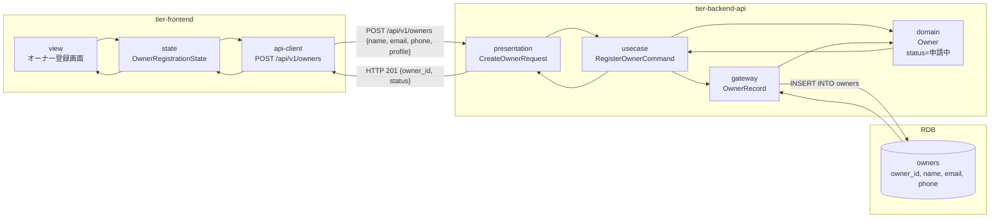
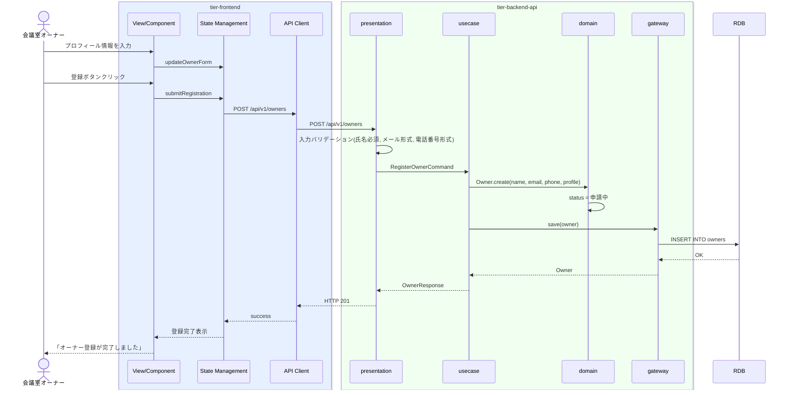

# オーナーを登録する

## 概要

会議室オーナーがプロフィール情報（氏名、メールアドレス、電話番号、プロフィール）を入力し、オーナーとしてシステムに登録する。オーナー状態は「未登録」から「申請中」へ遷移する。

## データフロー



| レイヤー | データモデル | 変換内容 |
|---------|------------|---------|
| FE View | 氏名, メールアドレス, 電話番号, プロフィール入力フォーム | ユーザー入力 → state 更新 |
| BE presentation | CreateOwnerRequest(name, email, phone, profile) | バリデーション + RegisterOwnerCommand 変換 |
| BE gateway | INSERT INTO owners (owner_id, name, email, phone, profile, current_status) | owner_id 自動生成, current_status=申請中 |
| Response | {owner_id, status: "申請中"} | 登録完了メッセージ表示 |

## 処理フロー



## バリエーション一覧

該当なし

## 分岐条件一覧

該当なし

## 計算ルール一覧

該当なし

## 状態遷移一覧

| 状態モデル | 遷移元 | 遷移先 | トリガー | 事前条件 | 事後処理 | 適用 tier |
|-----------|--------|--------|---------|---------|---------|----------|
| オーナー状態 | 未登録 | 申請中 | オーナーを登録する | プロフィール情報が入力済み | オーナー申請レコード作成 | tier-backend-api |

## 関連 RDRA モデル

| モデル種別 | 要素名 | 関連 |
|-----------|--------|------|
| 業務 | オーナー管理業務 | このUCが属する業務 |
| BUC | オーナー登録フロー | このUCを含むBUC |
| アクター | 会議室オーナー | 操作するアクター |
| 情報 | オーナー情報 | 登録する情報 |
| 状態 | オーナー状態 | 未登録→申請中 |

## E2E 完了条件（BDD）

### 正常系

```gherkin
Feature: オーナーを登録する

  Scenario: オーナーが正常にプロフィールを登録する
    Given 未登録の会議室オーナー「田中太郎」がオーナー登録画面を表示している
    When 氏名「田中太郎」、メールアドレス「tanaka@example.com」、電話番号「090-1234-5678」、プロフィール「渋谷区で貸会議室を運営」を入力し登録ボタンをクリックする
    Then オーナー情報が登録されオーナー状態が「申請中」になる
    And 「オーナー登録が完了しました」のメッセージが表示される
```

### 異常系

```gherkin
  Scenario: メールアドレスが不正な形式で登録に失敗する
    Given 未登録の会議室オーナーがオーナー登録画面を表示している
    When 氏名「田中太郎」、メールアドレス「invalid-email」、電話番号「090-1234-5678」を入力し登録ボタンをクリックする
    Then 「メールアドレスの形式が正しくありません」のバリデーションエラーが表示される

  Scenario: 必須項目が未入力で登録に失敗する
    Given 未登録の会議室オーナーがオーナー登録画面を表示している
    When 氏名を空のまま登録ボタンをクリックする
    Then 「氏名は必須です」のバリデーションエラーが表示される
```

## ティア別仕様

- [フロントエンド](tier-frontend.md)
- [バックエンドAPI](tier-backend-api.md)

### 統合 API Spec

- [OpenAPI Spec](../../../_cross-cutting/api/openapi.yaml)
