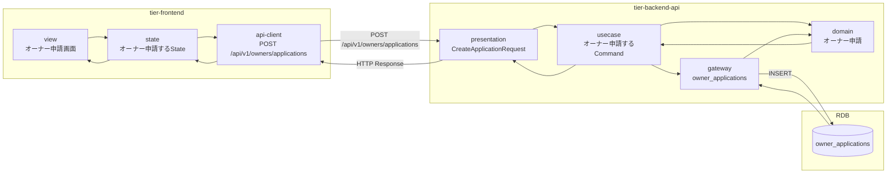
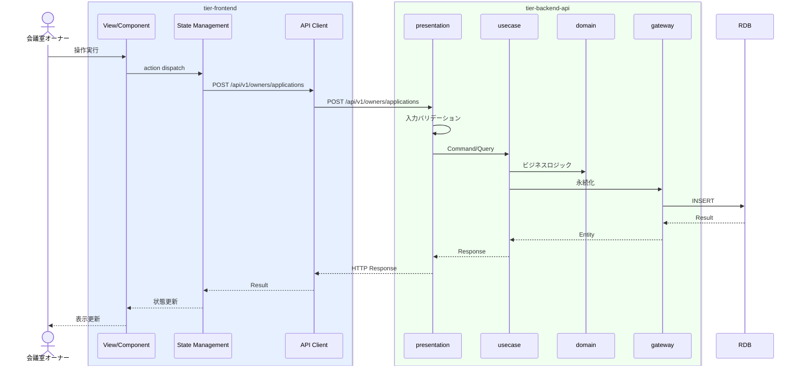

# オーナー申請する

## 概要

オーナーが規約確認後に申請を提出する。オーナー状態は申請中のまま審査待ちとなる。

## データフロー



| レイヤー | データモデル | 変換内容 |
|---------|------------|---------|
| FE View | オーナー申請画面の表示/入力 | ユーザー操作 → state 更新 |
| BE presentation | CreateApplicationRequest | バリデーション + Command変換 |
| BE gateway | INSERT owner_applications | レコード操作 |
| Response | ApplicationResponse | 表示用データ |

## 処理フロー



## バリエーション一覧

該当なし

## 分岐条件一覧

該当なし

## 計算ルール一覧

該当なし


## 状態遷移一覧

該当なし

## 関連 RDRA モデル

| モデル種別 | 要素名 | 関連 |
|-----------|--------|------|
| 業務 | オーナー管理業務 | このUCが属する業務 |
| BUC | オーナー登録フロー | このUCを含むBUC |
| アクター | 会議室オーナー | 操作するアクター |
| 情報 | オーナー申請 | 参照・更新する情報 |
| 状態 | オーナー状態 | 関連する状態遷移 |


## E2E 完了条件（BDD）

### 正常系

```gherkin
Feature: オーナー申請する

  Scenario: オーナーが申請を提出する
    Given 会議室オーナー「田中太郎」が規約確認済みでオーナー申請画面を表示している
    When 申請内容を確認し「申請する」ボタンをクリックする
    Then オーナー申請が提出され「申請が完了しました。審査結果をお待ちください」のメッセージが表示される
```

### 異常系

```gherkin
  Scenario: 規約未確認で申請しようとする
    Given 会議室オーナーが規約確認をスキップしてオーナー申請画面にアクセスする
    When 「申請する」ボタンをクリックする
    Then 「先に利用規約をご確認ください」のエラーが表示される
```

## ティア別仕様

- [フロントエンド](tier-frontend.md)
- [バックエンドAPI](tier-backend-api.md)

### 統合 API Spec

- [OpenAPI Spec](../../../_cross-cutting/api/openapi.yaml)
