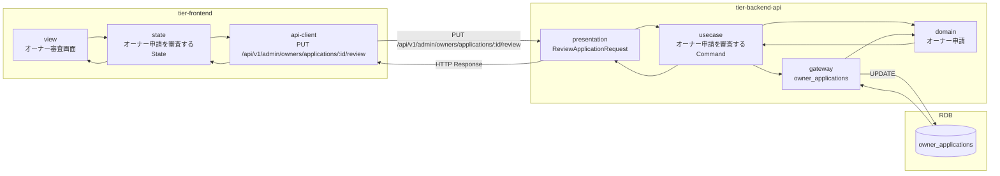
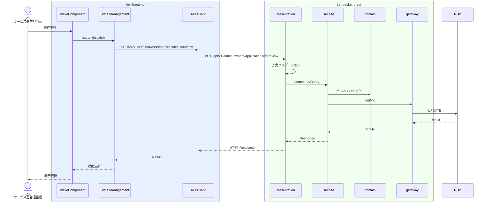

# オーナー申請を審査する

## 概要

サービス運営担当者がオーナー申請を審査し承認または却下する。オーナー状態は審査中→承認済/却下に遷移する。

## データフロー



| レイヤー | データモデル | 変換内容 |
|---------|------------|---------|
| FE View | オーナー審査画面の表示/入力 | ユーザー操作 → state 更新 |
| BE presentation | ReviewApplicationRequest | バリデーション + Command変換 |
| BE gateway | UPDATE owner_applications | レコード操作 |
| Response | ApplicationResponse | 表示用データ |

## 処理フロー



## バリエーション一覧

該当なし

## 分岐条件一覧

| 条件名 | 判定ルール | 適用 tier | 適用箇所 | BDD Scenario |
|--------|----------|----------|---------|-------------|
| オーナー審査基準 | 条件.tsvの定義に従う | tier-backend-api | ビジネスロジック | 異常系シナリオ |

## 計算ルール一覧

該当なし


## 状態遷移一覧

| 状態モデル | 遷移元 | 遷移先 | トリガー | 事前条件 | 事後処理 | 適用 tier |
|-----------|--------|--------|---------|---------|---------|----------|
| オーナー状態 | 申請中 | 審査中 | 審査開始 | - | - | tier-backend-api |
| オーナー状態 | 審査中 | 承認済 | 承認 | - | - | tier-backend-api |
| オーナー状態 | 審査中 | 却下 | 却下 | - | - | tier-backend-api |

## 関連 RDRA モデル

| モデル種別 | 要素名 | 関連 |
|-----------|--------|------|
| 業務 | オーナー管理業務 | このUCが属する業務 |
| BUC | オーナー登録フロー | このUCを含むBUC |
| アクター | サービス運営担当者 | 操作するアクター |
| 情報 | オーナー申請 | 参照・更新する情報 |
| 状態 | オーナー状態 | 関連する状態遷移 |
| 条件 | オーナー審査基準 | 適用される条件 |


## E2E 完了条件（BDD）

### 正常系

```gherkin
Feature: オーナー申請を審査する

  Scenario: 運営担当者がオーナー申請を承認する
    Given サービス運営担当者「管理者A」がオーナー審査画面でオーナー「田中太郎」の申請を表示している
    When 審査結果を「承認」に設定し「審査完了」ボタンをクリックする
    Then オーナー状態が「承認済」に更新され審査結果が記録される
```

### 異常系

```gherkin
  Scenario: 運営担当者がオーナー申請を却下する
    Given サービス運営担当者「管理者A」がオーナー審査画面でオーナー「鈴木花子」の申請を表示している
    When 審査結果を「却下」に設定し却下理由「提出書類不備」を入力し「審査完了」ボタンをクリックする
    Then オーナー状態が「却下」に更新され却下理由が記録される
```

## ティア別仕様

- [フロントエンド](tier-frontend.md)
- [バックエンドAPI](tier-backend-api.md)

### 統合 API Spec

- [OpenAPI Spec](../../../_cross-cutting/api/openapi.yaml)
