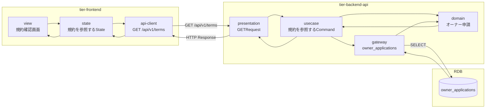
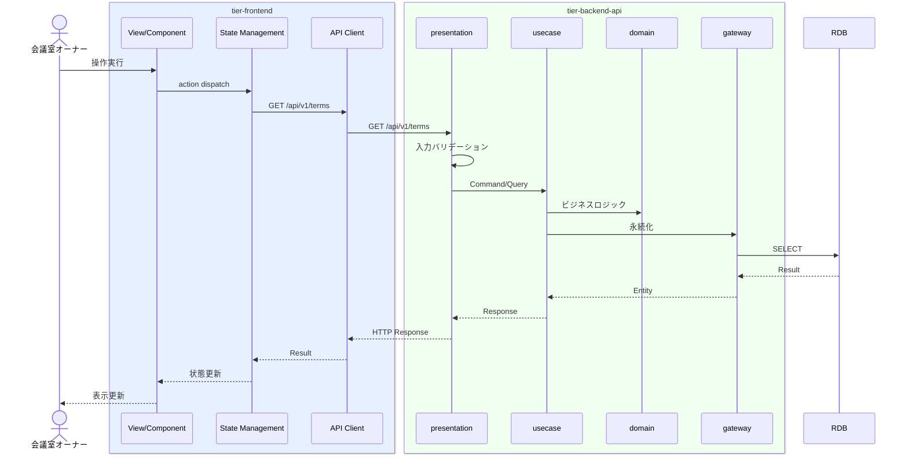

# 規約を参照する

## 概要

オーナーが利用規約を確認する。規約確認日時がオーナー申請に記録される。

## データフロー



| レイヤー | データモデル | 変換内容 |
|---------|------------|---------|
| FE View | 規約確認画面の表示/入力 | ユーザー操作 → state 更新 |
| BE presentation | Request | バリデーション + Command変換 |
| BE gateway | SELECT owner_applications | レコード操作 |
| Response | TermsResponse | 表示用データ |

## 処理フロー



## バリエーション一覧

該当なし

## 分岐条件一覧

該当なし

## 計算ルール一覧

該当なし


## 状態遷移一覧

該当なし

## 関連 RDRA モデル

| モデル種別 | 要素名 | 関連 |
|-----------|--------|------|
| 業務 | オーナー管理業務 | このUCが属する業務 |
| BUC | オーナー登録フロー | このUCを含むBUC |
| アクター | 会議室オーナー | 操作するアクター |
| 情報 | オーナー申請 | 参照・更新する情報 |


## E2E 完了条件（BDD）

### 正常系

```gherkin
Feature: 規約を参照する

  Scenario: オーナーが利用規約を確認する
    Given 会議室オーナー「田中太郎」がオーナー登録フロー中で規約確認画面を表示している
    When 規約内容を最後までスクロールし「同意する」ボタンをクリックする
    Then 規約確認日時が記録され次のステップ（オーナー申請画面）へ遷移する
```

### 異常系

```gherkin
  Scenario: 規約に同意せずに次へ進もうとする
    Given 会議室オーナーが規約確認画面を表示している
    When 規約をスクロールせずに「同意する」ボタンをクリックする
    Then 「規約を最後までお読みください」のメッセージが表示される
```

## ティア別仕様

- [フロントエンド](tier-frontend.md)
- [バックエンドAPI](tier-backend-api.md)

### 統合 API Spec

- [OpenAPI Spec](../../../_cross-cutting/api/openapi.yaml)
