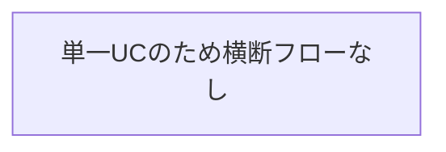
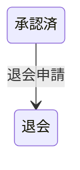

# オーナー退会フロー

## 概要

承認済みのオーナーが退会申請を行いアカウントを退会状態にするフロー。

## 所属 UC 一覧

| UC名 | アクター | 主な操作 | 関連情報 |
|------|---------|---------|---------|
| [オーナー退会する](オーナー退会する/spec.md) | 会議室オーナー | 退会申請 | オーナー情報 |

## UC 横断データフロー

### データフロー図

### 情報 CRUD マトリクス

| 情報名 | オーナー退会する |
|--------|:---:|
| オーナー情報 | U |

## 状態遷移全体図

### オーナー状態

| 遷移元 | 遷移先 | トリガー UC |
|--------|--------|------------|
| 承認済 | 退会 | 退会申請 |

## BUC 内共有条件一覧

該当なし

## BUC 内共有バリエーション一覧

該当なし
