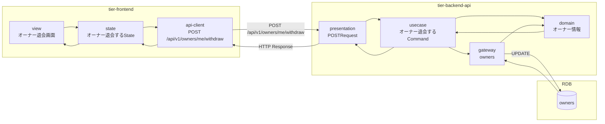
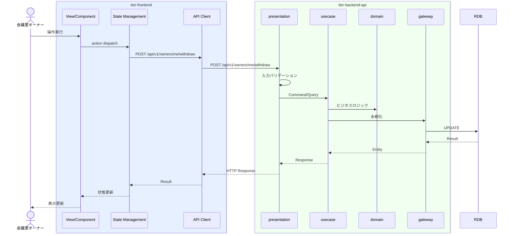

# オーナー退会する

## 概要

オーナーが退会申請を行いアカウントを退会状態にする。オーナー状態は承認済→退会に遷移する。

## データフロー



| レイヤー | データモデル | 変換内容 |
|---------|------------|---------|
| FE View | オーナー退会画面の表示/入力 | ユーザー操作 → state 更新 |
| BE presentation | Request | バリデーション + Command変換 |
| BE gateway | UPDATE owners | レコード操作 |
| Response | OwnerResponse | 表示用データ |

## 処理フロー



## バリエーション一覧

該当なし

## 分岐条件一覧

該当なし

## 計算ルール一覧

該当なし


## 状態遷移一覧

| 状態モデル | 遷移元 | 遷移先 | トリガー | 事前条件 | 事後処理 | 適用 tier |
|-----------|--------|--------|---------|---------|---------|----------|
| オーナー状態 | 承認済 | 退会 | 退会申請 | - | - | tier-backend-api |

## 関連 RDRA モデル

| モデル種別 | 要素名 | 関連 |
|-----------|--------|------|
| 業務 | オーナー管理業務 | このUCが属する業務 |
| BUC | オーナー退会フロー | このUCを含むBUC |
| アクター | 会議室オーナー | 操作するアクター |
| 情報 | オーナー情報 | 参照・更新する情報 |
| 状態 | オーナー状態 | 関連する状態遷移 |


## E2E 完了条件（BDD）

### 正常系

```gherkin
Feature: オーナー退会する

  Scenario: オーナーが退会する
    Given 承認済みの会議室オーナー「田中太郎」がオーナー退会画面を表示している
    When 退会理由を入力し「退会する」ボタンをクリックし確認ダイアログで「はい」を選択する
    Then オーナー状態が「退会」に更新されログアウトされる
```

### 異常系

```gherkin
  Scenario: 未精算のオーナーが退会しようとする
    Given 承認済みの会議室オーナー「田中太郎」に未精算の売上がある状態でオーナー退会画面を表示している
    When 「退会する」ボタンをクリックする
    Then 「未精算の売上があるため退会できません」のエラーが表示される
```

## ティア別仕様

- [フロントエンド](tier-frontend.md)
- [バックエンドAPI](tier-backend-api.md)

### 統合 API Spec

- [OpenAPI Spec](../../../_cross-cutting/api/openapi.yaml)
