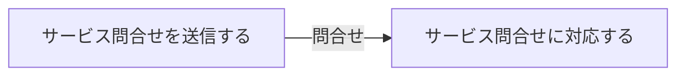

# サービス問合せ対応フロー

## 概要

利用者がサービスへの問合せを送信し、サービス運営担当者が対応するフロー。

## 所属 UC 一覧

| UC名 | アクター | 主な操作 | 関連情報 |
|------|---------|---------|---------|
| [サービス問合せを送信する](サービス問合せを送信する/spec.md) | 利用者 | サービスへの問合せ送信 | 問合せ |
| [サービス問合せに対応する](サービス問合せに対応する/spec.md) | サービス運営担当者 | 問合せへの回答 | 問合せ |

## UC 横断データフロー

### データフロー図

### 情報 CRUD マトリクス

| 情報名 | サービス問合せを送信する | サービス問合せに対応する |
|--------|:---:|:---:|
| 問合せ | C | U |

## 状態遷移全体図

該当なし

## BUC 内共有条件一覧

該当なし

## BUC 内共有バリエーション一覧

| バリエーション名 | 適用 UC |
|----------------|--------|
| 問合せ種別 | サービス問合せを送信する, サービス問合せに対応する |
