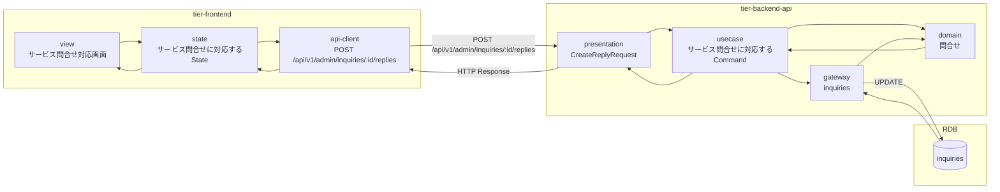
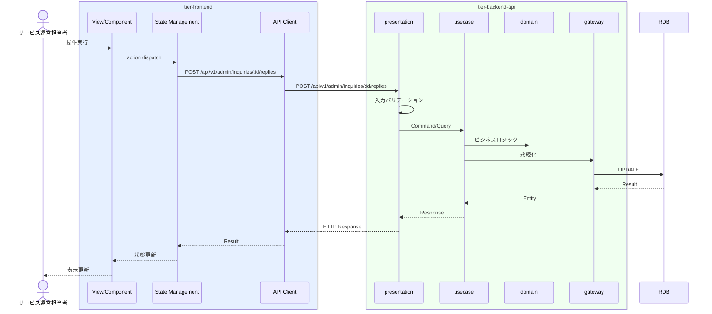

# サービス問合せに対応する

## 概要

サービス運営担当者が利用者からのサービス問合せに対応する。

## データフロー



| レイヤー | データモデル | 変換内容 |
|---------|------------|---------|
| FE View | サービス問合せ対応画面の表示/入力 | ユーザー操作 → state 更新 |
| BE presentation | CreateReplyRequest | バリデーション + Command変換 |
| BE gateway | UPDATE inquiries | レコード操作 |
| Response | InquiryResponse | 表示用データ |

## 処理フロー



## バリエーション一覧

該当なし

## 分岐条件一覧

該当なし

## 計算ルール一覧

該当なし


## 状態遷移一覧

該当なし

## 関連 RDRA モデル

| モデル種別 | 要素名 | 関連 |
|-----------|--------|------|
| 業務 | サービス運営業務 | このUCが属する業務 |
| BUC | サービス問合せ対応フロー | このUCを含むBUC |
| アクター | サービス運営担当者 | 操作するアクター |
| 情報 | 問合せ | 参照・更新する情報 |


## E2E 完了条件（BDD）

### 正常系

```gherkin
Feature: サービス問合せに対応する

  Scenario: 運営担当者がサービス問合せに回答する
    Given サービス運営担当者「管理者A」がサービス問合せ対応画面で利用者「山田花子」の問合せ「退会方法について」を表示している
    When 回答「マイページの設定メニューから退会手続きが可能です」を入力し「回答する」ボタンをクリックする
    Then 回答が送信され利用者に通知される
```

### 異常系

```gherkin
  Scenario: 空の回答を送信しようとする
    Given サービス運営担当者がサービス問合せ対応画面を表示している
    When 回答内容を空のまま「回答する」ボタンをクリックする
    Then 「回答内容は必須です」のバリデーションエラーが表示される
```

## ティア別仕様

- [フロントエンド](tier-frontend.md)
- [バックエンドAPI](tier-backend-api.md)

### 統合 API Spec

- [OpenAPI Spec](../../../_cross-cutting/api/openapi.yaml)
