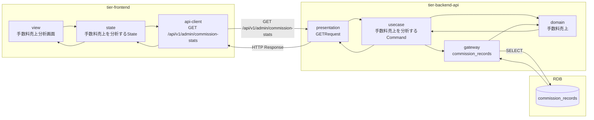
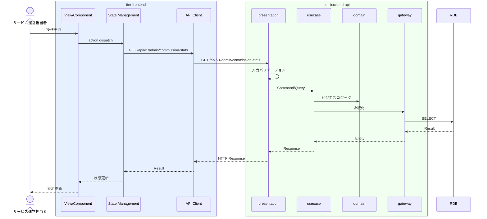

# 手数料売上を分析する

## 概要

サービス運営担当者が手数料売上を会議室別・貸出別に分析する。

## データフロー



| レイヤー | データモデル | 変換内容 |
|---------|------------|---------|
| FE View | 手数料売上分析画面の表示/入力 | ユーザー操作 → state 更新 |
| BE presentation | Request | バリデーション + Command変換 |
| BE gateway | SELECT commission_records | レコード操作 |
| Response | CommissionStatsResponse | 表示用データ |

## 処理フロー



## バリエーション一覧

| バリエーション名 | 値 | 処理内容 | 適用 tier | 適用箇所 |
|----------------|---|---------|----------|---------|

## 分岐条件一覧

該当なし

## 計算ルール一覧

該当なし


## 状態遷移一覧

該当なし

## 関連 RDRA モデル

| モデル種別 | 要素名 | 関連 |
|-----------|--------|------|
| 業務 | サービス運営業務 | このUCが属する業務 |
| BUC | サービス運営管理フロー | このUCを含むBUC |
| アクター | サービス運営担当者 | 操作するアクター |
| 情報 | 手数料売上 | 参照・更新する情報 |


| バリエーション | 売上分析軸 | 関連するバリエーション |


## E2E 完了条件（BDD）

### 正常系

```gherkin
Feature: 手数料売上を分析する

  Scenario: 運営担当者が手数料売上を分析する
    Given サービス運営担当者「管理者A」が手数料売上分析画面を表示している
    When 分析軸「会議室別」、期間「2026年3月」を選択する
    Then 会議室別手数料売上の棒グラフとサマリー（合計手数料「450,000円」、前月比「+8%」）が表示される
```

### 異常系

```gherkin
  Scenario: データがない期間を選択する
    Given サービス運営担当者が手数料売上分析画面を表示している
    When 期間「2024年1月」を選択する
    Then 「この期間のデータはありません」の空状態メッセージが表示される
```

## ティア別仕様

- [フロントエンド](tier-frontend.md)
- [バックエンドAPI](tier-backend-api.md)

### 統合 API Spec

- [OpenAPI Spec](../../../_cross-cutting/api/openapi.yaml)
