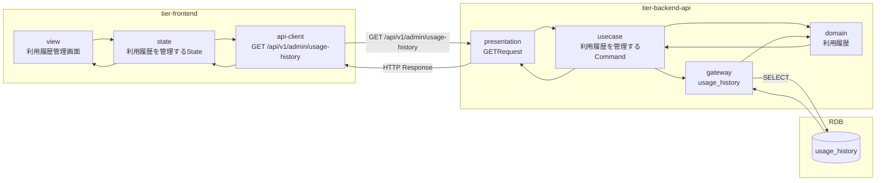
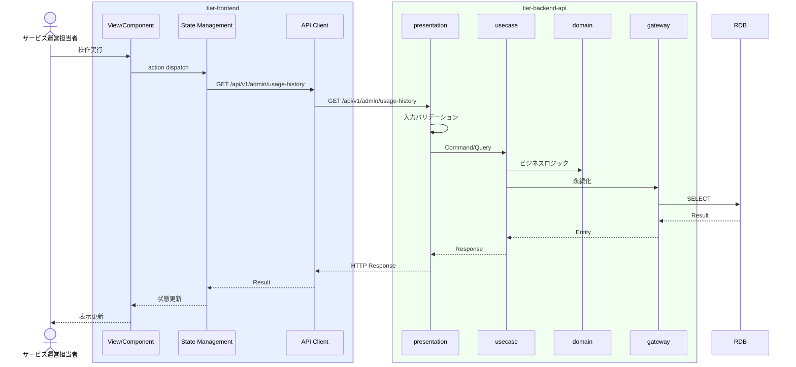

# 利用履歴を管理する

## 概要

サービス運営担当者が利用履歴を会員別・物件別に管理する。

## データフロー



| レイヤー | データモデル | 変換内容 |
|---------|------------|---------|
| FE View | 利用履歴管理画面の表示/入力 | ユーザー操作 → state 更新 |
| BE presentation | Request | バリデーション + Command変換 |
| BE gateway | SELECT usage_history | レコード操作 |
| Response | UsageHistoryListResponse | 表示用データ |

## 処理フロー



## バリエーション一覧

| バリエーション名 | 値 | 処理内容 | 適用 tier | 適用箇所 |
|----------------|---|---------|----------|---------|

## 分岐条件一覧

該当なし

## 計算ルール一覧

該当なし


## 状態遷移一覧

該当なし

## 関連 RDRA モデル

| モデル種別 | 要素名 | 関連 |
|-----------|--------|------|
| 業務 | サービス運営業務 | このUCが属する業務 |
| BUC | 利用状況管理フロー | このUCを含むBUC |
| アクター | サービス運営担当者 | 操作するアクター |
| 情報 | 利用履歴 | 参照・更新する情報 |


| バリエーション | 利用履歴分析軸 | 関連するバリエーション |


## E2E 完了条件（BDD）

### 正常系

```gherkin
Feature: 利用履歴を管理する

  Scenario: 運営担当者が利用履歴を管理する
    Given サービス運営担当者「管理者A」が利用履歴管理画面を表示している
    When 分析軸「会員別」でフィルターし期間「2026年3月」を選択する
    Then 会員別の利用履歴一覧が表示され各履歴に利用日時、利用時間、会議室名が含まれる
```

### 異常系

```gherkin
  Scenario: 条件に合う利用履歴がない場合
    Given サービス運営担当者が利用履歴管理画面を表示している
    When 存在しない会員IDで検索する
    Then 「条件に合う利用履歴はありません」の空状態メッセージが表示される
```

## ティア別仕様

- [フロントエンド](tier-frontend.md)
- [バックエンドAPI](tier-backend-api.md)

### 統合 API Spec

- [OpenAPI Spec](../../../_cross-cutting/api/openapi.yaml)
