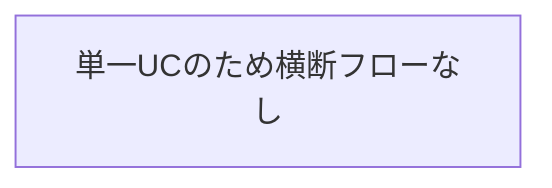
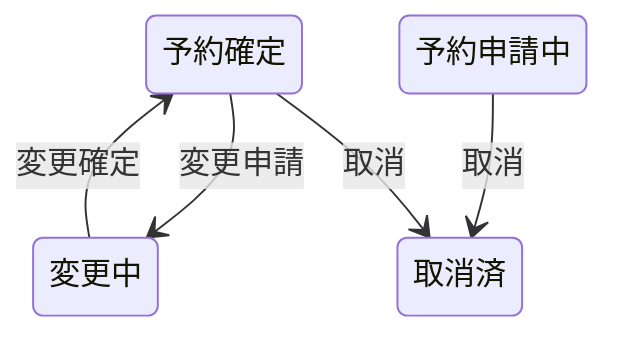

# 予約変更取消フロー

## 概要

利用者が予約内容を変更または取り消すフロー。キャンセルポリシーに基づきキャンセル料が発生する場合がある。

## 所属 UC 一覧

| UC名 | アクター | 主な操作 | 関連情報 |
|------|---------|---------|---------|
| [予約を変更する](予約を変更する/spec.md) | 利用者 | 予約日時の変更 | 予約情報 |
| [予約を取消する](予約を取消する/spec.md) | 利用者 | 予約の取消 | 予約情報 |

## UC 横断データフロー

### データフロー図

### 情報 CRUD マトリクス

| 情報名 | 予約を変更する | 予約を取消する |
|--------|:---:|:---:|
| 予約情報 | U | U |

## 状態遷移全体図

### 予約状態

| 遷移元 | 遷移先 | トリガー UC |
|--------|--------|------------|
| 予約確定 | 変更中 | 変更申請 |
| 変更中 | 予約確定 | 変更確定 |
| 予約申請中 | 取消済 | 取消 |
| 予約確定 | 取消済 | 取消 |

## BUC 内共有条件一覧

| 条件名 | 適用 UC |
|--------|--------|
| キャンセルポリシー | 予約を変更する, 予約を取消する |

## BUC 内共有バリエーション一覧

該当なし
