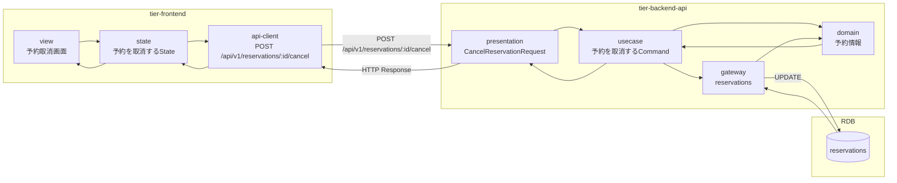
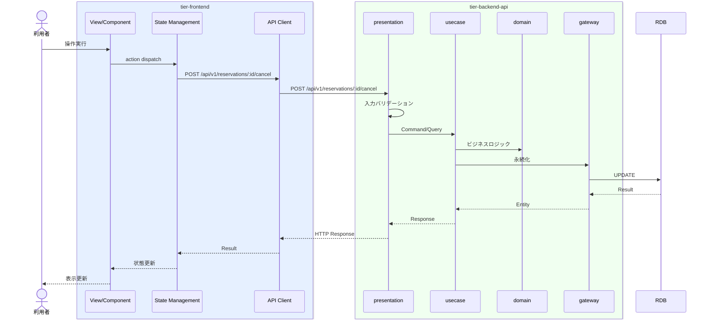

# 予約を取消する

## 概要

利用者が予約を取り消す。キャンセルポリシーに基づきキャンセル料が発生する場合がある。予約状態は取消済に遷移する。

## データフロー



| レイヤー | データモデル | 変換内容 |
|---------|------------|---------|
| FE View | 予約取消画面の表示/入力 | ユーザー操作 → state 更新 |
| BE presentation | CancelReservationRequest | バリデーション + Command変換 |
| BE gateway | UPDATE reservations | レコード操作 |
| Response | ReservationResponse | 表示用データ |

## 処理フロー



## バリエーション一覧

該当なし

## 分岐条件一覧

| 条件名 | 判定ルール | 適用 tier | 適用箇所 | BDD Scenario |
|--------|----------|----------|---------|-------------|
| キャンセルポリシー | 条件.tsvの定義に従う | tier-backend-api | ビジネスロジック | 異常系シナリオ |

## 計算ルール一覧

該当なし


## 状態遷移一覧

| 状態モデル | 遷移元 | 遷移先 | トリガー | 事前条件 | 事後処理 | 適用 tier |
|-----------|--------|--------|---------|---------|---------|----------|
| 予約状態 | 予約申請中 | 取消済 | 予約を取消する | - | - | tier-backend-api |
| 予約状態 | 予約確定 | 取消済 | 予約を取消する | - | - | tier-backend-api |

## 関連 RDRA モデル

| モデル種別 | 要素名 | 関連 |
|-----------|--------|------|
| 業務 | 会議室予約業務 | このUCが属する業務 |
| BUC | 予約変更取消フロー | このUCを含むBUC |
| アクター | 利用者 | 操作するアクター |
| 情報 | 予約情報 | 参照・更新する情報 |
| 状態 | 予約状態 | 関連する状態遷移 |
| 条件 | キャンセルポリシー | 適用される条件 |


## E2E 完了条件（BDD）

### 正常系

```gherkin
Feature: 予約を取消する

  Scenario: 利用者が予約を取り消す（キャンセル料なし）
    Given 利用者「山田花子」が予約「RSV-001」（利用日2026-04-20）の予約取消画面を本日2026-04-10に表示している
    When キャンセルポリシー「3日前まで無料」を確認し「取消する」ボタンをクリックする
    Then 予約状態が「取消済」に更新されキャンセル料は0円と表示される
```

### 異常系

```gherkin
  Scenario: 利用者が直前に予約を取り消す（キャンセル料発生）
    Given 利用者「山田花子」が予約「RSV-002」（利用日2026-04-12）の予約取消画面を本日2026-04-11に表示している
    When キャンセルポリシー「前日キャンセルは50%」を確認し「取消する」ボタンをクリックする
    Then 予約状態が「取消済」に更新されキャンセル料「2500円」が表示される
```

## ティア別仕様

- [フロントエンド](tier-frontend.md)
- [バックエンドAPI](tier-backend-api.md)

### 統合 API Spec

- [OpenAPI Spec](../../../_cross-cutting/api/openapi.yaml)
