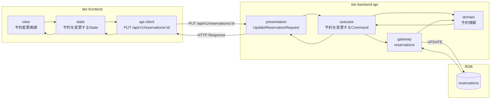
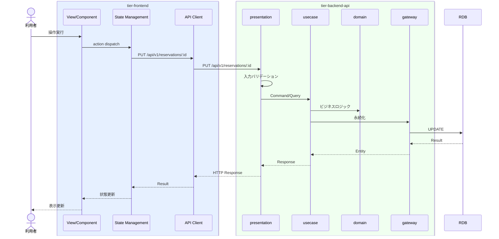

# 予約を変更する

## 概要

利用者が予約内容（日時）を変更する。予約状態は予約確定→変更中→予約確定に遷移する。

## データフロー



| レイヤー | データモデル | 変換内容 |
|---------|------------|---------|
| FE View | 予約変更画面の表示/入力 | ユーザー操作 → state 更新 |
| BE presentation | UpdateReservationRequest | バリデーション + Command変換 |
| BE gateway | UPDATE reservations | レコード操作 |
| Response | ReservationResponse | 表示用データ |

## 処理フロー



## バリエーション一覧

該当なし

## 分岐条件一覧

該当なし

## 計算ルール一覧

該当なし


## 状態遷移一覧

| 状態モデル | 遷移元 | 遷移先 | トリガー | 事前条件 | 事後処理 | 適用 tier |
|-----------|--------|--------|---------|---------|---------|----------|
| 予約状態 | 予約確定 | 変更中 | 変更申請 | - | - | tier-backend-api |
| 予約状態 | 変更中 | 予約確定 | 変更確定 | - | - | tier-backend-api |

## 関連 RDRA モデル

| モデル種別 | 要素名 | 関連 |
|-----------|--------|------|
| 業務 | 会議室予約業務 | このUCが属する業務 |
| BUC | 予約変更取消フロー | このUCを含むBUC |
| アクター | 利用者 | 操作するアクター |
| 情報 | 予約情報 | 参照・更新する情報 |
| 状態 | 予約状態 | 関連する状態遷移 |


## E2E 完了条件（BDD）

### 正常系

```gherkin
Feature: 予約を変更する

  Scenario: 利用者が予約日時を変更する
    Given 利用者「山田花子」が予約「RSV-001」の予約変更画面を表示している
    When 利用日時を「2026-04-16 10:00-12:00」に変更し「変更する」ボタンをクリックする
    Then 予約日時が更新され予約状態が「予約確定」に戻る
```

### 異常系

```gherkin
  Scenario: 変更先の時間帯が予約済みの場合
    Given 利用者が予約変更画面を表示している
    When 既に予約が入っている時間帯「2026-04-16 14:00-16:00」に変更しようとする
    Then 「選択した時間帯は既に予約されています」のエラーが表示される
```

## ティア別仕様

- [フロントエンド](tier-frontend.md)
- [バックエンドAPI](tier-backend-api.md)

### 統合 API Spec

- [OpenAPI Spec](../../../_cross-cutting/api/openapi.yaml)
