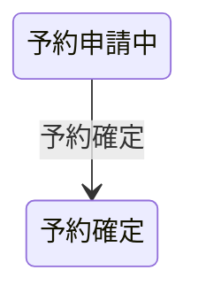

# 会議室予約フロー

## 概要

利用者が条件で会議室を検索し、予約と決済方法を設定するフロー。

## 所属 UC 一覧

| UC名 | アクター | 主な操作 | 関連情報 |
|------|---------|---------|---------|
| [会議室を照会する](会議室を照会する/spec.md) | 利用者 | 会議室の検索・一覧表示 | 会議室情報, 会議室評価 |
| [会議室を予約する](会議室を予約する/spec.md) | 利用者 | 会議室の予約・決済方法設定 | 予約情報, 決済情報 |

## UC 横断データフロー

### データフロー図

### 情報 CRUD マトリクス

| 情報名 | 会議室を照会する | 会議室を予約する |
|--------|:---:|:---:|
| 会議室情報 | R | R |
| 会議室評価 | R | - |
| 予約情報 | - | C |
| 決済情報 | - | R |

## 状態遷移全体図

### 予約状態

| 遷移元 | 遷移先 | トリガー UC |
|--------|--------|------------|
| 予約申請中 | 予約確定 | 予約確定 |

## BUC 内共有条件一覧

該当なし

## BUC 内共有バリエーション一覧

| バリエーション名 | 適用 UC |
|----------------|--------|
| 決済方法 | 会議室を照会する, 会議室を予約する |
