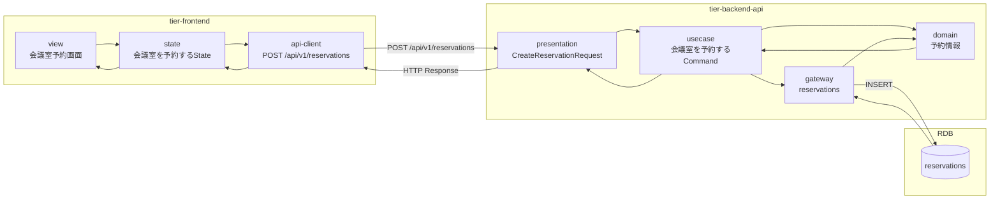
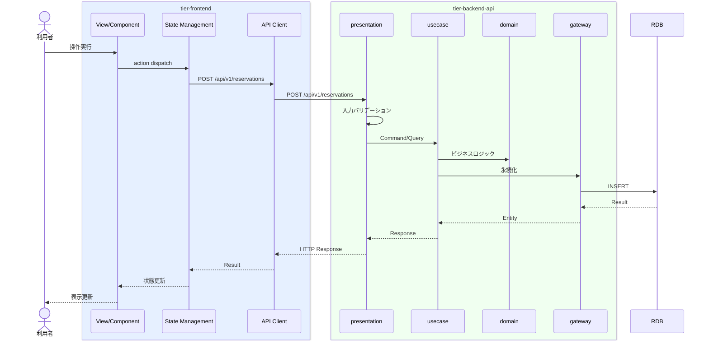

# 会議室を予約する

## 概要

利用者が会議室を選択し予約と決済方法を設定する。予約状態は予約申請中→予約確定に遷移する。

## データフロー



| レイヤー | データモデル | 変換内容 |
|---------|------------|---------|
| FE View | 会議室予約画面の表示/入力 | ユーザー操作 → state 更新 |
| BE presentation | CreateReservationRequest | バリデーション + Command変換 |
| BE gateway | INSERT reservations | レコード操作 |
| Response | ReservationResponse | 表示用データ |

## 処理フロー



## バリエーション一覧

| バリエーション名 | 値 | 処理内容 | 適用 tier | 適用箇所 |
|----------------|---|---------|----------|---------|

## 分岐条件一覧

該当なし

## 計算ルール一覧

該当なし


## 状態遷移一覧

| 状態モデル | 遷移元 | 遷移先 | トリガー | 事前条件 | 事後処理 | 適用 tier |
|-----------|--------|--------|---------|---------|---------|----------|
| 予約状態 | 予約申請中 | 予約確定 | 会議室を予約する | - | - | tier-backend-api |

## 関連 RDRA モデル

| モデル種別 | 要素名 | 関連 |
|-----------|--------|------|
| 業務 | 会議室予約業務 | このUCが属する業務 |
| BUC | 会議室予約フロー | このUCを含むBUC |
| アクター | 利用者 | 操作するアクター |
| 情報 | 予約情報 | 参照・更新する情報 |
| 情報 | 決済情報 | 参照・更新する情報 |
| 状態 | 予約状態 | 関連する状態遷移 |

| バリエーション | 決済方法 | 関連するバリエーション |


## E2E 完了条件（BDD）

### 正常系

```gherkin
Feature: 会議室を予約する

  Scenario: 利用者が会議室を予約する
    Given 利用者「山田花子」が会議室「渋谷ミーティングルームA」の予約画面を表示している
    When 利用日時「2026-04-15 10:00-12:00」、決済方法「クレジットカード」を選択し「予約する」ボタンをクリックする
    Then 予約が確定し予約状態が「予約確定」になり予約IDが発行される
```

### 異常系

```gherkin
  Scenario: 既に予約済みの時間帯に予約しようとする
    Given 利用者「山田花子」が会議室「渋谷ミーティングルームA」の予約画面を表示している
    When 既に予約が入っている「2026-04-15 14:00-16:00」の時間帯を選択し「予約する」ボタンをクリックする
    Then 「選択した時間帯は既に予約されています」のエラーが表示される
```

## ティア別仕様

- [フロントエンド](tier-frontend.md)
- [バックエンドAPI](tier-backend-api.md)

### 統合 API Spec

- [OpenAPI Spec](../../../_cross-cutting/api/openapi.yaml)
