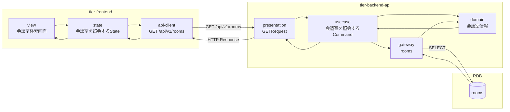
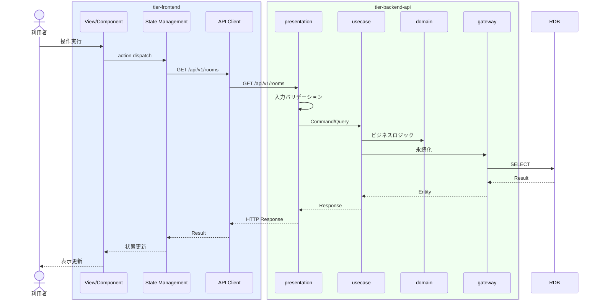

# 会議室を照会する

## 概要

利用者が条件（所在地、価格帯、広さ、機能性）で会議室を検索する。

## データフロー



| レイヤー | データモデル | 変換内容 |
|---------|------------|---------|
| FE View | 会議室検索画面の表示/入力 | ユーザー操作 → state 更新 |
| BE presentation | Request | バリデーション + Command変換 |
| BE gateway | SELECT rooms | レコード操作 |
| Response | RoomListResponse | 表示用データ |

## 処理フロー



## バリエーション一覧

該当なし

## 分岐条件一覧

該当なし

## 計算ルール一覧

該当なし


## 状態遷移一覧

該当なし

## 関連 RDRA モデル

| モデル種別 | 要素名 | 関連 |
|-----------|--------|------|
| 業務 | 会議室予約業務 | このUCが属する業務 |
| BUC | 会議室予約フロー | このUCを含むBUC |
| アクター | 利用者 | 操作するアクター |
| 情報 | 会議室情報 | 参照・更新する情報 |
| 情報 | 会議室評価 | 参照・更新する情報 |


## E2E 完了条件（BDD）

### 正常系

```gherkin
Feature: 会議室を照会する

  Scenario: 利用者が会議室を検索する
    Given 利用者「山田花子」が会議室検索画面を表示している
    When 所在地「渋谷区」、価格帯「3000-8000円」、収容人数「10人以上」で検索する
    Then 条件に合致する会議室が一覧表示され各会議室の評価点が表示される
```

### 異常系

```gherkin
  Scenario: 条件に合う会議室がない場合
    Given 利用者が会議室検索画面を表示している
    When 所在地「北海道稚内市」で検索する
    Then 「条件に合う会議室が見つかりませんでした」の空状態メッセージが表示される
```

## ティア別仕様

- [フロントエンド](tier-frontend.md)
- [バックエンドAPI](tier-backend-api.md)

### 統合 API Spec

- [OpenAPI Spec](../../../_cross-cutting/api/openapi.yaml)
