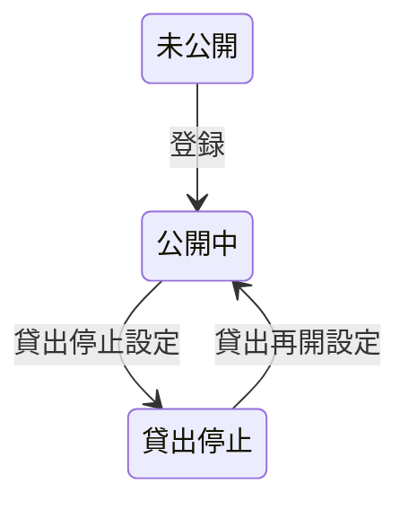

# 会議室登録フロー

## 概要

オーナーが会議室の物件情報を登録し、運用ルール（キャンセルポリシー・貸出可否）を設定するフロー。

## 所属 UC 一覧

| UC名 | アクター | 主な操作 | 関連情報 |
|------|---------|---------|---------|
| [会議室を登録する](会議室を登録する/spec.md) | 会議室オーナー | 会議室物件情報の登録 | 会議室情報 |
| [運用ルールを設定する](運用ルールを設定する/spec.md) | 会議室オーナー | キャンセルポリシー・貸出可否の設定 | 運用ルール |

## UC 横断データフロー

### データフロー図

### 情報 CRUD マトリクス

| 情報名 | 会議室を登録する | 運用ルールを設定する |
|--------|:---:|:---:|
| 会議室情報 | C | U |
| 運用ルール | - | C |

## 状態遷移全体図

### 会議室状態

| 遷移元 | 遷移先 | トリガー UC |
|--------|--------|------------|
| 未公開 | 公開中 | 登録 |
| 公開中 | 貸出停止 | 貸出停止設定 |
| 貸出停止 | 公開中 | 貸出再開設定 |

## BUC 内共有条件一覧

| 条件名 | 適用 UC |
|--------|--------|
| キャンセルポリシー | 会議室を登録する, 運用ルールを設定する |

## BUC 内共有バリエーション一覧

該当なし
