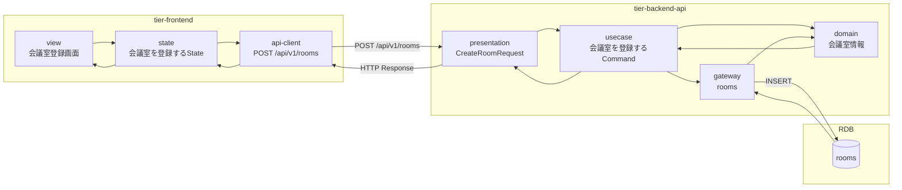
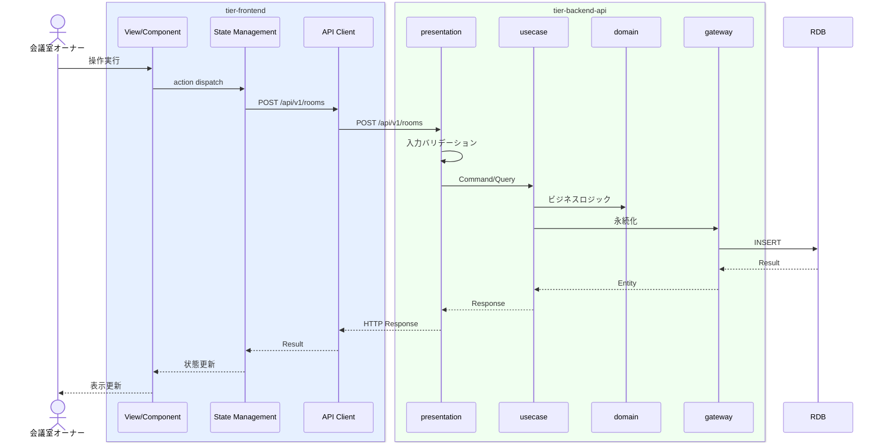

# 会議室を登録する

## 概要

オーナーが会議室の物件情報（会議室名、所在地、広さ、価格、機能性）を登録する。会議室状態は未公開→公開中に遷移する。

## データフロー



| レイヤー | データモデル | 変換内容 |
|---------|------------|---------|
| FE View | 会議室登録画面の表示/入力 | ユーザー操作 → state 更新 |
| BE presentation | CreateRoomRequest | バリデーション + Command変換 |
| BE gateway | INSERT rooms | レコード操作 |
| Response | RoomResponse | 表示用データ |

## 処理フロー



## バリエーション一覧

該当なし

## 分岐条件一覧

該当なし

## 計算ルール一覧

該当なし


## 状態遷移一覧

| 状態モデル | 遷移元 | 遷移先 | トリガー | 事前条件 | 事後処理 | 適用 tier |
|-----------|--------|--------|---------|---------|---------|----------|
| 会議室状態 | 未公開 | 公開中 | 会議室を登録する | - | - | tier-backend-api |

## 関連 RDRA モデル

| モデル種別 | 要素名 | 関連 |
|-----------|--------|------|
| 業務 | 会議室管理業務 | このUCが属する業務 |
| BUC | 会議室登録フロー | このUCを含むBUC |
| アクター | 会議室オーナー | 操作するアクター |
| 情報 | 会議室情報 | 参照・更新する情報 |
| 状態 | 会議室状態 | 関連する状態遷移 |


## E2E 完了条件（BDD）

### 正常系

```gherkin
Feature: 会議室を登録する

  Scenario: オーナーが会議室を登録する
    Given 承認済みの会議室オーナー「田中太郎」が会議室登録画面を表示している
    When 会議室名「渋谷ミーティングルームA」、所在地「東京都渋谷区道玄坂1-1-1」、広さ「30平米」、価格「5000円/時間」、機能性「プロジェクター、ホワイトボード」を入力し「登録する」ボタンをクリックする
    Then 会議室情報が登録され会議室状態が「公開中」になる
```

### 異常系

```gherkin
  Scenario: 必須項目未入力で会議室登録に失敗する
    Given 承認済みの会議室オーナー「田中太郎」が会議室登録画面を表示している
    When 会議室名を空のまま「登録する」ボタンをクリックする
    Then 「会議室名は必須です」のバリデーションエラーが表示される
```

## ティア別仕様

- [フロントエンド](tier-frontend.md)
- [バックエンドAPI](tier-backend-api.md)

### 統合 API Spec

- [OpenAPI Spec](../../../_cross-cutting/api/openapi.yaml)
