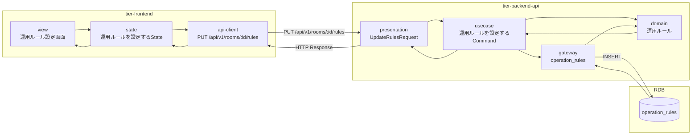
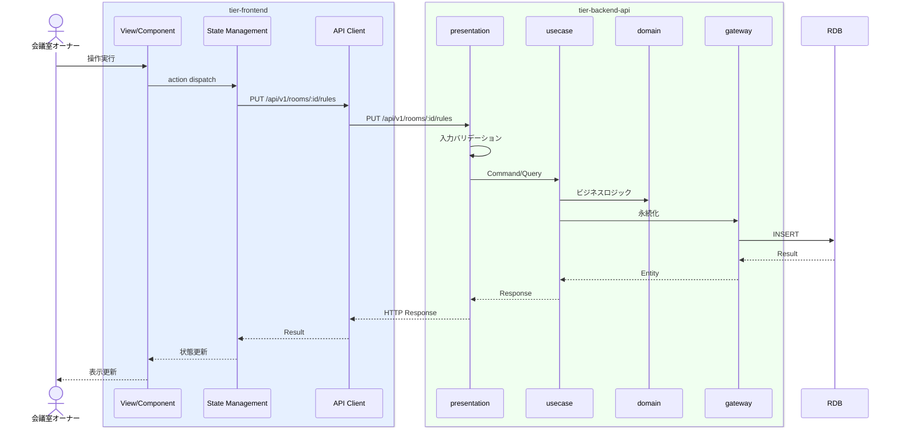

# 運用ルールを設定する

## 概要

オーナーがキャンセルポリシーと貸出可否を設定する。貸出停止に設定すると会議室状態が貸出停止に遷移する。

## データフロー



| レイヤー | データモデル | 変換内容 |
|---------|------------|---------|
| FE View | 運用ルール設定画面の表示/入力 | ユーザー操作 → state 更新 |
| BE presentation | UpdateRulesRequest | バリデーション + Command変換 |
| BE gateway | INSERT operation_rules | レコード操作 |
| Response | RulesResponse | 表示用データ |

## 処理フロー



## バリエーション一覧

該当なし

## 分岐条件一覧

| 条件名 | 判定ルール | 適用 tier | 適用箇所 | BDD Scenario |
|--------|----------|----------|---------|-------------|
| キャンセルポリシー | 条件.tsvの定義に従う | tier-backend-api | ビジネスロジック | 異常系シナリオ |

## 計算ルール一覧

該当なし


## 状態遷移一覧

| 状態モデル | 遷移元 | 遷移先 | トリガー | 事前条件 | 事後処理 | 適用 tier |
|-----------|--------|--------|---------|---------|---------|----------|
| 会議室状態 | 公開中 | 貸出停止 | 貸出停止設定 | - | - | tier-backend-api |
| 会議室状態 | 貸出停止 | 公開中 | 貸出再開設定 | - | - | tier-backend-api |

## 関連 RDRA モデル

| モデル種別 | 要素名 | 関連 |
|-----------|--------|------|
| 業務 | 会議室管理業務 | このUCが属する業務 |
| BUC | 会議室登録フロー | このUCを含むBUC |
| アクター | 会議室オーナー | 操作するアクター |
| 情報 | 運用ルール | 参照・更新する情報 |
| 状態 | 会議室状態 | 関連する状態遷移 |
| 条件 | キャンセルポリシー | 適用される条件 |


## E2E 完了条件（BDD）

### 正常系

```gherkin
Feature: 運用ルールを設定する

  Scenario: オーナーが運用ルールを設定する
    Given 会議室オーナー「田中太郎」が会議室「渋谷ミーティングルームA」の運用ルール設定画面を表示している
    When キャンセルポリシー「3日前まで無料、それ以降50%」、貸出可否「可」、最低利用時間「60分」を設定し「保存する」ボタンをクリックする
    Then 運用ルールが保存される
```

### 異常系

```gherkin
  Scenario: 最低利用時間が0以下で設定に失敗する
    Given 会議室オーナーが運用ルール設定画面を表示している
    When 最低利用時間「0分」を入力し「保存する」ボタンをクリックする
    Then 「最低利用時間は1分以上を設定してください」のバリデーションエラーが表示される
```

## ティア別仕様

- [フロントエンド](tier-frontend.md)
- [バックエンドAPI](tier-backend-api.md)

### 統合 API Spec

- [OpenAPI Spec](../../../_cross-cutting/api/openapi.yaml)
