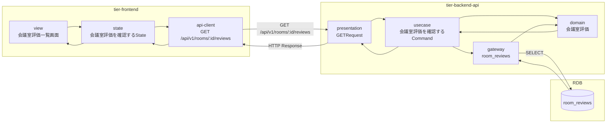
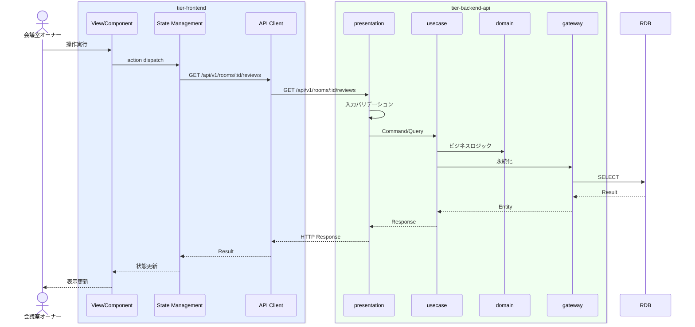

# 会議室評価を確認する

## 概要

オーナーが利用者からの会議室評価（会議室評価点、ホスト評価点、コメント）を確認する。

## データフロー



| レイヤー | データモデル | 変換内容 |
|---------|------------|---------|
| FE View | 会議室評価一覧画面の表示/入力 | ユーザー操作 → state 更新 |
| BE presentation | Request | バリデーション + Command変換 |
| BE gateway | SELECT room_reviews | レコード操作 |
| Response | ReviewListResponse | 表示用データ |

## 処理フロー



## バリエーション一覧

| バリエーション名 | 値 | 処理内容 | 適用 tier | 適用箇所 |
|----------------|---|---------|----------|---------|

## 分岐条件一覧

該当なし

## 計算ルール一覧

該当なし


## 状態遷移一覧

該当なし

## 関連 RDRA モデル

| モデル種別 | 要素名 | 関連 |
|-----------|--------|------|
| 業務 | 会議室管理業務 | このUCが属する業務 |
| BUC | 会議室評価確認フロー | このUCを含むBUC |
| アクター | 会議室オーナー | 操作するアクター |
| 情報 | 会議室評価 | 参照・更新する情報 |


| バリエーション | 評価種別 | 関連するバリエーション |


## E2E 完了条件（BDD）

### 正常系

```gherkin
Feature: 会議室評価を確認する

  Scenario: オーナーが会議室評価を確認する
    Given 会議室オーナー「田中太郎」が会議室「渋谷ミーティングルームA」の評価一覧画面を表示している
    When ページが読み込まれる
    Then 利用者からの会議室評価（評価点4.5、コメント「清潔で使いやすい」等）が一覧表示される
```

### 異常系

```gherkin
  Scenario: 評価がない会議室の評価一覧を表示する
    Given 会議室オーナーが評価のない会議室「新規ルームB」の評価一覧画面を表示している
    When ページが読み込まれる
    Then 「まだ評価はありません」の空状態メッセージが表示される
```

## ティア別仕様

- [フロントエンド](tier-frontend.md)
- [バックエンドAPI](tier-backend-api.md)

### 統合 API Spec

- [OpenAPI Spec](../../../_cross-cutting/api/openapi.yaml)
