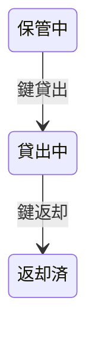
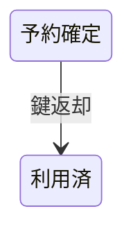
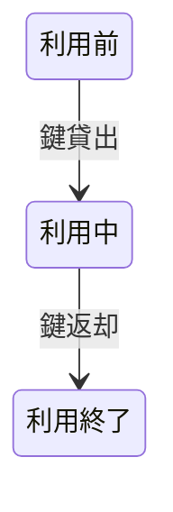

# 会議室貸出フロー

## 概要

オーナーが利用者への会議室貸出を管理するフロー。利用者の使用許諾、鍵の貸出・返却、利用者の評価を行う。

## 所属 UC 一覧

| UC名 | アクター | 主な操作 | 関連情報 |
|------|---------|---------|---------|
| [利用者使用許諾する](利用者使用許諾する/spec.md) | 会議室オーナー | 利用者の使用許諾判断 | 予約情報, 利用者評価 |
| [鍵を貸し出す](鍵を貸し出す/spec.md) | 会議室オーナー | 鍵の貸出記録 | 鍵 |
| [鍵を返却する](鍵を返却する/spec.md) | 会議室オーナー | 鍵の返却記録 | 鍵 |
| [利用者評価を登録する](利用者評価を登録する/spec.md) | 会議室オーナー | 利用者評価の登録 | 利用者評価 |

## UC 横断データフロー

### データフロー図

### 情報 CRUD マトリクス

| 情報名 | 利用者使用許諾する | 鍵を貸し出す | 鍵を返却する | 利用者評価を登録する |
|--------|:---:|:---:|:---:|:---:|
| 予約情報 | R | - | U | - |
| 利用者評価 | R | - | - | C |
| 鍵 | - | U | U | - |

## 状態遷移全体図

### 鍵状態

| 遷移元 | 遷移先 | トリガー UC |
|--------|--------|------------|
| 保管中 | 貸出中 | 鍵貸出 |
| 貸出中 | 返却済 | 鍵返却 |

### 予約状態

| 遷移元 | 遷移先 | トリガー UC |
|--------|--------|------------|
| 予約確定 | 利用済 | 鍵返却 |

### 会議室利用状態

| 遷移元 | 遷移先 | トリガー UC |
|--------|--------|------------|
| 利用前 | 利用中 | 鍵貸出 |
| 利用中 | 利用終了 | 鍵返却 |

## BUC 内共有条件一覧

| 条件名 | 適用 UC |
|--------|--------|
| 利用者許諾条件 | 利用者使用許諾する, 鍵を貸し出す, 鍵を返却する, 利用者評価を登録する |

## BUC 内共有バリエーション一覧

| バリエーション名 | 適用 UC |
|----------------|--------|
| 評価種別 | 利用者使用許諾する, 鍵を貸し出す, 鍵を返却する, 利用者評価を登録する |
