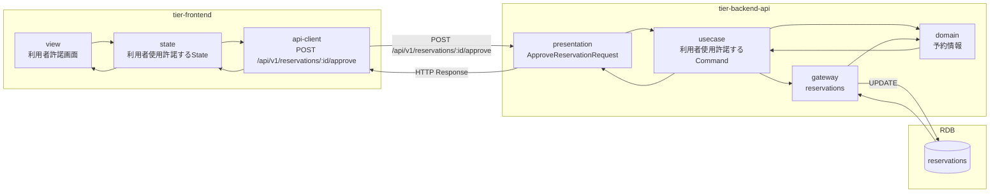
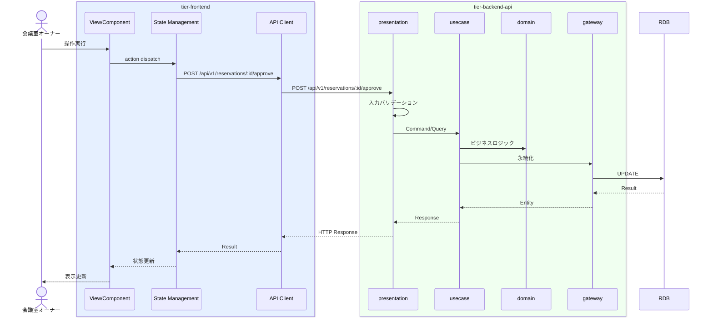

# 利用者使用許諾する

## 概要

オーナーが利用者の過去評価を確認し貸出可否を判断する。

## データフロー



| レイヤー | データモデル | 変換内容 |
|---------|------------|---------|
| FE View | 利用者許諾画面の表示/入力 | ユーザー操作 → state 更新 |
| BE presentation | ApproveReservationRequest | バリデーション + Command変換 |
| BE gateway | UPDATE reservations | レコード操作 |
| Response | ReservationResponse | 表示用データ |

## 処理フロー



## バリエーション一覧

該当なし

## 分岐条件一覧

| 条件名 | 判定ルール | 適用 tier | 適用箇所 | BDD Scenario |
|--------|----------|----------|---------|-------------|
| 利用者許諾条件 | 条件.tsvの定義に従う | tier-backend-api | ビジネスロジック | 異常系シナリオ |

## 計算ルール一覧

該当なし


## 状態遷移一覧

該当なし

## 関連 RDRA モデル

| モデル種別 | 要素名 | 関連 |
|-----------|--------|------|
| 業務 | 会議室貸出業務 | このUCが属する業務 |
| BUC | 会議室貸出フロー | このUCを含むBUC |
| アクター | 会議室オーナー | 操作するアクター |
| 情報 | 予約情報 | 参照・更新する情報 |
| 情報 | 利用者評価 | 参照・更新する情報 |

| 条件 | 利用者許諾条件 | 適用される条件 |


## E2E 完了条件（BDD）

### 正常系

```gherkin
Feature: 利用者使用許諾する

  Scenario: オーナーが利用者の使用を許諾する
    Given 会議室オーナー「田中太郎」が利用者許諾画面で利用者「山田花子」（評価4.8）の予約を表示している
    When 利用者の過去評価を確認し「許諾する」ボタンをクリックする
    Then 予約が許諾され利用者に通知される
```

### 異常系

```gherkin
  Scenario: オーナーが利用者の使用を拒否する
    Given 会議室オーナー「田中太郎」が利用者許諾画面で利用者「佐藤一郎」（評価2.1）の予約を表示している
    When 拒否理由「過去の利用マナーに問題あり」を入力し「拒否する」ボタンをクリックする
    Then 予約が拒否され利用者に通知される
```

## ティア別仕様

- [フロントエンド](tier-frontend.md)
- [バックエンドAPI](tier-backend-api.md)

### 統合 API Spec

- [OpenAPI Spec](../../../_cross-cutting/api/openapi.yaml)
