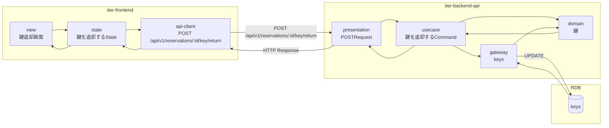
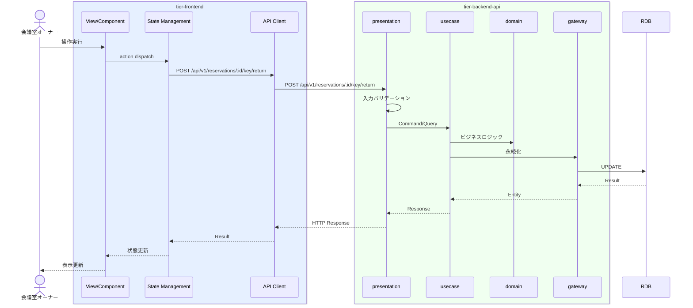

# 鍵を返却する

## 概要

利用者から鍵を返却し利用終了を記録する。鍵状態は貸出中→返却済、予約状態は予約確定→利用済、会議室利用状態は利用中→利用終了に遷移する。

## データフロー



| レイヤー | データモデル | 変換内容 |
|---------|------------|---------|
| FE View | 鍵返却画面の表示/入力 | ユーザー操作 → state 更新 |
| BE presentation | Request | バリデーション + Command変換 |
| BE gateway | UPDATE keys | レコード操作 |
| Response | KeyResponse | 表示用データ |

## 処理フロー



## バリエーション一覧

該当なし

## 分岐条件一覧

該当なし

## 計算ルール一覧

該当なし


## 状態遷移一覧

| 状態モデル | 遷移元 | 遷移先 | トリガー | 事前条件 | 事後処理 | 適用 tier |
|-----------|--------|--------|---------|---------|---------|----------|
| 鍵状態 | 貸出中 | 返却済 | 鍵を返却する | - | - | tier-backend-api |
| 予約状態 | 予約確定 | 利用済 | 鍵を返却する | - | - | tier-backend-api |
| 会議室利用状態 | 利用中 | 利用終了 | 鍵を返却する | - | - | tier-backend-api |

## 関連 RDRA モデル

| モデル種別 | 要素名 | 関連 |
|-----------|--------|------|
| 業務 | 会議室貸出業務 | このUCが属する業務 |
| BUC | 会議室貸出フロー | このUCを含むBUC |
| アクター | 会議室オーナー | 操作するアクター |
| 情報 | 鍵 | 参照・更新する情報 |
| 状態 | 鍵状態 | 関連する状態遷移 |
| 状態 | 予約状態 | 関連する状態遷移 |
| 状態 | 会議室利用状態 | 関連する状態遷移 |


## E2E 完了条件（BDD）

### 正常系

```gherkin
Feature: 鍵を返却する

  Scenario: オーナーが鍵を返却処理する
    Given 会議室オーナー「田中太郎」が鍵返却画面で鍵状態が「貸出中」の予約を表示している
    When 「鍵を返却する」ボタンをクリックする
    Then 鍵状態が「返却済」、予約状態が「利用済」、会議室利用状態が「利用終了」に更新される
```

### 異常系

```gherkin
  Scenario: 保管中の鍵を返却しようとする
    Given 鍵状態が「保管中」の鍵返却画面を表示している
    When 「鍵を返却する」ボタンをクリックする
    Then 「この鍵は貸出されていません」のエラーが表示される
```

## ティア別仕様

- [フロントエンド](tier-frontend.md)
- [バックエンドAPI](tier-backend-api.md)

### 統合 API Spec

- [OpenAPI Spec](../../../_cross-cutting/api/openapi.yaml)
