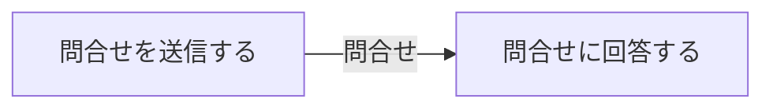

# 問合せ対応フロー

## 概要

利用者がオーナーへ問合せを送信し、オーナーが回答するフロー。

## 所属 UC 一覧

| UC名 | アクター | 主な操作 | 関連情報 |
|------|---------|---------|---------|
| [問合せを送信する](問合せを送信する/spec.md) | 利用者 | オーナーへの問合せ送信 | 問合せ |
| [問合せに回答する](問合せに回答する/spec.md) | 会議室オーナー | 問合せへの回答 | 問合せ |

## UC 横断データフロー

### データフロー図

### 情報 CRUD マトリクス

| 情報名 | 問合せを送信する | 問合せに回答する |
|--------|:---:|:---:|
| 問合せ | C | U |

## 状態遷移全体図

該当なし

## BUC 内共有条件一覧

該当なし

## BUC 内共有バリエーション一覧

| バリエーション名 | 適用 UC |
|----------------|--------|
| 問合せ種別 | 問合せを送信する, 問合せに回答する |
