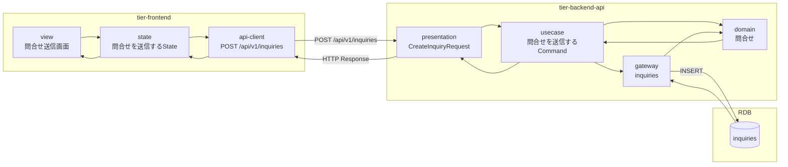
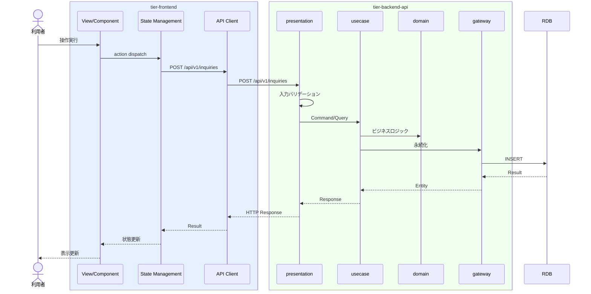

# 問合せを送信する

## 概要

利用者がオーナーへ問合せを送信する。問合せ種別は「会議室オーナー宛」。

## データフロー



| レイヤー | データモデル | 変換内容 |
|---------|------------|---------|
| FE View | 問合せ送信画面の表示/入力 | ユーザー操作 → state 更新 |
| BE presentation | CreateInquiryRequest | バリデーション + Command変換 |
| BE gateway | INSERT inquiries | レコード操作 |
| Response | InquiryResponse | 表示用データ |

## 処理フロー



## バリエーション一覧

| バリエーション名 | 値 | 処理内容 | 適用 tier | 適用箇所 |
|----------------|---|---------|----------|---------|

## 分岐条件一覧

該当なし

## 計算ルール一覧

該当なし


## 状態遷移一覧

該当なし

## 関連 RDRA モデル

| モデル種別 | 要素名 | 関連 |
|-----------|--------|------|
| 業務 | 会議室貸出業務 | このUCが属する業務 |
| BUC | 問合せ対応フロー | このUCを含むBUC |
| アクター | 利用者 | 操作するアクター |
| 情報 | 問合せ | 参照・更新する情報 |


| バリエーション | 問合せ種別 | 関連するバリエーション |


## E2E 完了条件（BDD）

### 正常系

```gherkin
Feature: 問合せを送信する

  Scenario: 利用者がオーナーに問合せを送信する
    Given 利用者「山田花子」が問合せ送信画面を表示している
    When 件名「駐車場の有無について」、内容「会議室近くに駐車場はありますか？」を入力し宛先「会議室オーナー宛」で「送信」ボタンをクリックする
    Then 問合せが送信され「問合せを送信しました」のメッセージが表示される
```

### 異常系

```gherkin
  Scenario: 件名未入力で問合せ送信に失敗する
    Given 利用者が問合せ送信画面を表示している
    When 件名を空のまま「送信」ボタンをクリックする
    Then 「件名は必須です」のバリデーションエラーが表示される
```

## ティア別仕様

- [フロントエンド](tier-frontend.md)
- [バックエンドAPI](tier-backend-api.md)

### 統合 API Spec

- [OpenAPI Spec](../../../_cross-cutting/api/openapi.yaml)
