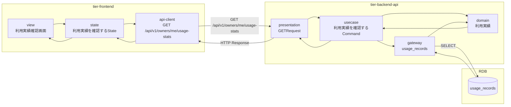
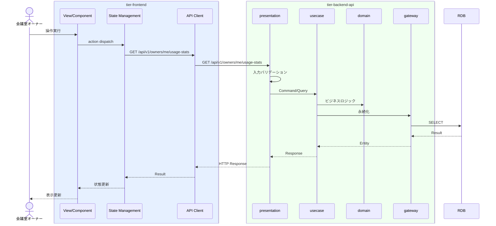

# 利用実績を確認する

## 概要

オーナーが会議室の利用実績（利用件数、利用時間、利用料金）を確認する。

## データフロー



| レイヤー | データモデル | 変換内容 |
|---------|------------|---------|
| FE View | 利用実績確認画面の表示/入力 | ユーザー操作 → state 更新 |
| BE presentation | Request | バリデーション + Command変換 |
| BE gateway | SELECT usage_records | レコード操作 |
| Response | UsageStatsResponse | 表示用データ |

## 処理フロー



## バリエーション一覧

該当なし

## 分岐条件一覧

該当なし

## 計算ルール一覧

該当なし


## 状態遷移一覧

該当なし

## 関連 RDRA モデル

| モデル種別 | 要素名 | 関連 |
|-----------|--------|------|
| 業務 | 利用実績管理業務 | このUCが属する業務 |
| BUC | 利用実績管理フロー | このUCを含むBUC |
| アクター | 会議室オーナー | 操作するアクター |
| 情報 | 利用実績 | 参照・更新する情報 |


## E2E 完了条件（BDD）

### 正常系

```gherkin
Feature: 利用実績を確認する

  Scenario: オーナーが利用実績を確認する
    Given 会議室オーナー「田中太郎」が利用実績確認画面を表示している
    When 期間「2026年3月」を選択する
    Then 月間利用件数「15件」、月間利用時間「45時間」、月間利用料金「225,000円」のサマリーと日別推移グラフが表示される
```

### 異常系

```gherkin
  Scenario: 利用実績がない期間を選択する
    Given 会議室オーナーが利用実績確認画面を表示している
    When 期間「2025年1月」を選択する
    Then 「この期間の利用実績はありません」の空状態メッセージが表示される
```

## ティア別仕様

- [フロントエンド](tier-frontend.md)
- [バックエンドAPI](tier-backend-api.md)

### 統合 API Spec

- [OpenAPI Spec](../../../_cross-cutting/api/openapi.yaml)
