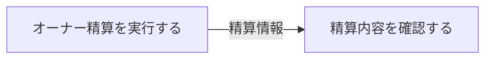

# オーナー精算フロー

## 概要

オーナーが精算額を確認し、サービス運営担当者が月末精算処理を実行してオーナーに支払うフロー。決済機関と連携する。

## 所属 UC 一覧

| UC名 | アクター | 主な操作 | 関連情報 |
|------|---------|---------|---------|
| [精算内容を確認する](精算内容を確認する/spec.md) | 会議室オーナー | 精算額の確認 | 精算情報 |
| [オーナー精算を実行する](オーナー精算を実行する/spec.md) | サービス運営担当者 | 月末精算処理の実行 | 精算情報, 利用実績 |

## UC 横断データフロー

### データフロー図

### 情報 CRUD マトリクス

| 情報名 | 精算内容を確認する | オーナー精算を実行する |
|--------|:---:|:---:|
| 精算情報 | R | C |
| 利用実績 | - | R |

## 状態遷移全体図

該当なし

## BUC 内共有条件一覧

| 条件名 | 適用 UC |
|--------|--------|
| 精算ルール | 精算内容を確認する, オーナー精算を実行する |

## BUC 内共有バリエーション一覧

該当なし
