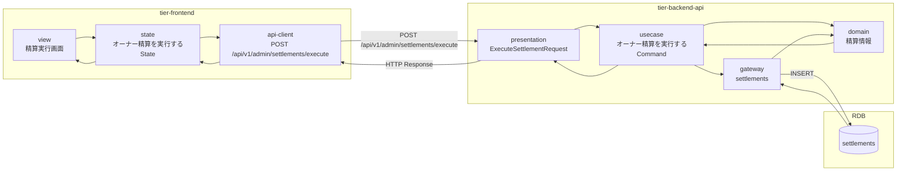
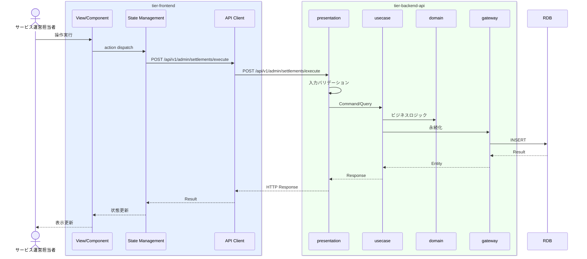

# オーナー精算を実行する

## 概要

サービス運営担当者が月末精算処理を実行しオーナーに支払う。決済機関との連携で精算依頼を送信する。

## データフロー



| レイヤー | データモデル | 変換内容 |
|---------|------------|---------|
| FE View | 精算実行画面の表示/入力 | ユーザー操作 → state 更新 |
| BE presentation | ExecuteSettlementRequest | バリデーション + Command変換 |
| BE gateway | INSERT settlements | レコード操作 |
| Response | SettlementExecutionResponse | 表示用データ |

## 処理フロー



## バリエーション一覧

該当なし

## 分岐条件一覧

| 条件名 | 判定ルール | 適用 tier | 適用箇所 | BDD Scenario |
|--------|----------|----------|---------|-------------|
| 精算ルール | 条件.tsvの定義に従う | tier-backend-api | ビジネスロジック | 異常系シナリオ |

## 計算ルール一覧

該当なし

## 非同期イベント

| イベント | チャネル | 方向 |
|---------|---------|------|
| 決済機関への精算依頼 | settlement-request-queue | publish |

## 状態遷移一覧

該当なし

## 関連 RDRA モデル

| モデル種別 | 要素名 | 関連 |
|-----------|--------|------|
| 業務 | 精算業務 | このUCが属する業務 |
| BUC | オーナー精算フロー | このUCを含むBUC |
| アクター | サービス運営担当者 | 操作するアクター |
| 情報 | 精算情報 | 参照・更新する情報 |
| 情報 | 利用実績 | 参照・更新する情報 |

| 条件 | 精算ルール | 適用される条件 |

| 外部システム | 決済機関 | 連携する外部システム |

## E2E 完了条件（BDD）

### 正常系

```gherkin
Feature: オーナー精算を実行する

  Scenario: 運営担当者が月末精算を実行する
    Given サービス運営担当者「管理者A」が精算実行画面を表示し対象月「2026年3月」を選択している
    When 精算対象オーナー一覧（オーナー「田中太郎」精算額「202,500円」等）を確認し「精算実行」ボタンをクリックし確認ダイアログで「実行する」を選択する
    Then 精算処理がバッチ実行され決済機関に精算依頼が送信される
```

### 異常系

```gherkin
  Scenario: 既に精算済みの月で再度精算を実行しようとする
    Given サービス運営担当者が精算実行画面を表示している
    When 既に精算済みの「2026年2月」を選択し「精算実行」ボタンをクリックする
    Then 「2026年2月は既に精算済みです」のエラーが表示される
```

## ティア別仕様

- [フロントエンド](tier-frontend.md)
- [バックエンドAPI](tier-backend-api.md)
- [バックエンドワーカー](tier-backend-worker.md)

### 統合 API Spec

- [OpenAPI Spec](../../../_cross-cutting/api/openapi.yaml)
